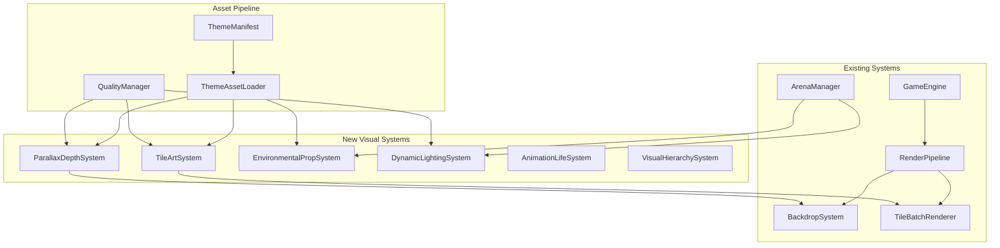

# Design Document: AAA Arena Visual System

## Overview

This design document outlines the architecture for implementing the AAA Arena Visual System, which transforms the current basic arena visuals into production-quality 2D graphics. The system integrates with the existing rendering pipeline while adding six new visual subsystems.

**Key Integration Points:**
- `GameEngine.ts` - Coordinates all visual systems
- `RenderPipeline.ts` - Composites visual layers
- `BackdropSystem.ts` - Enhanced with parallax depth
- `TileBatchRenderer.ts` - Enhanced with procedural textures
- `ArenaManager.ts` - Provides hazard/prop positions

## Architecture




## Components and Interfaces

### 1. TileArtSystem

Generates procedural tile textures with cracks, weathering, and baked lighting.

```typescript
// frontend/src/game/visual/TileArtSystem.ts

interface TileArtConfig {
  seed: number
  crackDensity: number      // 0-1, density of crack patterns
  weatheringIntensity: number // 0-1, amount of color variation
  edgeErosion: boolean      // Enable crumbling edge effects
}

interface EdgeFlags {
  top: boolean    // Adjacent to empty space above
  right: boolean  // Adjacent to empty space right
  bottom: boolean // Adjacent to empty space below
  left: boolean   // Adjacent to empty space left
}

interface TileTexture {
  canvas: HTMLCanvasElement
  width: number
  height: number
  edges: EdgeFlags
}

class TileArtSystem {
  private cache: Map<string, TileTexture> = new Map()
  private config: TileArtConfig
  private palette: ThemePalette
  
  constructor(config: TileArtConfig, palette: ThemePalette) {
    this.config = config
    this.palette = palette
  }
  
  /**
   * Generate a tile texture with procedural details
   * Same seed + config = identical output (deterministic)
   */
  generateTileTexture(
    type: TileType,
    gridX: number,
    gridY: number,
    edges: EdgeFlags
  ): TileTexture {
    const cacheKey = `${type}_${gridX}_${gridY}_${JSON.stringify(edges)}`
    if (this.cache.has(cacheKey)) {
      return this.cache.get(cacheKey)!
    }
    
    const canvas = document.createElement('canvas')
    canvas.width = 80
    canvas.height = 80
    const ctx = canvas.getContext('2d')!
    
    // 1. Base color with noise
    this.renderBaseColor(ctx, type)
    
    // 2. Crack patterns
    if (this.config.crackDensity > 0) {
      this.renderCracks(ctx, gridX, gridY)
    }
    
    // 3. Edge erosion
    if (this.config.edgeErosion) {
      this.renderEdgeErosion(ctx, edges)
    }
    
    // 4. Baked lighting gradient
    this.applyBakedLighting(ctx)
    
    const texture = { canvas, width: 80, height: 80, edges }
    this.cache.set(cacheKey, texture)
    return texture
  }
  
  /**
   * Render using 9-slice for non-square barriers
   */
  render9Slice(
    ctx: CanvasRenderingContext2D,
    texture: TileTexture,
    bounds: { x: number, y: number, width: number, height: number }
  ): void {
    const cornerSize = 16
    // ... 9-slice implementation
  }
  
  private renderBaseColor(ctx: CanvasRenderingContext2D, type: TileType): void {
    const baseColor = this.palette[type] || this.palette.platform
    // Apply ±10% hue/saturation variation using seeded noise
  }
  
  private renderCracks(ctx: CanvasRenderingContext2D, x: number, y: number): void {
    // Procedural crack patterns using seeded random
  }
  
  private renderEdgeErosion(ctx: CanvasRenderingContext2D, edges: EdgeFlags): void {
    // Crumbling fragments on exposed edges
  }
  
  private applyBakedLighting(ctx: CanvasRenderingContext2D): void {
    // Top 15% lighter, bottom 20% darker
    const gradient = ctx.createLinearGradient(0, 0, 0, 80)
    gradient.addColorStop(0, 'rgba(255,255,255,0.15)')
    gradient.addColorStop(0.5, 'rgba(0,0,0,0)')
    gradient.addColorStop(1, 'rgba(0,0,0,0.20)')
    ctx.fillStyle = gradient
    ctx.fillRect(0, 0, 80, 80)
  }
}
```

### 2. ParallaxDepthSystem

Enhanced backdrop with 4 distinct depth layers.

```typescript
// frontend/src/game/visual/ParallaxDepthSystem.ts

interface ParallaxLayer {
  id: string
  depth: number           // 0=far, 1=mid, 2=gameplay, 3=foreground
  scrollRatio: number     // Movement relative to camera
  canvas: OffscreenCanvas // Pre-rendered static content
  elements: LayerElement[]
  isStatic: boolean       // Can be cached
}

interface LayerElement {
  type: 'sprite' | 'procedural' | 'particle'
  sprite?: HTMLImageElement
  position: Vector2
  size: Vector2
  alpha: number
  parallaxOffset: Vector2  // Additional per-element offset
}

class ParallaxDepthSystem {
  private layers: ParallaxLayer[] = []
  private cameraPosition: Vector2 = { x: 0, y: 0 }
  
  constructor(width: number, height: number, theme: ThemeManifest) {
    this.initializeLayers(width, height, theme)
  }
  
  private initializeLayers(width: number, height: number, theme: ThemeManifest): void {
    // Layer 0: Far background (scrollRatio: 0.1)
    this.layers.push({
      id: 'far',
      depth: 0,
      scrollRatio: 0.1,
      canvas: this.createFarBackground(width, height, theme),
      elements: [],
      isStatic: true
    })
    
    // Layer 1: Mid background (scrollRatio: 0.3)
    this.layers.push({
      id: 'mid',
      depth: 1,
      scrollRatio: 0.3,
      canvas: this.createMidBackground(width, height, theme),
      elements: [],
      isStatic: true
    })
    
    // Layer 2: Gameplay (scrollRatio: 1.0) - handled by TileBatchRenderer
    
    // Layer 3: Foreground (scrollRatio: 1.2)
    this.layers.push({
      id: 'foreground',
      depth: 3,
      scrollRatio: 1.2,
      canvas: new OffscreenCanvas(width, height),
      elements: this.createForegroundElements(theme),
      isStatic: false
    })
  }
  
  updateCameraPosition(position: Vector2): void {
    this.cameraPosition = position
  }
  
  render(ctx: CanvasRenderingContext2D): void {
    for (const layer of this.layers) {
      ctx.save()
      
      // Apply parallax offset
      const offsetX = this.cameraPosition.x * layer.scrollRatio
      const offsetY = this.cameraPosition.y * layer.scrollRatio
      ctx.translate(-offsetX, -offsetY)
      
      if (layer.isStatic && layer.canvas) {
        ctx.drawImage(layer.canvas, 0, 0)
      } else {
        this.renderDynamicLayer(ctx, layer)
      }
      
      ctx.restore()
    }
  }
  
  getLayerCount(): number {
    return this.layers.length + 1 // +1 for gameplay layer
  }
}
```


### 3. EnvironmentalPropSystem

Places and renders decorative props throughout the arena.

```typescript
// frontend/src/game/visual/EnvironmentalPropSystem.ts

type PropCategory = 'structural' | 'organic' | 'atmospheric'

interface PropDefinition {
  id: string
  category: PropCategory
  sprite: string           // Path relative to theme/props/
  size: { width: number, height: number }
  anchor: { x: number, y: number }  // 0-1 normalized
  animation?: {
    frames: number
    frameRate: number
    loop: boolean
  }
  particles?: ParticleEmitterConfig
}

interface PropInstance {
  id: string
  definitionId: string
  position: Vector2
  layer: 'background' | 'gameplay' | 'foreground'
  rotation: number
  scale: number
  currentFrame: number
  animationTime: number
  phaseOffset: number      // Stagger timing
}

class EnvironmentalPropSystem {
  private definitions: Map<string, PropDefinition> = new Map()
  private instances: PropInstance[] = []
  private sprites: Map<string, HTMLImageElement> = new Map()
  
  async loadDefinitions(themeId: string): Promise<void> {
    const response = await fetch(`/themes/${themeId}/props.json`)
    const data = await response.json()
    
    for (const prop of data.props) {
      this.definitions.set(prop.id, prop)
      // Preload sprite
      const img = new Image()
      img.src = `/themes/${themeId}/props/${prop.sprite}`
      await img.decode()
      this.sprites.set(prop.id, img)
    }
  }
  
  placeProp(
    definitionId: string,
    position: Vector2,
    layer: 'background' | 'gameplay' | 'foreground',
    options?: { rotation?: number, scale?: number }
  ): PropInstance {
    const instance: PropInstance = {
      id: crypto.randomUUID(),
      definitionId,
      position,
      layer,
      rotation: options?.rotation ?? 0,
      scale: options?.scale ?? 1,
      currentFrame: 0,
      animationTime: 0,
      phaseOffset: Math.random() * Math.PI * 2  // Random phase
    }
    this.instances.push(instance)
    return instance
  }
  
  update(deltaTime: number): void {
    for (const instance of this.instances) {
      const def = this.definitions.get(instance.definitionId)
      if (!def?.animation) continue
      
      instance.animationTime += deltaTime
      const frameTime = 1 / def.animation.frameRate
      instance.currentFrame = Math.floor(
        (instance.animationTime + instance.phaseOffset) / frameTime
      ) % def.animation.frames
    }
  }
  
  render(ctx: CanvasRenderingContext2D, layer: string): void {
    const layerProps = this.instances.filter(p => p.layer === layer)
    
    for (const prop of layerProps) {
      const def = this.definitions.get(prop.definitionId)
      const sprite = this.sprites.get(prop.definitionId)
      if (!def || !sprite) continue
      
      ctx.save()
      ctx.translate(prop.position.x, prop.position.y)
      ctx.rotate(prop.rotation)
      ctx.scale(prop.scale, prop.scale)
      
      // Draw current animation frame
      const frameWidth = def.size.width
      const frameX = prop.currentFrame * frameWidth
      ctx.drawImage(
        sprite,
        frameX, 0, frameWidth, def.size.height,
        -def.anchor.x * frameWidth, -def.anchor.y * def.size.height,
        frameWidth, def.size.height
      )
      
      ctx.restore()
    }
  }
  
  getPropsInLayer(layer: string): PropInstance[] {
    return this.instances.filter(p => p.layer === layer)
  }
}
```

### 4. DynamicLightingSystem

Real-time lighting with rim effects and player underglow.

```typescript
// frontend/src/game/visual/DynamicLightingSystem.ts

interface LightSource {
  id: string
  position: Vector2
  color: string
  intensity: number       // 0-1
  radius: number
  falloff: 'linear' | 'quadratic'
  animation?: {
    type: 'pulse' | 'flicker'
    speed: number
    amplitude: number     // 0-1, variation range
  }
}

interface LightingConfig {
  ambientColor: string
  ambientIntensity: number
  rimLightingEnabled: boolean
  rimLightColor: string
  rimLightWidth: number
}

class DynamicLightingSystem {
  private lights: Map<string, LightSource> = new Map()
  private config: LightingConfig
  private time: number = 0
  
  constructor(config: LightingConfig) {
    this.config = config
  }
  
  /**
   * Create light sources from hazard zones
   */
  createLightsFromHazards(hazards: HazardZone[]): void {
    for (const hazard of hazards) {
      if (hazard.type !== 'damage') continue
      
      const light: LightSource = {
        id: `hazard_${hazard.id}`,
        position: {
          x: hazard.bounds.x + hazard.bounds.width / 2,
          y: hazard.bounds.y + hazard.bounds.height / 2
        },
        color: '#ff6600',
        intensity: hazard.intensity * 0.8,
        radius: Math.max(hazard.bounds.width, hazard.bounds.height) * 1.5,
        falloff: 'quadratic',
        animation: {
          type: 'pulse',
          speed: 2,
          amplitude: 0.2
        }
      }
      this.lights.set(light.id, light)
    }
  }
  
  update(deltaTime: number): void {
    this.time += deltaTime
    
    // Update animated lights
    for (const light of this.lights.values()) {
      if (!light.animation) continue
      
      if (light.animation.type === 'pulse') {
        const pulse = Math.sin(this.time * light.animation.speed * Math.PI * 2)
        light.intensity = 0.8 + pulse * light.animation.amplitude
      }
    }
  }
  
  /**
   * Get light intensity at a position (for rim lighting)
   */
  getLightIntensityAt(position: Vector2): number {
    let totalIntensity = this.config.ambientIntensity
    
    for (const light of this.lights.values()) {
      const dx = position.x - light.position.x
      const dy = position.y - light.position.y
      const distance = Math.sqrt(dx * dx + dy * dy)
      
      if (distance < light.radius) {
        const falloff = light.falloff === 'linear'
          ? 1 - distance / light.radius
          : 1 - (distance / light.radius) ** 2
        totalIntensity += light.intensity * falloff
      }
    }
    
    return Math.min(1, totalIntensity)
  }
  
  /**
   * Apply rim lighting to platform edges
   */
  applyRimLighting(
    ctx: CanvasRenderingContext2D,
    platformBounds: Rect,
    edges: EdgeFlags
  ): void {
    if (!this.config.rimLightingEnabled) return
    
    const intensity = this.getLightIntensityAt({
      x: platformBounds.x + platformBounds.width / 2,
      y: platformBounds.y + platformBounds.height / 2
    })
    
    if (intensity < 0.1) return
    
    ctx.save()
    ctx.strokeStyle = this.config.rimLightColor
    ctx.lineWidth = this.config.rimLightWidth
    ctx.globalAlpha = intensity * 0.4
    
    // Draw rim on edges facing light sources
    // ... edge rendering logic
    
    ctx.restore()
  }
  
  /**
   * Apply underglow effect to player near lava
   */
  applyPlayerUnderglow(
    ctx: CanvasRenderingContext2D,
    playerPosition: Vector2,
    playerRadius: number
  ): void {
    let closestDistance = Infinity
    let closestLight: LightSource | null = null
    
    for (const light of this.lights.values()) {
      const dx = playerPosition.x - light.position.x
      const dy = playerPosition.y - light.position.y
      const distance = Math.sqrt(dx * dx + dy * dy)
      
      if (distance < 100 && distance < closestDistance) {
        closestDistance = distance
        closestLight = light
      }
    }
    
    if (!closestLight) return
    
    const intensity = 1 - closestDistance / 100
    const gradient = ctx.createRadialGradient(
      playerPosition.x, playerPosition.y + playerRadius * 0.5, 0,
      playerPosition.x, playerPosition.y + playerRadius * 0.5, playerRadius * 1.5
    )
    gradient.addColorStop(0, `rgba(255, 102, 0, ${intensity * 0.5})`)
    gradient.addColorStop(1, 'transparent')
    
    ctx.fillStyle = gradient
    ctx.beginPath()
    ctx.arc(playerPosition.x, playerPosition.y + playerRadius * 0.5, playerRadius * 1.5, 0, Math.PI * 2)
    ctx.fill()
  }
}
```


### 5. AnimationLifeSystem

Coordinates all environmental animations.

```typescript
// frontend/src/game/visual/AnimationLifeSystem.ts

interface AnimatedElement {
  id: string
  type: 'lava' | 'steam' | 'debris' | 'event'
  position: Vector2
  frames: HTMLCanvasElement[]
  frameRate: number
  currentFrame: number
  phaseOffset: number
  loop: boolean
}

interface EnvironmentalEvent {
  type: 'debris_fall' | 'lava_burst' | 'lightning'
  position: Vector2
  startTime: number
  duration: number
  progress: number
}

class AnimationLifeSystem {
  private elements: Map<string, AnimatedElement> = new Map()
  private activeEvents: EnvironmentalEvent[] = []
  private time: number = 0
  
  // Event probabilities per second
  private eventProbabilities = {
    debris_fall: 0.1,
    lava_burst: 0.05,
    lightning: 0.02
  }
  
  registerLavaAnimation(hazardId: string, position: Vector2): void {
    const frames = this.generateLavaFrames(8) // Minimum 8 frames
    
    this.elements.set(`lava_${hazardId}`, {
      id: `lava_${hazardId}`,
      type: 'lava',
      position,
      frames,
      frameRate: 10,
      currentFrame: 0,
      phaseOffset: Math.random() * Math.PI * 2,
      loop: true
    })
  }
  
  registerSteamVent(propId: string, position: Vector2): void {
    // Steam uses particle system, not frame animation
    this.elements.set(`steam_${propId}`, {
      id: `steam_${propId}`,
      type: 'steam',
      position,
      frames: [],
      frameRate: 0,
      currentFrame: 0,
      phaseOffset: Math.random() * Math.PI * 2,
      loop: true
    })
  }
  
  update(deltaTime: number): void {
    this.time += deltaTime
    
    // Update animated elements (delta-time based)
    for (const element of this.elements.values()) {
      if (element.frames.length === 0) continue
      
      const frameTime = 1 / element.frameRate
      const totalTime = this.time + element.phaseOffset
      element.currentFrame = Math.floor(totalTime / frameTime) % element.frames.length
    }
    
    // Check for new environmental events
    this.checkForNewEvents(deltaTime)
    
    // Update active events
    this.updateActiveEvents(deltaTime)
  }
  
  private checkForNewEvents(deltaTime: number): void {
    for (const [type, probability] of Object.entries(this.eventProbabilities)) {
      if (Math.random() < probability * deltaTime) {
        this.triggerEvent(type as EnvironmentalEvent['type'])
      }
    }
  }
  
  private triggerEvent(type: EnvironmentalEvent['type']): void {
    const event: EnvironmentalEvent = {
      type,
      position: this.getRandomEventPosition(type),
      startTime: this.time,
      duration: 0.5 + Math.random() * 1.5, // 0.5-2 seconds
      progress: 0
    }
    this.activeEvents.push(event)
  }
  
  private updateActiveEvents(deltaTime: number): void {
    for (let i = this.activeEvents.length - 1; i >= 0; i--) {
      const event = this.activeEvents[i]
      event.progress += deltaTime / event.duration
      
      if (event.progress >= 1) {
        this.activeEvents.splice(i, 1)
      }
    }
  }
  
  private generateLavaFrames(count: number): HTMLCanvasElement[] {
    const frames: HTMLCanvasElement[] = []
    
    for (let i = 0; i < count; i++) {
      const canvas = document.createElement('canvas')
      canvas.width = 80
      canvas.height = 80
      const ctx = canvas.getContext('2d')!
      
      // Generate bubbling lava frame
      this.renderLavaFrame(ctx, i / count)
      frames.push(canvas)
    }
    
    return frames
  }
  
  getCurrentFrame(elementId: string): HTMLCanvasElement | null {
    const element = this.elements.get(elementId)
    if (!element || element.frames.length === 0) return null
    return element.frames[element.currentFrame]
  }
  
  getActiveEvents(): EnvironmentalEvent[] {
    return this.activeEvents
  }
  
  /**
   * Verify animation phases are staggered
   */
  arePhasesDiversified(): boolean {
    const phases = Array.from(this.elements.values()).map(e => e.phaseOffset)
    if (phases.length < 3) return true
    
    // Check that at least 2 phases are different
    const uniquePhases = new Set(phases.map(p => Math.round(p * 10) / 10))
    return uniquePhases.size >= 2
  }
}
```

### 6. VisualHierarchySystem

Post-processing for gameplay clarity.

```typescript
// frontend/src/game/visual/VisualHierarchySystem.ts

interface HierarchyConfig {
  platformBrightness: number    // 1.0 = normal, 1.2 = 20% brighter
  backgroundDesaturation: number // 0-1, percentage to desaturate
  backgroundBlur: number        // Pixels of blur
  hazardContrastRatio: number   // Minimum contrast (4.5 for WCAG AA)
  vignetteIntensity: number     // 0-1
  vignetteRadius: number        // 0-1, percentage of screen
}

class VisualHierarchySystem {
  private config: HierarchyConfig
  private vignetteCanvas: HTMLCanvasElement | null = null
  
  constructor(config: HierarchyConfig) {
    this.config = config
  }
  
  /**
   * Apply brightness boost to platforms
   */
  applyPlatformContrast(
    ctx: CanvasRenderingContext2D,
    platforms: Rect[]
  ): void {
    ctx.save()
    ctx.globalCompositeOperation = 'lighter'
    ctx.fillStyle = `rgba(255, 255, 255, ${this.config.platformBrightness - 1})`
    
    for (const platform of platforms) {
      ctx.fillRect(platform.x, platform.y, platform.width, platform.height)
    }
    
    ctx.restore()
  }
  
  /**
   * Apply desaturation and blur to background
   */
  applyBackgroundEffects(
    ctx: CanvasRenderingContext2D,
    backgroundCanvas: HTMLCanvasElement
  ): void {
    ctx.save()
    
    // Apply blur
    if (this.config.backgroundBlur > 0) {
      ctx.filter = `blur(${this.config.backgroundBlur}px)`
    }
    
    // Draw background
    ctx.drawImage(backgroundCanvas, 0, 0)
    
    // Apply desaturation overlay
    ctx.globalCompositeOperation = 'saturation'
    ctx.fillStyle = `hsl(0, ${100 - this.config.backgroundDesaturation * 100}%, 50%)`
    ctx.fillRect(0, 0, ctx.canvas.width, ctx.canvas.height)
    
    ctx.restore()
  }
  
  /**
   * Apply pulsing danger indicators to hazards
   */
  applyHazardIndicators(
    ctx: CanvasRenderingContext2D,
    hazards: HazardZone[],
    playerPosition: Vector2 | null,
    time: number
  ): void {
    const basePulse = 0.5 + 0.5 * Math.sin(time * Math.PI * 4) // 2Hz
    
    for (const hazard of hazards) {
      // Check if player is inside
      const playerInside = playerPosition && this.isPointInRect(playerPosition, hazard.bounds)
      const intensity = playerInside ? basePulse * 1.5 : basePulse
      const pulseFreq = playerInside ? 2 : 1
      
      ctx.save()
      ctx.globalAlpha = intensity * 0.3
      ctx.fillStyle = '#ff2200'
      ctx.fillRect(
        hazard.bounds.x,
        hazard.bounds.y,
        hazard.bounds.width,
        hazard.bounds.height
      )
      ctx.restore()
    }
  }
  
  /**
   * Apply glow to interactive elements
   */
  applyInteractiveGlow(
    ctx: CanvasRenderingContext2D,
    elements: Array<{ position: Vector2, radius: number, type: string }>,
    time: number
  ): void {
    for (const element of elements) {
      const color = element.type === 'teleporter' ? '#00ffff' : '#00ff00'
      const pulse = 0.7 + 0.3 * Math.sin(time * Math.PI * 2)
      
      const gradient = ctx.createRadialGradient(
        element.position.x, element.position.y, 0,
        element.position.x, element.position.y, element.radius * 1.5
      )
      gradient.addColorStop(0, `${color}${Math.round(pulse * 80).toString(16).padStart(2, '0')}`)
      gradient.addColorStop(1, 'transparent')
      
      ctx.fillStyle = gradient
      ctx.beginPath()
      ctx.arc(element.position.x, element.position.y, element.radius * 1.5, 0, Math.PI * 2)
      ctx.fill()
    }
  }
  
  /**
   * Apply vignette effect to focus attention
   */
  applyVignette(ctx: CanvasRenderingContext2D): void {
    const { width, height } = ctx.canvas
    const centerX = width / 2
    const centerY = height / 2
    const radius = Math.sqrt(centerX * centerX + centerY * centerY) * this.config.vignetteRadius
    
    const gradient = ctx.createRadialGradient(
      centerX, centerY, radius * 0.5,
      centerX, centerY, radius
    )
    gradient.addColorStop(0, 'transparent')
    gradient.addColorStop(1, `rgba(0, 0, 0, ${this.config.vignetteIntensity})`)
    
    ctx.fillStyle = gradient
    ctx.fillRect(0, 0, width, height)
  }
  
  /**
   * Calculate contrast ratio between two colors (WCAG formula)
   */
  calculateContrastRatio(color1: string, color2: string): number {
    const lum1 = this.getRelativeLuminance(color1)
    const lum2 = this.getRelativeLuminance(color2)
    const lighter = Math.max(lum1, lum2)
    const darker = Math.min(lum1, lum2)
    return (lighter + 0.05) / (darker + 0.05)
  }
  
  private getRelativeLuminance(color: string): number {
    // Parse hex color and calculate luminance
    const rgb = this.hexToRgb(color)
    const [r, g, b] = rgb.map(c => {
      c = c / 255
      return c <= 0.03928 ? c / 12.92 : Math.pow((c + 0.055) / 1.055, 2.4)
    })
    return 0.2126 * r + 0.7152 * g + 0.0722 * b
  }
  
  private hexToRgb(hex: string): [number, number, number] {
    const result = /^#?([a-f\d]{2})([a-f\d]{2})([a-f\d]{2})$/i.exec(hex)
    return result
      ? [parseInt(result[1], 16), parseInt(result[2], 16), parseInt(result[3], 16)]
      : [0, 0, 0]
  }
  
  private isPointInRect(point: Vector2, rect: Rect): boolean {
    return point.x >= rect.x && point.x <= rect.x + rect.width &&
           point.y >= rect.y && point.y <= rect.y + rect.height
  }
}
```


### 7. ThemeAssetLoader

Loads and validates theme assets.

```typescript
// frontend/src/game/visual/ThemeAssetLoader.ts

interface ThemeManifest {
  id: string
  name: string
  version: string
  palette: {
    primary: string
    secondary: string
    background: string
    platform: string
    hazard: string
  }
  tileConfig: TileArtConfig
  lighting: LightingConfig
  props?: PropDefinition[]
}

interface ValidationResult {
  valid: boolean
  errors: string[]
}

class ThemeAssetLoader {
  private loadedThemes: Map<string, ThemeManifest> = new Map()
  private assetCache: Map<string, HTMLImageElement> = new Map()
  private placeholderTexture: HTMLCanvasElement | null = null
  
  async loadTheme(themeId: string): Promise<ThemeManifest> {
    if (this.loadedThemes.has(themeId)) {
      return this.loadedThemes.get(themeId)!
    }
    
    const manifestUrl = `/themes/${themeId}/manifest.json`
    const response = await fetch(manifestUrl)
    
    if (!response.ok) {
      throw new Error(`Failed to load theme manifest: ${themeId}`)
    }
    
    const manifest = await response.json()
    const validation = this.validateManifest(manifest)
    
    if (!validation.valid) {
      throw new Error(`Invalid theme manifest: ${validation.errors.join(', ')}`)
    }
    
    this.loadedThemes.set(themeId, manifest)
    return manifest
  }
  
  async loadAsset(themeId: string, assetType: string, filename: string): Promise<HTMLImageElement> {
    const path = `/themes/${themeId}/${assetType}/${filename}`
    
    if (this.assetCache.has(path)) {
      return this.assetCache.get(path)!
    }
    
    try {
      const img = new Image()
      img.src = path
      await img.decode()
      
      // Validate dimensions for tiles
      if (assetType === 'tiles') {
        const validSizes = [80, 160, 320]
        if (!validSizes.includes(img.width) || !validSizes.includes(img.height)) {
          console.warn(`Invalid tile dimensions: ${img.width}x${img.height}`)
          return this.getPlaceholderAsImage()
        }
      }
      
      this.assetCache.set(path, img)
      return img
    } catch (error) {
      console.warn(`Failed to load asset: ${path}`, error)
      return this.getPlaceholderAsImage()
    }
  }
  
  validateManifest(manifest: unknown): ValidationResult {
    const errors: string[] = []
    
    if (!manifest || typeof manifest !== 'object') {
      return { valid: false, errors: ['Manifest must be an object'] }
    }
    
    const m = manifest as Record<string, unknown>
    
    // Required fields
    if (!m.id || typeof m.id !== 'string') {
      errors.push('Missing or invalid field: id')
    }
    if (!m.name || typeof m.name !== 'string') {
      errors.push('Missing or invalid field: name')
    }
    if (!m.palette || typeof m.palette !== 'object') {
      errors.push('Missing or invalid field: palette')
    } else {
      const palette = m.palette as Record<string, unknown>
      const requiredColors = ['primary', 'secondary', 'background', 'platform', 'hazard']
      for (const color of requiredColors) {
        if (!palette[color] || typeof palette[color] !== 'string') {
          errors.push(`Missing palette color: ${color}`)
        }
      }
    }
    
    return { valid: errors.length === 0, errors }
  }
  
  getPlaceholderTexture(): HTMLCanvasElement {
    if (this.placeholderTexture) {
      return this.placeholderTexture
    }
    
    // Create magenta/black checkerboard
    const canvas = document.createElement('canvas')
    canvas.width = 80
    canvas.height = 80
    const ctx = canvas.getContext('2d')!
    
    const squareSize = 8
    for (let y = 0; y < 80; y += squareSize) {
      for (let x = 0; x < 80; x += squareSize) {
        const isEven = ((x + y) / squareSize) % 2 === 0
        ctx.fillStyle = isEven ? '#ff00ff' : '#000000'
        ctx.fillRect(x, y, squareSize, squareSize)
      }
    }
    
    this.placeholderTexture = canvas
    return canvas
  }
  
  private getPlaceholderAsImage(): HTMLImageElement {
    const canvas = this.getPlaceholderTexture()
    const img = new Image()
    img.src = canvas.toDataURL()
    return img
  }
}
```

### 8. QualityManager

Performance-based quality scaling.

```typescript
// frontend/src/game/visual/QualityManager.ts

type QualityPreset = 'low' | 'medium' | 'high' | 'ultra'

interface QualitySettings {
  parallaxLayers: number
  particleMultiplier: number
  animatedTilesEnabled: boolean
  dynamicLightingEnabled: boolean
  blurEffectsEnabled: boolean
  maxDrawCalls: number
}

const QUALITY_PRESETS: Record<QualityPreset, QualitySettings> = {
  low: {
    parallaxLayers: 2,
    particleMultiplier: 0.25,
    animatedTilesEnabled: false,
    dynamicLightingEnabled: false,
    blurEffectsEnabled: false,
    maxDrawCalls: 30
  },
  medium: {
    parallaxLayers: 3,
    particleMultiplier: 0.5,
    animatedTilesEnabled: true,
    dynamicLightingEnabled: false,
    blurEffectsEnabled: false,
    maxDrawCalls: 40
  },
  high: {
    parallaxLayers: 4,
    particleMultiplier: 0.75,
    animatedTilesEnabled: true,
    dynamicLightingEnabled: true,
    blurEffectsEnabled: true,
    maxDrawCalls: 50
  },
  ultra: {
    parallaxLayers: 4,
    particleMultiplier: 1.0,
    animatedTilesEnabled: true,
    dynamicLightingEnabled: true,
    blurEffectsEnabled: true,
    maxDrawCalls: 60
  }
}

class QualityManager {
  private currentPreset: QualityPreset = 'high'
  private settings: QualitySettings
  private frameTimeHistory: number[] = []
  private readonly historySize = 60
  
  constructor() {
    this.currentPreset = this.detectDeviceCapabilities()
    this.settings = { ...QUALITY_PRESETS[this.currentPreset] }
  }
  
  detectDeviceCapabilities(): QualityPreset {
    // Check device memory (if available)
    const memory = (navigator as any).deviceMemory
    
    // Check for mobile
    const isMobile = /Android|iPhone|iPad|iPod/i.test(navigator.userAgent)
    
    // Check GPU (rough heuristic via canvas performance)
    const canvas = document.createElement('canvas')
    canvas.width = 1000
    canvas.height = 1000
    const ctx = canvas.getContext('2d')
    
    if (!ctx) return 'low'
    
    const start = performance.now()
    for (let i = 0; i < 100; i++) {
      ctx.fillRect(0, 0, 1000, 1000)
    }
    const elapsed = performance.now() - start
    
    if (isMobile || memory < 4 || elapsed > 50) return 'low'
    if (memory < 8 || elapsed > 20) return 'medium'
    if (memory < 16 || elapsed > 10) return 'high'
    return 'ultra'
  }
  
  setPreset(preset: QualityPreset): void {
    this.currentPreset = preset
    this.settings = { ...QUALITY_PRESETS[preset] }
  }
  
  getSettings(): QualitySettings {
    return this.settings
  }
  
  recordFrameTime(ms: number): void {
    this.frameTimeHistory.push(ms)
    if (this.frameTimeHistory.length > this.historySize) {
      this.frameTimeHistory.shift()
    }
  }
  
  shouldReduceQuality(): boolean {
    if (this.frameTimeHistory.length < 30) return false
    
    const avgFrameTime = this.frameTimeHistory.reduce((a, b) => a + b, 0) / this.frameTimeHistory.length
    return avgFrameTime > 18 // Below 55fps
  }
  
  autoAdjustQuality(): void {
    if (!this.shouldReduceQuality()) return
    
    // First try reducing particles
    if (this.settings.particleMultiplier > 0.25) {
      this.settings.particleMultiplier *= 0.75
      console.warn(`Reduced particle multiplier to ${this.settings.particleMultiplier}`)
      return
    }
    
    // Then disable blur
    if (this.settings.blurEffectsEnabled) {
      this.settings.blurEffectsEnabled = false
      console.warn('Disabled blur effects for performance')
      return
    }
    
    // Finally reduce parallax layers
    if (this.settings.parallaxLayers > 2) {
      this.settings.parallaxLayers--
      console.warn(`Reduced parallax layers to ${this.settings.parallaxLayers}`)
    }
  }
  
  /**
   * Serialize settings for persistence
   */
  serialize(): string {
    return JSON.stringify({
      preset: this.currentPreset,
      settings: this.settings
    })
  }
  
  /**
   * Deserialize settings
   */
  deserialize(json: string): void {
    const data = JSON.parse(json)
    this.currentPreset = data.preset
    this.settings = data.settings
  }
}
```

## Data Models

### Theme Manifest Schema

```json
{
  "id": "volcanic",
  "name": "Volcanic Cavern",
  "version": "1.0.0",
  "palette": {
    "primary": "#ff4400",
    "secondary": "#ff6600",
    "background": "#1a0a0a",
    "platform": "#2d2d2d",
    "hazard": "#ff2200",
    "interactive": "#00ffff"
  },
  "tileConfig": {
    "seed": 42,
    "crackDensity": 0.3,
    "weatheringIntensity": 0.5,
    "edgeErosion": true
  },
  "lighting": {
    "ambientColor": "#1a0505",
    "ambientIntensity": 0.3,
    "rimLightingEnabled": true,
    "rimLightColor": "#ff6600",
    "rimLightWidth": 3
  },
  "parallax": {
    "layers": [
      { "id": "far", "depth": 0, "scrollRatio": 0.1, "sprite": "backgrounds/far_mountains.png" },
      { "id": "mid", "depth": 1, "scrollRatio": 0.3, "sprite": "backgrounds/mid_rocks.png" },
      { "id": "foreground", "depth": 3, "scrollRatio": 1.2, "elements": ["stalactites", "steam"] }
    ]
  },
  "props": [
    {
      "id": "chain_hanging",
      "category": "structural",
      "sprite": "chain_hanging.png",
      "size": { "width": 32, "height": 128 },
      "anchor": { "x": 0.5, "y": 0 },
      "animation": { "frames": 4, "frameRate": 8, "loop": true }
    },
    {
      "id": "crystal_cluster",
      "category": "organic",
      "sprite": "crystal_cluster.png",
      "size": { "width": 48, "height": 64 },
      "anchor": { "x": 0.5, "y": 1 }
    },
    {
      "id": "steam_vent",
      "category": "atmospheric",
      "sprite": "steam_vent.png",
      "size": { "width": 32, "height": 32 },
      "anchor": { "x": 0.5, "y": 1 },
      "particles": { "type": "steam", "rate": 5, "lifetime": { "min": 2, "max": 4 } }
    }
  ],
  "animations": {
    "lavaFrames": 8,
    "steamLifetime": { "min": 2, "max": 4 },
    "eventProbabilities": {
      "debris_fall": 0.1,
      "lava_burst": 0.05
    }
  }
}
```

## Correctness Properties

*A property is a characteristic or behavior that should hold true across all valid executions of a system-essentially, a formal statement about what the system should do. Properties serve as the bridge between human-readable specifications and machine-verifiable correctness guarantees.*

### Property 1: Seed Determinism
*For any* TileArtConfig with a fixed seed, generating a tile texture twice with the same parameters (type, gridX, gridY, edges) SHALL produce pixel-identical output.
**Validates: Requirements 1.5**

### Property 2: Tile Texture Dimensions
*For any* generated tile texture, the canvas dimensions SHALL be exactly 80x80 pixels with non-transparent content.
**Validates: Requirements 1.1**

### Property 3: Baked Lighting Gradient
*For any* solid tile texture, the top edge pixels SHALL be at least 10% lighter than center pixels, and bottom edge pixels SHALL be at least 15% darker than center pixels.
**Validates: Requirements 1.4**

### Property 4: 9-Slice Corner Preservation
*For any* 9-slice rendered barrier with dimensions >= 32x32, the corner regions (16x16px) SHALL remain unstretched regardless of total barrier size.
**Validates: Requirements 1.3**

### Property 5: Parallax Layer Count
*For any* initialized ParallaxDepthSystem, the total layer count (including gameplay layer) SHALL equal exactly 4.
**Validates: Requirements 2.1**

### Property 6: Parallax Scroll Ratio
*For any* camera position change (dx, dy), each parallax layer's rendered offset SHALL equal (dx * scrollRatio, dy * scrollRatio) where scrollRatio is the layer's configured ratio.
**Validates: Requirements 2.2**

### Property 7: Prop Placement Accuracy
*For any* prop anchor defined in map config, the placed PropInstance position SHALL match the anchor position exactly.
**Validates: Requirements 3.1**

### Property 8: Prop Layer Ordering
*For any* set of props across layers, background props SHALL render before gameplay props, and gameplay props SHALL render before foreground props.
**Validates: Requirements 3.4**

### Property 9: Animation Phase Diversity
*For any* set of 3+ animated elements, at least 2 elements SHALL have different phase offsets (preventing synchronized pulsing).
**Validates: Requirements 5.5**

### Property 10: Delta-Time Animation
*For any* animation update with deltaTime, the animation progress SHALL be proportional to deltaTime (frame-rate independent).
**Validates: Requirements 5.6**

### Property 11: Light Source from Hazard
*For any* lava hazard zone, the created light source SHALL have position at hazard center, radius = 1.5x hazard width, and intensity = hazard.intensity * 0.8.
**Validates: Requirements 4.1**

### Property 12: Underglow Distance Threshold
*For any* player position, underglow SHALL be applied if and only if the player is within 100px of a lava light source.
**Validates: Requirements 4.4**

### Property 13: Hazard Contrast Ratio
*For any* hazard zone rendering, the contrast ratio between hazard color and adjacent platform color SHALL be >= 4.5:1 (WCAG AA compliance).
**Validates: Requirements 6.2**

### Property 14: Quality Preset Settings
*For any* quality preset selection, the applied settings SHALL exactly match the preset definition (parallaxLayers, particleMultiplier, etc.).
**Validates: Requirements 7.2**

### Property 15: Quality Config Round-Trip
*For any* QualitySettings object, serializing to JSON and deserializing back SHALL produce an equivalent settings object.
**Validates: Requirements 7.6**

### Property 16: Auto Quality Reduction
*For any* frame time history where average exceeds 18ms, the QualityManager SHALL reduce particle multiplier by 25% or disable blur effects.
**Validates: Requirements 7.5**

### Property 17: Theme Manifest Validation
*For any* theme manifest, validation SHALL pass if and only if required fields (id, name, palette with all colors) are present and valid.
**Validates: Requirements 8.6**

### Property 18: Asset Fallback Behavior
*For any* missing tile asset, the system SHALL generate a procedural texture instead of failing.
**Validates: Requirements 8.3**

### Property 19: Placeholder Rendering
*For any* failed asset load, the system SHALL render a magenta/black 8x8 checkerboard pattern.
**Validates: Requirements 8.4**

### Property 20: Asset Dimension Validation
*For any* tile asset, dimensions SHALL be one of [80, 160, 320] pixels; invalid dimensions SHALL be rejected with placeholder.
**Validates: Requirements 8.5**

## Error Handling

| Error Case | Handling | Fallback |
|------------|----------|----------|
| Theme manifest not found | Log error, use default volcanic theme | Default theme loads |
| Asset file missing | Log warning, generate procedurally | Procedural texture |
| Asset invalid dimensions | Log error, reject asset | Placeholder texture |
| Canvas context unavailable | Throw error, disable visual system | Basic rendering only |
| WebGL not supported | Fall back to Canvas 2D | Reduced effects |
| Memory limit exceeded | Reduce quality preset | Lower quality |
| Frame time > 18ms sustained | Auto-reduce quality | Adaptive quality |
| Particle pool exhausted | Reuse oldest particles | No new particles |
| Invalid prop definition | Skip prop, log warning | Prop not rendered |
| Animation frame out of bounds | Wrap to valid frame | Continuous animation |

## Testing Strategy

### Property-Based Testing Library
- **Frontend:** fast-check (TypeScript)

### Unit Tests
- TileArtSystem: texture generation, crack patterns, edge erosion
- ParallaxDepthSystem: layer initialization, scroll calculations
- EnvironmentalPropSystem: prop placement, animation cycling
- DynamicLightingSystem: light creation, rim lighting, underglow
- AnimationLifeSystem: frame cycling, event triggering
- VisualHierarchySystem: contrast calculation, vignette application
- QualityManager: device detection, preset application, auto-adjustment
- ThemeAssetLoader: manifest parsing, validation, fallback

### Property-Based Tests
Each correctness property will be implemented as a property-based test:

1. **Property 1-4:** Tile generation tests (generate random configs, verify output)
2. **Property 5-6:** Parallax tests (generate random camera positions, verify offsets)
3. **Property 7-8:** Prop system tests (generate random prop configs, verify placement)
4. **Property 9-10:** Animation tests (generate random elements, verify phases)
5. **Property 11-12:** Lighting tests (generate random hazards, verify lights)
6. **Property 13:** Contrast tests (generate random color pairs, verify ratio)
7. **Property 14-16:** Quality tests (generate random settings, verify behavior)
8. **Property 17-20:** Asset tests (generate random manifests, verify validation)

### Test Configuration
- Minimum 100 iterations per property test
- Each test tagged with: `**Feature: aaa-arena-visual-system, Property {number}: {property_text}**`

### Integration Tests
- Full render pipeline: all systems rendering together
- Theme switching: load different themes, verify visual changes
- Quality scaling: simulate performance issues, verify auto-adjustment
- Asset loading: verify fallback chain works correctly

