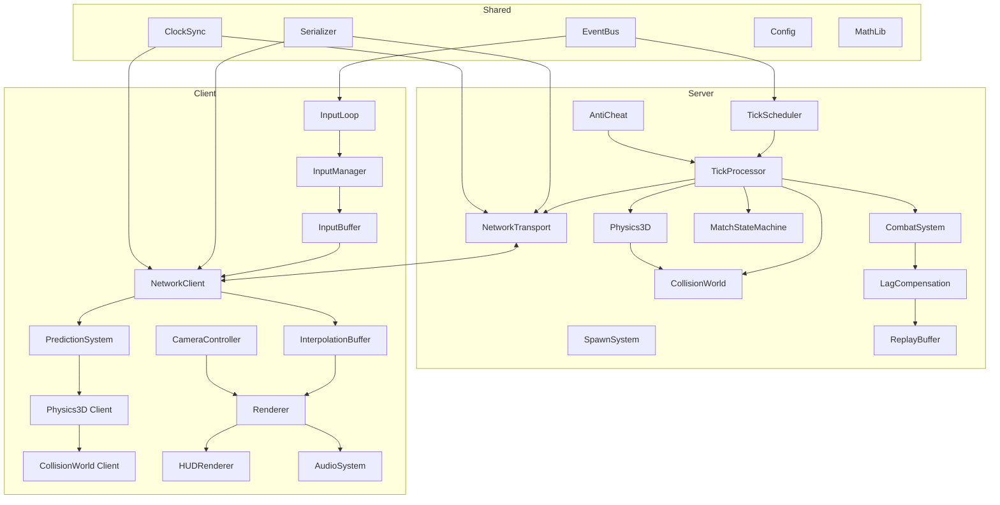

# Design Document: Arena 3D Physics Multiplayer

## Overview

This design document specifies a production-grade, server-authoritative multiplayer netcode and 3D physics system for a competitive 1v1 arena shooter. The architecture follows a layered, modular approach where each subsystem is independently testable, has explicit dependencies, and communicates through a typed event bus.

**Design Principles:**
1. **Determinism First**: All simulation code produces identical results given identical inputs
2. **Explicit Dependencies**: No hidden state, no singletons, all dependencies injected
3. **Result Types**: All fallible operations return `Result<T, E>`, never throw in game loop
4. **Event-Driven**: Cross-system communication via typed EventBus, no direct coupling
5. **Testable Layers**: Each layer can be tested in isolation with mock dependencies
6. **400 Line Limit**: No file exceeds 400 lines; split into focused modules

**Build Order Strategy:**
The system is built in layers, where each layer is fully tested before the next begins:

```
Layer 0: Core Primitives (Math, Result, EventBus)
Layer 1: Physics (Vector3, Collision, Physics3D)
Layer 2: Networking (Serialization, Transport, Clock)
Layer 3: Game Logic (Combat, Spawn, Match State)
Layer 4: Client Systems (Prediction, Interpolation, Input)
Layer 5: Presentation (Renderer, HUD, Audio)
Layer 6: Integration (Orchestrator, Debug)
```

## Architecture

### System Architecture Diagram



### Data Flow

**Server Tick Flow:**
```
1. TickScheduler triggers tick
2. TickProcessor acquires state lock
3. Process all pending inputs (sorted by sequence_number)
4. For each input: AntiCheat.validate() → Physics3D.step() → CollisionWorld.resolve()
5. CombatSystem processes fire commands with LagCompensation
6. MatchStateMachine evaluates transitions
7. Serializer creates snapshot
8. NetworkTransport broadcasts to clients
9. TickProcessor releases state lock
```

**Client Frame Flow:**
```
1. InputLoop captures input at frame start
2. InputManager packages input with timestamp
3. PredictionSystem applies input locally (Physics3D + CollisionWorld)
4. InputBuffer queues input for transmission
5. NetworkClient sends batched inputs
6. On state receive: InterpolationBuffer stores snapshot
7. PredictionSystem reconciles if needed
8. Renderer interpolates remote entities
9. HUD/Audio update from events
```

## Components and Interfaces

### Layer 0: Core Primitives

#### Result Type
```typescript
// File: src/core/Result.ts (~50 lines)

export type Result<T, E> = Ok<T> | Err<E>;

export interface Ok<T> {
  readonly ok: true;
  readonly value: T;
}

export interface Err<E> {
  readonly ok: false;
  readonly error: E;
}

export const Ok = <T>(value: T): Ok<T> => ({ ok: true, value });
export const Err = <E>(error: E): Err<E> => ({ ok: false, error });

export const isOk = <T, E>(result: Result<T, E>): result is Ok<T> => result.ok;
export const isErr = <T, E>(result: Result<T, E>): result is Err<E> => !result.ok;

export const unwrap = <T, E>(result: Result<T, E>): T => {
  if (isOk(result)) return result.value;
  throw new Error(`Unwrap called on Err: ${JSON.stringify(result.error)}`);
};

export const unwrapOr = <T, E>(result: Result<T, E>, defaultValue: T): T => {
  return isOk(result) ? result.value : defaultValue;
};

export const map = <T, U, E>(result: Result<T, E>, fn: (value: T) => U): Result<U, E> => {
  return isOk(result) ? Ok(fn(result.value)) : result;
};

export const flatMap = <T, U, E>(result: Result<T, E>, fn: (value: T) => Result<U, E>): Result<U, E> => {
  return isOk(result) ? fn(result.value) : result;
};
```

#### EventBus
```typescript
// File: src/core/EventBus.ts (~80 lines)

export interface GameEvent {
  readonly type: string;
  readonly timestamp: number;
}

export type EventHandler<T extends GameEvent> = (event: T) => void;

export interface IEventBus {
  emit<T extends GameEvent>(event: T): void;
  on<T extends GameEvent>(type: T['type'], handler: EventHandler<T>): () => void;
  off<T extends GameEvent>(type: T['type'], handler: EventHandler<T>): void;
  clear(): void;
}

export class EventBus implements IEventBus {
  private handlers: Map<string, Set<EventHandler<GameEvent>>> = new Map();

  emit<T extends GameEvent>(event: T): void {
    const typeHandlers = this.handlers.get(event.type);
    if (typeHandlers) {
      typeHandlers.forEach(handler => handler(event));
    }
  }

  on<T extends GameEvent>(type: string, handler: EventHandler<T>): () => void {
    if (!this.handlers.has(type)) {
      this.handlers.set(type, new Set());
    }
    this.handlers.get(type)!.add(handler as EventHandler<GameEvent>);
    return () => this.off(type, handler);
  }

  off<T extends GameEvent>(type: string, handler: EventHandler<T>): void {
    const typeHandlers = this.handlers.get(type);
    if (typeHandlers) {
      typeHandlers.delete(handler as EventHandler<GameEvent>);
    }
  }

  clear(): void {
    this.handlers.clear();
  }
}
```


#### Game Events Definition
```typescript
// File: src/core/GameEvents.ts (~120 lines)

import { GameEvent } from './EventBus';
import { Vector3 } from '../math/Vector3';

// System Events
export interface SystemReadyEvent extends GameEvent {
  type: 'system_ready';
  systemName: string;
}

export interface InitializationFailedEvent extends GameEvent {
  type: 'initialization_failed';
  systemName: string;
  error: string;
}

// Match Events
export interface MatchStateChangedEvent extends GameEvent {
  type: 'match_state_changed';
  previousState: MatchState;
  newState: MatchState;
}

export interface MatchStartEvent extends GameEvent {
  type: 'match_start';
  tickNumber: number;
}

export interface MatchEndEvent extends GameEvent {
  type: 'match_end';
  winnerId: number;
  finalScores: Map<number, number>;
}

// Player Events
export interface PlayerSpawnedEvent extends GameEvent {
  type: 'player_spawned';
  playerId: number;
  position: Vector3;
}

export interface PlayerDeathEvent extends GameEvent {
  type: 'player_death';
  victimId: number;
  killerId: number;
  position: Vector3;
}

export interface PlayerDamagedEvent extends GameEvent {
  type: 'player_damaged';
  victimId: number;
  attackerId: number;
  damage: number;
  hitPosition: Vector3;
}

// Combat Events
export interface WeaponFiredEvent extends GameEvent {
  type: 'weapon_fired';
  playerId: number;
  origin: Vector3;
  direction: Vector3;
}

export interface HitConfirmedEvent extends GameEvent {
  type: 'hit_confirmed';
  shooterId: number;
  targetId: number;
  hitPosition: Vector3;
  damage: number;
}

// Network Events
export interface ConnectionEstablishedEvent extends GameEvent {
  type: 'connection_established';
  playerId: number;
  rtt: number;
}

export interface ConnectionLostEvent extends GameEvent {
  type: 'connection_lost';
  playerId: number;
  reason: string;
}

export interface DesyncDetectedEvent extends GameEvent {
  type: 'desync_detected';
  predictionError: number;
  tickNumber: number;
}

// Input Events
export interface PointerLockedEvent extends GameEvent {
  type: 'pointer_locked';
}

export interface PointerReleasedEvent extends GameEvent {
  type: 'pointer_released';
}

export interface InputBufferOverflowEvent extends GameEvent {
  type: 'input_buffer_overflow';
  droppedCount: number;
}

// Anti-Cheat Events
export interface ViolationDetectedEvent extends GameEvent {
  type: 'violation_detected';
  playerId: number;
  violationType: ViolationType;
  details: string;
}

export interface PlayerKickedEvent extends GameEvent {
  type: 'player_kicked';
  playerId: number;
  reason: string;
  violationCount: number;
}

// System Lifecycle Events
export interface LandImpactEvent extends GameEvent {
  type: 'land_impact';
}

export interface ClockDriftDetectedEvent extends GameEvent {
  type: 'clock_drift_detected';
  drift: number;
}

export interface TickCatchupWarningEvent extends GameEvent {
  type: 'tick_catchup_warning';
  skippedTicks: number;
}

export interface TickHandlerErrorEvent extends GameEvent {
  type: 'tick_handler_error';
  tickNumber: number;
  error: string;
}

export type MatchState = 'waiting' | 'countdown' | 'playing' | 'ended' | 'cleanup';
export type ViolationType = 'speed_hack' | 'invalid_jump' | 'fire_rate' | 'timestamp_mismatch';
```

### Layer 1: Math and Physics Primitives

#### Vector3
```typescript
// File: src/math/Vector3.ts (~150 lines)

export interface IVector3 {
  readonly x: number;
  readonly y: number;
  readonly z: number;
}

export class Vector3 implements IVector3 {
  constructor(
    public readonly x: number = 0,
    public readonly y: number = 0,
    public readonly z: number = 0
  ) {}

  static readonly ZERO = new Vector3(0, 0, 0);
  static readonly UP = new Vector3(0, 1, 0);
  static readonly DOWN = new Vector3(0, -1, 0);
  static readonly FORWARD = new Vector3(0, 0, 1);

  add(other: IVector3): Vector3 {
    return new Vector3(this.x + other.x, this.y + other.y, this.z + other.z);
  }

  subtract(other: IVector3): Vector3 {
    return new Vector3(this.x - other.x, this.y - other.y, this.z - other.z);
  }

  scale(scalar: number): Vector3 {
    return new Vector3(this.x * scalar, this.y * scalar, this.z * scalar);
  }

  dot(other: IVector3): number {
    return this.x * other.x + this.y * other.y + this.z * other.z;
  }

  cross(other: IVector3): Vector3 {
    return new Vector3(
      this.y * other.z - this.z * other.y,
      this.z * other.x - this.x * other.z,
      this.x * other.y - this.y * other.x
    );
  }

  magnitude(): number {
    return Math.sqrt(this.x * this.x + this.y * this.y + this.z * this.z);
  }

  magnitudeSquared(): number {
    return this.x * this.x + this.y * this.y + this.z * this.z;
  }

  normalize(): Vector3 {
    const mag = this.magnitude();
    if (mag < 0.0001) return Vector3.ZERO;
    return this.scale(1 / mag);
  }

  distanceTo(other: IVector3): number {
    return this.subtract(other).magnitude();
  }

  lerp(other: IVector3, t: number): Vector3 {
    const clamped = Math.max(0, Math.min(1, t));
    return new Vector3(
      this.x + (other.x - this.x) * clamped,
      this.y + (other.y - this.y) * clamped,
      this.z + (other.z - this.z) * clamped
    );
  }

  equals(other: IVector3, epsilon: number = 0.0001): boolean {
    return (
      Math.abs(this.x - other.x) < epsilon &&
      Math.abs(this.y - other.y) < epsilon &&
      Math.abs(this.z - other.z) < epsilon
    );
  }

  toArray(): [number, number, number] {
    return [this.x, this.y, this.z];
  }

  static fromArray(arr: [number, number, number]): Vector3 {
    return new Vector3(arr[0], arr[1], arr[2]);
  }

  clone(): Vector3 {
    return new Vector3(this.x, this.y, this.z);
  }
}
```


#### AABB (Axis-Aligned Bounding Box)
```typescript
// File: src/physics/AABB.ts (~120 lines)

import { Vector3, IVector3 } from '../math/Vector3';
import { Result, Ok, Err } from '../core/Result';

export interface CollisionResult {
  readonly collided: boolean;
  readonly penetrationDepth: number;
  readonly normal: Vector3;
  readonly colliderId: string;
}

export interface IAABB {
  readonly id: string;
  readonly min: Vector3;
  readonly max: Vector3;
}

export class AABB implements IAABB {
  constructor(
    public readonly id: string,
    public readonly min: Vector3,
    public readonly max: Vector3
  ) {}

  static fromCenterSize(id: string, center: IVector3, size: IVector3): AABB {
    const halfSize = new Vector3(size.x / 2, size.y / 2, size.z / 2);
    return new AABB(
      id,
      new Vector3(center.x - halfSize.x, center.y - halfSize.y, center.z - halfSize.z),
      new Vector3(center.x + halfSize.x, center.y + halfSize.y, center.z + halfSize.z)
    );
  }

  center(): Vector3 {
    return new Vector3(
      (this.min.x + this.max.x) / 2,
      (this.min.y + this.max.y) / 2,
      (this.min.z + this.max.z) / 2
    );
  }

  size(): Vector3 {
    return new Vector3(
      this.max.x - this.min.x,
      this.max.y - this.min.y,
      this.max.z - this.min.z
    );
  }

  containsPoint(point: IVector3): boolean {
    return (
      point.x >= this.min.x && point.x <= this.max.x &&
      point.y >= this.min.y && point.y <= this.max.y &&
      point.z >= this.min.z && point.z <= this.max.z
    );
  }

  intersectsAABB(other: IAABB): boolean {
    return (
      this.min.x <= other.max.x && this.max.x >= other.min.x &&
      this.min.y <= other.max.y && this.max.y >= other.min.y &&
      this.min.z <= other.max.z && this.max.z >= other.min.z
    );
  }

  expand(amount: number): AABB {
    return new AABB(
      this.id,
      new Vector3(this.min.x - amount, this.min.y - amount, this.min.z - amount),
      new Vector3(this.max.x + amount, this.max.y + amount, this.max.z + amount)
    );
  }
}

export const NO_COLLISION: CollisionResult = {
  collided: false,
  penetrationDepth: 0,
  normal: Vector3.ZERO,
  colliderId: ''
};
```

#### Capsule Collider
```typescript
// File: src/physics/Capsule.ts (~100 lines)

import { Vector3, IVector3 } from '../math/Vector3';
import { AABB, CollisionResult, NO_COLLISION } from './AABB';

export interface ICapsule {
  readonly position: Vector3;  // Base center position
  readonly radius: number;
  readonly height: number;
}

export class Capsule implements ICapsule {
  constructor(
    public readonly position: Vector3,
    public readonly radius: number = 0.4,
    public readonly height: number = 1.8
  ) {}

  get top(): Vector3 {
    return new Vector3(this.position.x, this.position.y + this.height - this.radius, this.position.z);
  }

  get bottom(): Vector3 {
    return new Vector3(this.position.x, this.position.y + this.radius, this.position.z);
  }

  get center(): Vector3 {
    return new Vector3(this.position.x, this.position.y + this.height / 2, this.position.z);
  }

  get eyePosition(): Vector3 {
    return new Vector3(this.position.x, this.position.y + 1.6, this.position.z);
  }

  toBoundingAABB(): AABB {
    return new AABB(
      'capsule_bounds',
      new Vector3(
        this.position.x - this.radius,
        this.position.y,
        this.position.z - this.radius
      ),
      new Vector3(
        this.position.x + this.radius,
        this.position.y + this.height,
        this.position.z + this.radius
      )
    );
  }

  withPosition(newPosition: Vector3): Capsule {
    return new Capsule(newPosition, this.radius, this.height);
  }
}

export function capsuleVsAABB(capsule: Capsule, aabb: AABB): CollisionResult {
  // Find closest point on AABB to capsule line segment
  const segmentStart = capsule.bottom;
  const segmentEnd = capsule.top;
  
  // Clamp segment to AABB
  const closestOnSegment = closestPointOnSegmentToAABB(segmentStart, segmentEnd, aabb);
  const closestOnAABB = closestPointOnAABB(closestOnSegment, aabb);
  
  const distance = closestOnSegment.distanceTo(closestOnAABB);
  
  if (distance >= capsule.radius) {
    return NO_COLLISION;
  }
  
  const penetration = capsule.radius - distance;
  const normal = distance > 0.0001 
    ? closestOnSegment.subtract(closestOnAABB).normalize()
    : Vector3.UP;
  
  return {
    collided: true,
    penetrationDepth: penetration,
    normal,
    colliderId: aabb.id
  };
}

function closestPointOnAABB(point: Vector3, aabb: AABB): Vector3 {
  return new Vector3(
    Math.max(aabb.min.x, Math.min(point.x, aabb.max.x)),
    Math.max(aabb.min.y, Math.min(point.y, aabb.max.y)),
    Math.max(aabb.min.z, Math.min(point.z, aabb.max.z))
  );
}

function closestPointOnSegmentToAABB(start: Vector3, end: Vector3, aabb: AABB): Vector3 {
  const center = aabb.center();
  const dir = end.subtract(start);
  const len = dir.magnitude();
  if (len < 0.0001) return start;
  
  const t = Math.max(0, Math.min(1, start.subtract(center).scale(-1).dot(dir.normalize()) / len));
  return start.add(dir.scale(t));
}
```


#### Spatial Hash Grid
```typescript
// File: src/physics/SpatialHashGrid.ts (~120 lines)

import { AABB, IAABB } from './AABB';
import { IVector3 } from '../math/Vector3';

export interface ISpatialHashGrid {
  insert(aabb: AABB): void;
  remove(id: string): void;
  query(bounds: IAABB): AABB[];
  queryPoint(point: IVector3): AABB[];
  clear(): void;
}

export class SpatialHashGrid implements ISpatialHashGrid {
  private cells: Map<string, Set<AABB>> = new Map();
  private aabbToKeys: Map<string, Set<string>> = new Map();

  constructor(private readonly cellSize: number = 4) {}

  private hashKey(x: number, y: number, z: number): string {
    const cx = Math.floor(x / this.cellSize);
    const cy = Math.floor(y / this.cellSize);
    const cz = Math.floor(z / this.cellSize);
    return `${cx},${cy},${cz}`;
  }

  private getCellKeys(aabb: IAABB): Set<string> {
    const keys = new Set<string>();
    const minX = Math.floor(aabb.min.x / this.cellSize);
    const maxX = Math.floor(aabb.max.x / this.cellSize);
    const minY = Math.floor(aabb.min.y / this.cellSize);
    const maxY = Math.floor(aabb.max.y / this.cellSize);
    const minZ = Math.floor(aabb.min.z / this.cellSize);
    const maxZ = Math.floor(aabb.max.z / this.cellSize);

    for (let x = minX; x <= maxX; x++) {
      for (let y = minY; y <= maxY; y++) {
        for (let z = minZ; z <= maxZ; z++) {
          keys.add(`${x},${y},${z}`);
        }
      }
    }
    return keys;
  }

  insert(aabb: AABB): void {
    const keys = this.getCellKeys(aabb);
    this.aabbToKeys.set(aabb.id, keys);
    
    keys.forEach(key => {
      if (!this.cells.has(key)) {
        this.cells.set(key, new Set());
      }
      this.cells.get(key)!.add(aabb);
    });
  }

  remove(id: string): void {
    const keys = this.aabbToKeys.get(id);
    if (!keys) return;

    keys.forEach(key => {
      const cell = this.cells.get(key);
      if (cell) {
        cell.forEach(aabb => {
          if (aabb.id === id) cell.delete(aabb);
        });
      }
    });
    this.aabbToKeys.delete(id);
  }

  query(bounds: IAABB): AABB[] {
    const result: AABB[] = [];
    const seen = new Set<string>();
    const keys = this.getCellKeys(bounds);

    keys.forEach(key => {
      const cell = this.cells.get(key);
      if (cell) {
        cell.forEach(aabb => {
          if (!seen.has(aabb.id) && aabb.intersectsAABB(bounds)) {
            seen.add(aabb.id);
            result.push(aabb);
          }
        });
      }
    });
    return result;
  }

  queryPoint(point: IVector3): AABB[] {
    const key = this.hashKey(point.x, point.y, point.z);
    const cell = this.cells.get(key);
    if (!cell) return [];
    
    return Array.from(cell).filter(aabb => aabb.containsPoint(point));
  }

  clear(): void {
    this.cells.clear();
    this.aabbToKeys.clear();
  }
}
```

#### CollisionWorld
```typescript
// File: src/physics/CollisionWorld.ts (~150 lines)

import { AABB, CollisionResult, NO_COLLISION } from './AABB';
import { Capsule, capsuleVsAABB } from './Capsule';
import { SpatialHashGrid } from './SpatialHashGrid';
import { Vector3 } from '../math/Vector3';
import { Result, Ok, Err } from '../core/Result';

export interface CollisionManifest {
  readonly colliders: AABBDefinition[];
}

export interface AABBDefinition {
  readonly id: string;
  readonly center: [number, number, number];
  readonly size: [number, number, number];
}

export interface ICollisionWorld {
  loadManifest(manifest: CollisionManifest): Result<void, string>;
  testCapsule(capsule: Capsule): CollisionResult[];
  resolveCollisions(capsule: Capsule, velocity: Vector3): { position: Vector3; velocity: Vector3 };
  raycast(origin: Vector3, direction: Vector3, maxDistance: number): RaycastResult | null;
  clear(): void;
}

export interface RaycastResult {
  readonly hit: boolean;
  readonly point: Vector3;
  readonly normal: Vector3;
  readonly distance: number;
  readonly colliderId: string;
}

export class CollisionWorld implements ICollisionWorld {
  private grid: SpatialHashGrid;
  private staticColliders: Map<string, AABB> = new Map();

  constructor(cellSize: number = 4) {
    this.grid = new SpatialHashGrid(cellSize);
  }

  loadManifest(manifest: CollisionManifest): Result<void, string> {
    if (!manifest.colliders || !Array.isArray(manifest.colliders)) {
      return Err('Invalid manifest: colliders array required');
    }

    this.clear();

    for (const def of manifest.colliders) {
      if (!def.id || !def.center || !def.size) {
        return Err(`Invalid collider definition: ${JSON.stringify(def)}`);
      }

      const aabb = AABB.fromCenterSize(
        def.id,
        Vector3.fromArray(def.center),
        Vector3.fromArray(def.size)
      );
      this.staticColliders.set(def.id, aabb);
      this.grid.insert(aabb);
    }

    return Ok(undefined);
  }

  testCapsule(capsule: Capsule): CollisionResult[] {
    const bounds = capsule.toBoundingAABB();
    const candidates = this.grid.query(bounds);
    const results: CollisionResult[] = [];

    for (const aabb of candidates) {
      const result = capsuleVsAABB(capsule, aabb);
      if (result.collided) {
        results.push(result);
      }
    }

    return results;
  }

  resolveCollisions(capsule: Capsule, velocity: Vector3): { position: Vector3; velocity: Vector3 } {
    const MAX_ITERATIONS = 4;
    let currentPos = capsule.position;
    let currentVel = velocity;

    for (let i = 0; i < MAX_ITERATIONS; i++) {
      const testCapsule = capsule.withPosition(currentPos);
      const collisions = this.testCapsule(testCapsule);

      if (collisions.length === 0) break;

      // Find deepest penetration
      let deepest = collisions[0];
      for (const col of collisions) {
        if (col.penetrationDepth > deepest.penetrationDepth) {
          deepest = col;
        }
      }

      // Push out along normal
      currentPos = currentPos.add(deepest.normal.scale(deepest.penetrationDepth + 0.001));

      // Project velocity onto slide plane
      const velDotNormal = currentVel.dot(deepest.normal);
      if (velDotNormal < 0) {
        currentVel = currentVel.subtract(deepest.normal.scale(velDotNormal));
      }
    }

    return { position: currentPos, velocity: currentVel };
  }

  raycast(origin: Vector3, direction: Vector3, maxDistance: number): RaycastResult | null {
    const dir = direction.normalize();
    const endPoint = origin.add(dir.scale(maxDistance));
    
    // Create AABB encompassing ray
    const rayBounds = new AABB(
      'ray_bounds',
      new Vector3(
        Math.min(origin.x, endPoint.x),
        Math.min(origin.y, endPoint.y),
        Math.min(origin.z, endPoint.z)
      ),
      new Vector3(
        Math.max(origin.x, endPoint.x),
        Math.max(origin.y, endPoint.y),
        Math.max(origin.z, endPoint.z)
      )
    );

    const candidates = this.grid.query(rayBounds);
    let closest: RaycastResult | null = null;

    for (const aabb of candidates) {
      const result = rayVsAABB(origin, dir, aabb, maxDistance);
      if (result && (!closest || result.distance < closest.distance)) {
        closest = result;
      }
    }

    return closest;
  }

  clear(): void {
    this.grid.clear();
    this.staticColliders.clear();
  }
}

function rayVsAABB(origin: Vector3, dir: Vector3, aabb: AABB, maxDist: number): RaycastResult | null {
  let tmin = 0;
  let tmax = maxDist;
  let normal = Vector3.ZERO;

  const axes: ('x' | 'y' | 'z')[] = ['x', 'y', 'z'];
  const normals = [new Vector3(-1, 0, 0), new Vector3(0, -1, 0), new Vector3(0, 0, -1)];

  for (let i = 0; i < 3; i++) {
    const axis = axes[i];
    if (Math.abs(dir[axis]) < 0.0001) {
      if (origin[axis] < aabb.min[axis] || origin[axis] > aabb.max[axis]) {
        return null;
      }
    } else {
      let t1 = (aabb.min[axis] - origin[axis]) / dir[axis];
      let t2 = (aabb.max[axis] - origin[axis]) / dir[axis];
      let n = normals[i];

      if (t1 > t2) {
        [t1, t2] = [t2, t1];
        n = n.scale(-1);
      }

      if (t1 > tmin) {
        tmin = t1;
        normal = n;
      }
      tmax = Math.min(tmax, t2);

      if (tmin > tmax) return null;
    }
  }

  return {
    hit: true,
    point: origin.add(dir.scale(tmin)),
    normal,
    distance: tmin,
    colliderId: aabb.id
  };
}
```


#### Physics3D System
```typescript
// File: src/physics/Physics3D.ts (~200 lines)

import { Vector3 } from '../math/Vector3';
import { Capsule } from './Capsule';
import { ICollisionWorld } from './CollisionWorld';
import { IEventBus } from '../core/EventBus';

export interface PhysicsConfig {
  readonly gravity: number;           // -20 units/sec²
  readonly maxSpeed: number;          // 7 m/s
  readonly acceleration: number;      // 70 m/s² (0 to max in 0.1s)
  readonly friction: number;          // 140 m/s² (max to 0 in 0.05s)
  readonly airControl: number;        // 0.3 (30% of ground accel)
  readonly jumpVelocity: number;      // 8 m/s
  readonly terminalVelocity: number;  // 50 m/s
  readonly coyoteTime: number;        // 0.1 seconds
  readonly landingPenaltyDuration: number; // 0.05 seconds
  readonly landingPenaltyFactor: number;   // 0.5
}

export const DEFAULT_PHYSICS_CONFIG: PhysicsConfig = {
  gravity: -20,
  maxSpeed: 7,
  acceleration: 70,
  friction: 140,
  airControl: 0.3,
  jumpVelocity: 8,
  terminalVelocity: 50,
  coyoteTime: 0.1,
  landingPenaltyDuration: 0.05,
  landingPenaltyFactor: 0.5
};

export interface PlayerPhysicsState {
  position: Vector3;
  velocity: Vector3;
  isGrounded: boolean;
  lastGroundedTime: number;
  landingPenaltyEndTime: number;
}

export interface MovementInput {
  readonly forward: number;   // -1 to 1
  readonly right: number;     // -1 to 1
  readonly jump: boolean;
  readonly yaw: number;       // radians
}

export interface IPhysics3D {
  step(
    state: PlayerPhysicsState,
    input: MovementInput,
    deltaTime: number,
    currentTime: number
  ): PlayerPhysicsState;
}

export class Physics3D implements IPhysics3D {
  constructor(
    private readonly config: PhysicsConfig,
    private readonly collisionWorld: ICollisionWorld,
    private readonly eventBus: IEventBus
  ) {}

  step(
    state: PlayerPhysicsState,
    input: MovementInput,
    deltaTime: number,
    currentTime: number
  ): PlayerPhysicsState {
    let { position, velocity, isGrounded, lastGroundedTime, landingPenaltyEndTime } = state;

    // 1. Apply gravity if airborne
    if (!isGrounded) {
      velocity = this.applyGravity(velocity, deltaTime);
    }

    // 2. Calculate movement direction in world space
    const moveDir = this.calculateMoveDirection(input);

    // 3. Apply acceleration/friction based on grounded state
    const accelFactor = isGrounded ? 1.0 : this.config.airControl;
    const speedFactor = currentTime < landingPenaltyEndTime ? this.config.landingPenaltyFactor : 1.0;
    
    velocity = this.applyMovement(velocity, moveDir, accelFactor, speedFactor, deltaTime, isGrounded);

    // 4. Handle jump
    if (input.jump && this.canJump(isGrounded, lastGroundedTime, currentTime)) {
      velocity = new Vector3(velocity.x, this.config.jumpVelocity, velocity.z);
      isGrounded = false;
    }

    // 5. Clamp to terminal velocity
    velocity = this.clampVelocity(velocity);

    // 6. Move and resolve collisions
    const newPosition = position.add(velocity.scale(deltaTime));
    const capsule = new Capsule(newPosition);
    const resolved = this.collisionWorld.resolveCollisions(capsule, velocity);
    
    position = resolved.position;
    velocity = resolved.velocity;

    // 7. Ground check
    const wasGrounded = isGrounded;
    isGrounded = this.checkGrounded(position);

    // 8. Update grounded time and landing penalty
    if (isGrounded) {
      lastGroundedTime = currentTime;
      if (!wasGrounded && velocity.y < -2) {
        landingPenaltyEndTime = currentTime + this.config.landingPenaltyDuration;
        this.eventBus.emit({ type: 'land_impact', timestamp: currentTime });
      }
    }

    return {
      position,
      velocity,
      isGrounded,
      lastGroundedTime,
      landingPenaltyEndTime
    };
  }

  private applyGravity(velocity: Vector3, deltaTime: number): Vector3 {
    return new Vector3(
      velocity.x,
      velocity.y + this.config.gravity * deltaTime,
      velocity.z
    );
  }

  private calculateMoveDirection(input: MovementInput): Vector3 {
    const forward = new Vector3(
      -Math.sin(input.yaw),
      0,
      -Math.cos(input.yaw)
    );
    const right = new Vector3(
      Math.cos(input.yaw),
      0,
      -Math.sin(input.yaw)
    );

    let dir = Vector3.ZERO;
    dir = dir.add(forward.scale(input.forward));
    dir = dir.add(right.scale(input.right));

    const mag = dir.magnitude();
    if (mag > 1) {
      dir = dir.scale(1 / mag);
    }

    return dir;
  }

  private applyMovement(
    velocity: Vector3,
    moveDir: Vector3,
    accelFactor: number,
    speedFactor: number,
    deltaTime: number,
    isGrounded: boolean
  ): Vector3 {
    const horizontalVel = new Vector3(velocity.x, 0, velocity.z);
    const targetSpeed = this.config.maxSpeed * speedFactor;

    if (moveDir.magnitudeSquared() > 0.01) {
      // Accelerate toward target
      const targetVel = moveDir.scale(targetSpeed);
      const accel = this.config.acceleration * accelFactor * deltaTime;
      const newHorizontal = this.moveToward(horizontalVel, targetVel, accel);
      return new Vector3(newHorizontal.x, velocity.y, newHorizontal.z);
    } else if (isGrounded) {
      // Apply friction when no input
      const friction = this.config.friction * deltaTime;
      const newHorizontal = this.moveToward(horizontalVel, Vector3.ZERO, friction);
      return new Vector3(newHorizontal.x, velocity.y, newHorizontal.z);
    }

    return velocity;
  }

  private moveToward(current: Vector3, target: Vector3, maxDelta: number): Vector3 {
    const diff = target.subtract(current);
    const dist = diff.magnitude();
    if (dist <= maxDelta || dist < 0.0001) {
      return target;
    }
    return current.add(diff.scale(maxDelta / dist));
  }

  private canJump(isGrounded: boolean, lastGroundedTime: number, currentTime: number): boolean {
    if (isGrounded) return true;
    return (currentTime - lastGroundedTime) <= this.config.coyoteTime;
  }

  private clampVelocity(velocity: Vector3): Vector3 {
    const mag = velocity.magnitude();
    if (mag > this.config.terminalVelocity) {
      return velocity.scale(this.config.terminalVelocity / mag);
    }
    return velocity;
  }

  private checkGrounded(position: Vector3): boolean {
    // Cast a short ray downward from capsule base
    const rayOrigin = new Vector3(position.x, position.y + 0.1, position.z);
    const result = this.collisionWorld.raycast(rayOrigin, Vector3.DOWN, 0.15);
    return result !== null;
  }
}
```


### Layer 2: Networking

#### Serialization Protocol
```typescript
// File: src/network/Serializer.ts (~180 lines)

import { Vector3 } from '../math/Vector3';
import { Result, Ok, Err } from '../core/Result';

export enum MessageType {
  INPUT = 0x01,
  STATE_SNAPSHOT = 0x02,
  STATE_DELTA = 0x03,
  CLOCK_SYNC_REQUEST = 0x04,
  CLOCK_SYNC_RESPONSE = 0x05,
  INPUT_ACK = 0x06,
  FULL_STATE_REQUEST = 0x07,
  PLAYER_EVENT = 0x08,
  MATCH_EVENT = 0x09,
  KEEPALIVE = 0x0A
}

export interface InputPacket {
  readonly sequenceNumber: number;
  readonly tickNumber: number;
  readonly movementX: number;      // -127 to 127
  readonly movementY: number;      // -127 to 127
  readonly lookDeltaX: number;     // -32768 to 32767
  readonly lookDeltaY: number;     // -32768 to 32767
  readonly buttons: number;        // bitfield
  readonly clientTimestamp: number;
}

export interface PlayerState {
  readonly entityId: number;
  readonly position: Vector3;
  readonly pitch: number;
  readonly yaw: number;
  readonly velocity: Vector3;
  readonly health: number;
  readonly stateFlags: number;     // grounded, invulnerable, etc.
}

export interface StateSnapshot {
  readonly tickNumber: number;
  readonly serverTimestamp: number;
  readonly players: PlayerState[];
  readonly matchState: number;
  readonly scores: Map<number, number>;
}

export interface ISerializer {
  serializeInput(input: InputPacket): ArrayBuffer;
  deserializeInput(buffer: ArrayBuffer): Result<InputPacket, string>;
  serializeSnapshot(snapshot: StateSnapshot): ArrayBuffer;
  deserializeSnapshot(buffer: ArrayBuffer): Result<StateSnapshot, string>;
  serializeDelta(current: StateSnapshot, baseline: StateSnapshot): ArrayBuffer;
  deserializeDelta(buffer: ArrayBuffer, baseline: StateSnapshot): Result<StateSnapshot, string>;
}

export class BinarySerializer implements ISerializer {
  serializeInput(input: InputPacket): ArrayBuffer {
    const buffer = new ArrayBuffer(23);
    const view = new DataView(buffer);
    let offset = 0;

    view.setUint8(offset++, MessageType.INPUT);
    view.setUint32(offset, input.sequenceNumber, true); offset += 4;
    view.setUint32(offset, input.tickNumber, true); offset += 4;
    view.setInt8(offset++, Math.round(input.movementX * 127));
    view.setInt8(offset++, Math.round(input.movementY * 127));
    view.setInt16(offset, Math.round(input.lookDeltaX), true); offset += 2;
    view.setInt16(offset, Math.round(input.lookDeltaY), true); offset += 2;
    view.setUint8(offset++, input.buttons);
    view.setFloat64(offset, input.clientTimestamp, true);

    return buffer;
  }

  deserializeInput(buffer: ArrayBuffer): Result<InputPacket, string> {
    if (buffer.byteLength < 23) {
      return Err('Input packet too small');
    }

    const view = new DataView(buffer);
    let offset = 0;

    const type = view.getUint8(offset++);
    if (type !== MessageType.INPUT) {
      return Err(`Expected INPUT message, got ${type}`);
    }

    const sequenceNumber = view.getUint32(offset, true); offset += 4;
    const tickNumber = view.getUint32(offset, true); offset += 4;
    const movementX = view.getInt8(offset++) / 127;
    const movementY = view.getInt8(offset++) / 127;
    const lookDeltaX = view.getInt16(offset, true); offset += 2;
    const lookDeltaY = view.getInt16(offset, true); offset += 2;
    const buttons = view.getUint8(offset++);
    const clientTimestamp = view.getFloat64(offset, true);

    return Ok({
      sequenceNumber,
      tickNumber,
      movementX,
      movementY,
      lookDeltaX,
      lookDeltaY,
      buttons,
      clientTimestamp
    });
  }

  serializeSnapshot(snapshot: StateSnapshot): ArrayBuffer {
    // Header: type(1) + tick(4) + timestamp(8) + matchState(1) + playerCount(1) = 15
    // Per player: entityId(2) + pos(12) + pitch(4) + yaw(4) + vel(12) + health(1) + flags(1) = 36
    const playerCount = snapshot.players.length;
    const scoreCount = snapshot.scores.size;
    const size = 15 + (playerCount * 36) + (scoreCount * 6);
    
    const buffer = new ArrayBuffer(size);
    const view = new DataView(buffer);
    let offset = 0;

    view.setUint8(offset++, MessageType.STATE_SNAPSHOT);
    view.setUint32(offset, snapshot.tickNumber, true); offset += 4;
    view.setFloat64(offset, snapshot.serverTimestamp, true); offset += 8;
    view.setUint8(offset++, snapshot.matchState);
    view.setUint8(offset++, playerCount);

    for (const player of snapshot.players) {
      view.setUint16(offset, player.entityId, true); offset += 2;
      view.setFloat32(offset, player.position.x, true); offset += 4;
      view.setFloat32(offset, player.position.y, true); offset += 4;
      view.setFloat32(offset, player.position.z, true); offset += 4;
      view.setFloat32(offset, player.pitch, true); offset += 4;
      view.setFloat32(offset, player.yaw, true); offset += 4;
      view.setFloat32(offset, player.velocity.x, true); offset += 4;
      view.setFloat32(offset, player.velocity.y, true); offset += 4;
      view.setFloat32(offset, player.velocity.z, true); offset += 4;
      view.setUint8(offset++, player.health);
      view.setUint8(offset++, player.stateFlags);
    }

    // Scores
    view.setUint8(offset++, scoreCount);
    snapshot.scores.forEach((score, playerId) => {
      view.setUint16(offset, playerId, true); offset += 2;
      view.setUint32(offset, score, true); offset += 4;
    });

    return buffer;
  }

  deserializeSnapshot(buffer: ArrayBuffer): Result<StateSnapshot, string> {
    if (buffer.byteLength < 15) {
      return Err('Snapshot packet too small');
    }

    const view = new DataView(buffer);
    let offset = 0;

    const type = view.getUint8(offset++);
    if (type !== MessageType.STATE_SNAPSHOT) {
      return Err(`Expected STATE_SNAPSHOT message, got ${type}`);
    }

    const tickNumber = view.getUint32(offset, true); offset += 4;
    const serverTimestamp = view.getFloat64(offset, true); offset += 8;
    const matchState = view.getUint8(offset++);
    const playerCount = view.getUint8(offset++);

    const players: PlayerState[] = [];
    for (let i = 0; i < playerCount; i++) {
      const entityId = view.getUint16(offset, true); offset += 2;
      const px = view.getFloat32(offset, true); offset += 4;
      const py = view.getFloat32(offset, true); offset += 4;
      const pz = view.getFloat32(offset, true); offset += 4;
      const pitch = view.getFloat32(offset, true); offset += 4;
      const yaw = view.getFloat32(offset, true); offset += 4;
      const vx = view.getFloat32(offset, true); offset += 4;
      const vy = view.getFloat32(offset, true); offset += 4;
      const vz = view.getFloat32(offset, true); offset += 4;
      const health = view.getUint8(offset++);
      const stateFlags = view.getUint8(offset++);

      players.push({
        entityId,
        position: new Vector3(px, py, pz),
        pitch,
        yaw,
        velocity: new Vector3(vx, vy, vz),
        health,
        stateFlags
      });
    }

    const scoreCount = view.getUint8(offset++);
    const scores = new Map<number, number>();
    for (let i = 0; i < scoreCount; i++) {
      const playerId = view.getUint16(offset, true); offset += 2;
      const score = view.getUint32(offset, true); offset += 4;
      scores.set(playerId, score);
    }

    return Ok({ tickNumber, serverTimestamp, players, matchState, scores });
  }

  serializeDelta(current: StateSnapshot, baseline: StateSnapshot): ArrayBuffer {
    // Simplified: just send full snapshot for now
    // Production would use bitmask of changed fields
    return this.serializeSnapshot(current);
  }

  deserializeDelta(buffer: ArrayBuffer, baseline: StateSnapshot): Result<StateSnapshot, string> {
    return this.deserializeSnapshot(buffer);
  }
}
```


#### Clock Synchronization
```typescript
// File: src/network/ClockSync.ts (~120 lines)

import { Result, Ok, Err } from '../core/Result';
import { IEventBus } from '../core/EventBus';

export interface ClockSyncConfig {
  readonly sampleCount: number;        // 5
  readonly resyncThresholdMs: number;  // 50
  readonly smoothingDurationMs: number; // 500
}

export const DEFAULT_CLOCK_SYNC_CONFIG: ClockSyncConfig = {
  sampleCount: 5,
  resyncThresholdMs: 50,
  smoothingDurationMs: 500
};

export interface IClockSync {
  recordSample(clientSendTime: number, serverTime: number, clientReceiveTime: number): void;
  isCalibrated(): boolean;
  getOffset(): number;
  getRTT(): number;
  serverTimeToLocal(serverTime: number): number;
  localTimeToServer(localTime: number): number;
  checkDrift(serverTime: number, localTime: number): boolean;
}

export class ClockSync implements IClockSync {
  private samples: { offset: number; rtt: number }[] = [];
  private calibratedOffset: number = 0;
  private calibratedRTT: number = 0;
  private isReady: boolean = false;

  constructor(
    private readonly config: ClockSyncConfig,
    private readonly eventBus: IEventBus
  ) {}

  recordSample(clientSendTime: number, serverTime: number, clientReceiveTime: number): void {
    const rtt = clientReceiveTime - clientSendTime;
    const oneWayLatency = rtt / 2;
    const offset = serverTime - (clientSendTime + oneWayLatency);

    this.samples.push({ offset, rtt });

    if (this.samples.length > this.config.sampleCount) {
      this.samples.shift();
    }

    if (this.samples.length >= this.config.sampleCount) {
      this.calibrate();
    }
  }

  private calibrate(): void {
    // Use median to reject outliers
    const sortedOffsets = [...this.samples].sort((a, b) => a.offset - b.offset);
    const sortedRTTs = [...this.samples].sort((a, b) => a.rtt - b.rtt);
    
    const medianIndex = Math.floor(sortedOffsets.length / 2);
    this.calibratedOffset = sortedOffsets[medianIndex].offset;
    this.calibratedRTT = sortedRTTs[medianIndex].rtt;
    this.isReady = true;
  }

  isCalibrated(): boolean {
    return this.isReady;
  }

  getOffset(): number {
    return this.calibratedOffset;
  }

  getRTT(): number {
    return this.calibratedRTT;
  }

  serverTimeToLocal(serverTime: number): number {
    return serverTime - this.calibratedOffset;
  }

  localTimeToServer(localTime: number): number {
    return localTime + this.calibratedOffset;
  }

  checkDrift(serverTime: number, localTime: number): boolean {
    const expectedServerTime = this.localTimeToServer(localTime);
    const drift = Math.abs(serverTime - expectedServerTime);
    
    if (drift > this.config.resyncThresholdMs) {
      this.eventBus.emit({
        type: 'clock_drift_detected',
        timestamp: localTime,
        drift
      });
      this.samples = []; // Force recalibration
      this.isReady = false;
      return true;
    }
    
    return false;
  }
}
```

#### Network Transport
```typescript
// File: src/network/NetworkTransport.ts (~150 lines)

import { Result, Ok, Err } from '../core/Result';
import { IEventBus } from '../core/EventBus';

export interface NetworkConfig {
  readonly serverUrl: string;
  readonly keepaliveIntervalMs: number;  // 5000
  readonly reconnectDelayMs: number;     // 1000
  readonly maxReconnectDelayMs: number;  // 30000
  readonly connectionTimeoutMs: number;  // 10000
}

export interface INetworkTransport {
  connect(): Promise<Result<void, string>>;
  disconnect(): void;
  send(data: ArrayBuffer): Result<void, string>;
  onMessage(handler: (data: ArrayBuffer) => void): () => void;
  isConnected(): boolean;
  getConnectionState(): ConnectionState;
}

export type ConnectionState = 'disconnected' | 'connecting' | 'connected' | 'reconnecting';

export class WebSocketTransport implements INetworkTransport {
  private socket: WebSocket | null = null;
  private state: ConnectionState = 'disconnected';
  private messageHandlers: Set<(data: ArrayBuffer) => void> = new Set();
  private keepaliveTimer: number | null = null;
  private reconnectAttempts: number = 0;

  constructor(
    private readonly config: NetworkConfig,
    private readonly eventBus: IEventBus
  ) {}

  async connect(): Promise<Result<void, string>> {
    if (this.state === 'connected' || this.state === 'connecting') {
      return Ok(undefined);
    }

    this.state = 'connecting';

    return new Promise((resolve) => {
      const timeout = setTimeout(() => {
        this.socket?.close();
        this.state = 'disconnected';
        resolve(Err('Connection timeout'));
      }, this.config.connectionTimeoutMs);

      try {
        this.socket = new WebSocket(this.config.serverUrl);
        this.socket.binaryType = 'arraybuffer';

        this.socket.onopen = () => {
          clearTimeout(timeout);
          this.state = 'connected';
          this.reconnectAttempts = 0;
          this.startKeepalive();
          this.eventBus.emit({ type: 'connection_established', timestamp: Date.now(), playerId: 0, rtt: 0 });
          resolve(Ok(undefined));
        };

        this.socket.onclose = (event) => {
          clearTimeout(timeout);
          this.handleDisconnect(event.reason || 'Connection closed');
        };

        this.socket.onerror = () => {
          clearTimeout(timeout);
          this.state = 'disconnected';
          resolve(Err('WebSocket error'));
        };

        this.socket.onmessage = (event) => {
          if (event.data instanceof ArrayBuffer) {
            this.messageHandlers.forEach(handler => handler(event.data));
          }
        };
      } catch (error) {
        clearTimeout(timeout);
        this.state = 'disconnected';
        resolve(Err(`Failed to create WebSocket: ${error}`));
      }
    });
  }

  disconnect(): void {
    this.stopKeepalive();
    this.socket?.close();
    this.socket = null;
    this.state = 'disconnected';
  }

  send(data: ArrayBuffer): Result<void, string> {
    if (!this.socket || this.state !== 'connected') {
      return Err('Not connected');
    }

    try {
      this.socket.send(data);
      return Ok(undefined);
    } catch (error) {
      return Err(`Send failed: ${error}`);
    }
  }

  onMessage(handler: (data: ArrayBuffer) => void): () => void {
    this.messageHandlers.add(handler);
    return () => this.messageHandlers.delete(handler);
  }

  isConnected(): boolean {
    return this.state === 'connected';
  }

  getConnectionState(): ConnectionState {
    return this.state;
  }

  private handleDisconnect(reason: string): void {
    this.stopKeepalive();
    this.state = 'disconnected';
    this.eventBus.emit({ type: 'connection_lost', timestamp: Date.now(), playerId: 0, reason });
    this.attemptReconnect();
  }

  private attemptReconnect(): void {
    this.state = 'reconnecting';
    const delay = Math.min(
      this.config.reconnectDelayMs * Math.pow(2, this.reconnectAttempts),
      this.config.maxReconnectDelayMs
    );
    this.reconnectAttempts++;

    setTimeout(() => {
      if (this.state === 'reconnecting') {
        this.connect();
      }
    }, delay);
  }

  private startKeepalive(): void {
    this.keepaliveTimer = window.setInterval(() => {
      const keepalive = new ArrayBuffer(1);
      new DataView(keepalive).setUint8(0, 0x0A); // KEEPALIVE
      this.send(keepalive);
    }, this.config.keepaliveIntervalMs);
  }

  private stopKeepalive(): void {
    if (this.keepaliveTimer !== null) {
      clearInterval(this.keepaliveTimer);
      this.keepaliveTimer = null;
    }
  }
}
```


### Layer 3: Game Logic

#### Match State Machine
```typescript
// File: src/game/MatchStateMachine.ts (~150 lines)

import { IEventBus } from '../core/EventBus';
import { MatchState, MatchStateChangedEvent, MatchStartEvent, MatchEndEvent } from '../core/GameEvents';

export interface MatchConfig {
  readonly countdownDurationMs: number;  // 3000
  readonly resultsDurationMs: number;    // 5000
  readonly killsToWin: number;           // 10
  readonly requiredPlayers: number;      // 2
}

export const DEFAULT_MATCH_CONFIG: MatchConfig = {
  countdownDurationMs: 3000,
  resultsDurationMs: 5000,
  killsToWin: 10,
  requiredPlayers: 2
};

export interface IMatchStateMachine {
  getState(): MatchState;
  getCountdownRemaining(): number;
  getScores(): Map<number, number>;
  getWinnerId(): number | null;
  
  playerConnected(playerId: number): void;
  playerDisconnected(playerId: number): void;
  recordKill(killerId: number, victimId: number): void;
  update(currentTime: number): void;
}

export class MatchStateMachine implements IMatchStateMachine {
  private state: MatchState = 'waiting';
  private connectedPlayers: Set<number> = new Set();
  private scores: Map<number, number> = new Map();
  private winnerId: number | null = null;
  private stateStartTime: number = 0;
  private currentTime: number = 0;

  constructor(
    private readonly config: MatchConfig,
    private readonly eventBus: IEventBus
  ) {}

  getState(): MatchState {
    return this.state;
  }

  getCountdownRemaining(): number {
    if (this.state !== 'countdown') return 0;
    const elapsed = this.currentTime - this.stateStartTime;
    return Math.max(0, this.config.countdownDurationMs - elapsed);
  }

  getScores(): Map<number, number> {
    return new Map(this.scores);
  }

  getWinnerId(): number | null {
    return this.winnerId;
  }

  playerConnected(playerId: number): void {
    this.connectedPlayers.add(playerId);
    this.scores.set(playerId, 0);
    this.checkTransitions();
  }

  playerDisconnected(playerId: number): void {
    this.connectedPlayers.delete(playerId);
    
    if (this.state === 'playing' && this.connectedPlayers.size < this.config.requiredPlayers) {
      // Award victory to remaining player
      const remainingPlayer = this.connectedPlayers.values().next().value;
      if (remainingPlayer !== undefined) {
        this.winnerId = remainingPlayer;
        this.transitionTo('ended');
      }
    }
  }

  recordKill(killerId: number, victimId: number): void {
    if (this.state !== 'playing') return;

    const currentScore = this.scores.get(killerId) ?? 0;
    const newScore = currentScore + 1;
    this.scores.set(killerId, newScore);

    if (newScore >= this.config.killsToWin) {
      this.winnerId = killerId;
      this.transitionTo('ended');
    }
  }

  update(currentTime: number): void {
    this.currentTime = currentTime;
    this.checkTransitions();
  }

  private checkTransitions(): void {
    switch (this.state) {
      case 'waiting':
        if (this.connectedPlayers.size >= this.config.requiredPlayers) {
          this.transitionTo('countdown');
        }
        break;

      case 'countdown':
        if (this.connectedPlayers.size < this.config.requiredPlayers) {
          this.transitionTo('waiting');
        } else if (this.currentTime - this.stateStartTime >= this.config.countdownDurationMs) {
          this.transitionTo('playing');
        }
        break;

      case 'playing':
        // Transitions handled by recordKill and playerDisconnected
        break;

      case 'ended':
        if (this.currentTime - this.stateStartTime >= this.config.resultsDurationMs) {
          this.transitionTo('cleanup');
        }
        break;

      case 'cleanup':
        // Terminal state - match should be destroyed
        break;
    }
  }

  private transitionTo(newState: MatchState): void {
    const previousState = this.state;
    this.state = newState;
    this.stateStartTime = this.currentTime;

    this.eventBus.emit<MatchStateChangedEvent>({
      type: 'match_state_changed',
      timestamp: this.currentTime,
      previousState,
      newState
    });

    if (newState === 'playing') {
      this.eventBus.emit<MatchStartEvent>({
        type: 'match_start',
        timestamp: this.currentTime,
        tickNumber: 0
      });
    }

    if (newState === 'ended') {
      this.eventBus.emit<MatchEndEvent>({
        type: 'match_end',
        timestamp: this.currentTime,
        winnerId: this.winnerId ?? -1,
        finalScores: this.getScores()
      });
    }
  }
}
```

#### Spawn System
```typescript
// File: src/game/SpawnSystem.ts (~120 lines)

import { Vector3 } from '../math/Vector3';
import { IEventBus } from '../core/EventBus';
import { PlayerSpawnedEvent } from '../core/GameEvents';

export interface SpawnPoint {
  readonly id: string;
  readonly position: Vector3;
  readonly lookDirection: Vector3;
}

export interface SpawnManifest {
  readonly spawnPoints: SpawnPointDefinition[];
  readonly arenaCenter: [number, number, number];
}

export interface SpawnPointDefinition {
  readonly id: string;
  readonly position: [number, number, number];
}

export interface ISpawnSystem {
  loadManifest(manifest: SpawnManifest): void;
  selectSpawnPoint(playerId: number, otherPlayerPositions: Vector3[]): SpawnPoint;
  getSpawnPoints(): SpawnPoint[];
}

export class SpawnSystem implements ISpawnSystem {
  private spawnPoints: SpawnPoint[] = [];
  private arenaCenter: Vector3 = Vector3.ZERO;
  private lastUsedTimes: Map<string, number> = new Map();
  private currentTime: number = 0;

  constructor(private readonly eventBus: IEventBus) {}

  loadManifest(manifest: SpawnManifest): void {
    this.arenaCenter = Vector3.fromArray(manifest.arenaCenter);
    
    this.spawnPoints = manifest.spawnPoints.map(def => {
      const position = Vector3.fromArray(def.position);
      const lookDirection = this.arenaCenter.subtract(position).normalize();
      return {
        id: def.id,
        position,
        lookDirection
      };
    });

    // Initialize last used times
    this.spawnPoints.forEach(sp => this.lastUsedTimes.set(sp.id, 0));
  }

  selectSpawnPoint(playerId: number, otherPlayerPositions: Vector3[]): SpawnPoint {
    if (this.spawnPoints.length === 0) {
      throw new Error('No spawn points loaded');
    }

    // Score each spawn point
    let bestSpawn = this.spawnPoints[0];
    let bestScore = -Infinity;

    for (const spawn of this.spawnPoints) {
      let score = 0;

      // Distance from enemies (higher is better)
      for (const enemyPos of otherPlayerPositions) {
        const dist = spawn.position.distanceTo(enemyPos);
        score += dist;
      }

      // Bonus for not recently used
      const lastUsed = this.lastUsedTimes.get(spawn.id) ?? 0;
      const timeSinceUsed = this.currentTime - lastUsed;
      score += timeSinceUsed * 0.001; // Small bonus per ms

      // Check if blocked (within 3m of any player)
      const isBlocked = otherPlayerPositions.some(
        pos => spawn.position.distanceTo(pos) < 3
      );
      if (isBlocked) {
        score -= 1000; // Heavy penalty
      }

      if (score > bestScore) {
        bestScore = score;
        bestSpawn = spawn;
      }
    }

    this.lastUsedTimes.set(bestSpawn.id, this.currentTime);

    this.eventBus.emit<PlayerSpawnedEvent>({
      type: 'player_spawned',
      timestamp: this.currentTime,
      playerId,
      position: bestSpawn.position
    });

    return bestSpawn;
  }

  getSpawnPoints(): SpawnPoint[] {
    return [...this.spawnPoints];
  }

  setCurrentTime(time: number): void {
    this.currentTime = time;
  }
}
```


#### Combat System
```typescript
// File: src/game/CombatSystem.ts (~180 lines)

import { Vector3 } from '../math/Vector3';
import { Capsule } from '../physics/Capsule';
import { ICollisionWorld, RaycastResult } from '../physics/CollisionWorld';
import { IEventBus } from '../core/EventBus';
import { WeaponFiredEvent, HitConfirmedEvent, PlayerDamagedEvent, PlayerDeathEvent } from '../core/GameEvents';
import { Result, Ok, Err } from '../core/Result';

export interface CombatConfig {
  readonly weaponDamage: number;           // 25
  readonly weaponRange: number;            // 100
  readonly fireRateCooldownMs: number;     // 200 (5 shots/sec)
  readonly respawnTimeMs: number;          // 3000
  readonly invulnerabilityDurationMs: number; // 2000
  readonly maxHealth: number;              // 100
}

export const DEFAULT_COMBAT_CONFIG: CombatConfig = {
  weaponDamage: 25,
  weaponRange: 100,
  fireRateCooldownMs: 200,
  respawnTimeMs: 3000,
  invulnerabilityDurationMs: 2000,
  maxHealth: 100
};

export interface PlayerCombatState {
  health: number;
  lastFireTime: number;
  deathTime: number | null;
  respawnTime: number | null;
  invulnerableUntil: number;
  isDead: boolean;
}

export interface FireCommand {
  readonly playerId: number;
  readonly origin: Vector3;
  readonly direction: Vector3;
  readonly clientTimestamp: number;
}

export interface ICombatSystem {
  initializePlayer(playerId: number): void;
  removePlayer(playerId: number): void;
  getPlayerState(playerId: number): PlayerCombatState | undefined;
  
  processFire(
    command: FireCommand,
    playerCapsules: Map<number, Capsule>,
    currentTime: number
  ): Result<HitResult | null, string>;
  
  applyDamage(victimId: number, attackerId: number, damage: number, hitPosition: Vector3, currentTime: number): void;
  update(currentTime: number): number[]; // Returns list of players ready to respawn
  respawnPlayer(playerId: number, currentTime: number): void;
}

export interface HitResult {
  readonly targetId: number;
  readonly hitPosition: Vector3;
  readonly damage: number;
}

export class CombatSystem implements ICombatSystem {
  private playerStates: Map<number, PlayerCombatState> = new Map();

  constructor(
    private readonly config: CombatConfig,
    private readonly collisionWorld: ICollisionWorld,
    private readonly eventBus: IEventBus
  ) {}

  initializePlayer(playerId: number): void {
    this.playerStates.set(playerId, {
      health: this.config.maxHealth,
      lastFireTime: 0,
      deathTime: null,
      respawnTime: null,
      invulnerableUntil: 0,
      isDead: false
    });
  }

  removePlayer(playerId: number): void {
    this.playerStates.delete(playerId);
  }

  getPlayerState(playerId: number): PlayerCombatState | undefined {
    return this.playerStates.get(playerId);
  }

  processFire(
    command: FireCommand,
    playerCapsules: Map<number, Capsule>,
    currentTime: number
  ): Result<HitResult | null, string> {
    const shooterState = this.playerStates.get(command.playerId);
    if (!shooterState) {
      return Err('Player not found');
    }

    if (shooterState.isDead) {
      return Err('Cannot fire while dead');
    }

    // Check fire rate
    if (currentTime - shooterState.lastFireTime < this.config.fireRateCooldownMs) {
      return Err('Fire rate exceeded');
    }

    shooterState.lastFireTime = currentTime;

    // Emit fire event
    this.eventBus.emit<WeaponFiredEvent>({
      type: 'weapon_fired',
      timestamp: currentTime,
      playerId: command.playerId,
      origin: command.origin,
      direction: command.direction
    });

    // Raycast against world geometry first
    const worldHit = this.collisionWorld.raycast(
      command.origin,
      command.direction,
      this.config.weaponRange
    );

    // Check against player capsules
    let closestHit: HitResult | null = null;
    let closestDistance = worldHit?.distance ?? this.config.weaponRange;

    playerCapsules.forEach((capsule, targetId) => {
      if (targetId === command.playerId) return; // Can't shoot self

      const targetState = this.playerStates.get(targetId);
      if (!targetState || targetState.isDead) return;
      if (currentTime < targetState.invulnerableUntil) return; // Invulnerable

      const hit = this.raycastCapsule(command.origin, command.direction, capsule, closestDistance);
      if (hit && hit.distance < closestDistance) {
        closestDistance = hit.distance;
        closestHit = {
          targetId,
          hitPosition: hit.point,
          damage: this.config.weaponDamage
        };
      }
    });

    if (closestHit) {
      this.eventBus.emit<HitConfirmedEvent>({
        type: 'hit_confirmed',
        timestamp: currentTime,
        shooterId: command.playerId,
        targetId: closestHit.targetId,
        hitPosition: closestHit.hitPosition,
        damage: closestHit.damage
      });
    }

    return Ok(closestHit);
  }

  applyDamage(victimId: number, attackerId: number, damage: number, hitPosition: Vector3, currentTime: number): void {
    const victimState = this.playerStates.get(victimId);
    if (!victimState || victimState.isDead) return;

    victimState.health = Math.max(0, victimState.health - damage);

    this.eventBus.emit<PlayerDamagedEvent>({
      type: 'player_damaged',
      timestamp: currentTime,
      victimId,
      attackerId,
      damage,
      hitPosition
    });

    if (victimState.health <= 0) {
      victimState.isDead = true;
      victimState.deathTime = currentTime;
      victimState.respawnTime = currentTime + this.config.respawnTimeMs;

      this.eventBus.emit<PlayerDeathEvent>({
        type: 'player_death',
        timestamp: currentTime,
        victimId,
        killerId: attackerId,
        position: hitPosition
      });
    }
  }

  update(currentTime: number): number[] {
    const readyToRespawn: number[] = [];

    this.playerStates.forEach((state, playerId) => {
      if (state.isDead && state.respawnTime && currentTime >= state.respawnTime) {
        readyToRespawn.push(playerId);
      }
    });

    return readyToRespawn;
  }

  respawnPlayer(playerId: number, currentTime: number): void {
    const state = this.playerStates.get(playerId);
    if (!state) return;

    state.health = this.config.maxHealth;
    state.isDead = false;
    state.deathTime = null;
    state.respawnTime = null;
    state.invulnerableUntil = currentTime + this.config.invulnerabilityDurationMs;
  }

  private raycastCapsule(
    origin: Vector3,
    direction: Vector3,
    capsule: Capsule,
    maxDistance: number
  ): { point: Vector3; distance: number } | null {
    // Simplified: treat capsule as sphere at center for now
    // Production would use proper capsule-ray intersection
    const center = capsule.center;
    const radius = capsule.radius + 0.2; // Slightly larger for hit detection

    const oc = origin.subtract(center);
    const a = direction.dot(direction);
    const b = 2 * oc.dot(direction);
    const c = oc.dot(oc) - radius * radius;
    const discriminant = b * b - 4 * a * c;

    if (discriminant < 0) return null;

    const t = (-b - Math.sqrt(discriminant)) / (2 * a);
    if (t < 0 || t > maxDistance) return null;

    return {
      point: origin.add(direction.scale(t)),
      distance: t
    };
  }
}
```


#### Lag Compensation System
```typescript
// File: src/game/LagCompensation.ts (~150 lines)

import { Vector3 } from '../math/Vector3';
import { Capsule } from '../physics/Capsule';
import { Result, Ok, Err } from '../core/Result';

export interface LagCompensationConfig {
  readonly maxRewindMs: number;        // 250
  readonly historyDurationMs: number;  // 1000
  readonly tickDurationMs: number;     // 16.67
}

export const DEFAULT_LAG_COMPENSATION_CONFIG: LagCompensationConfig = {
  maxRewindMs: 250,
  historyDurationMs: 1000,
  tickDurationMs: 16.67
};

export interface WorldSnapshot {
  readonly tickNumber: number;
  readonly timestamp: number;
  readonly playerPositions: Map<number, Vector3>;
  readonly playerCapsules: Map<number, Capsule>;
}

export interface ILagCompensation {
  recordSnapshot(snapshot: WorldSnapshot): void;
  getSnapshotAtTime(targetTime: number): Result<WorldSnapshot, string>;
  getSnapshotAtTick(tickNumber: number): Result<WorldSnapshot, string>;
  getPlayerCapsulesAtTime(targetTime: number): Result<Map<number, Capsule>, string>;
  pruneOldSnapshots(currentTime: number): void;
}

export class LagCompensation implements ILagCompensation {
  private snapshots: WorldSnapshot[] = [];

  constructor(private readonly config: LagCompensationConfig) {}

  recordSnapshot(snapshot: WorldSnapshot): void {
    this.snapshots.push(snapshot);
    
    // Keep sorted by tick number
    this.snapshots.sort((a, b) => a.tickNumber - b.tickNumber);
  }

  getSnapshotAtTime(targetTime: number): Result<WorldSnapshot, string> {
    if (this.snapshots.length === 0) {
      return Err('No snapshots available');
    }

    const currentTime = this.snapshots[this.snapshots.length - 1].timestamp;
    const rewindAmount = currentTime - targetTime;

    if (rewindAmount > this.config.maxRewindMs) {
      // Cap rewind to max allowed
      const cappedTime = currentTime - this.config.maxRewindMs;
      return this.findSnapshotNearTime(cappedTime);
    }

    return this.findSnapshotNearTime(targetTime);
  }

  getSnapshotAtTick(tickNumber: number): Result<WorldSnapshot, string> {
    const snapshot = this.snapshots.find(s => s.tickNumber === tickNumber);
    if (!snapshot) {
      return Err(`Snapshot for tick ${tickNumber} not found`);
    }
    return Ok(snapshot);
  }

  getPlayerCapsulesAtTime(targetTime: number): Result<Map<number, Capsule>, string> {
    const snapshotResult = this.getSnapshotAtTime(targetTime);
    if (!snapshotResult.ok) {
      return snapshotResult;
    }

    // Find surrounding snapshots for interpolation
    const before = this.findSnapshotBefore(targetTime);
    const after = this.findSnapshotAfter(targetTime);

    if (!before || !after || before === after) {
      return Ok(snapshotResult.value.playerCapsules);
    }

    // Interpolate between snapshots
    const t = (targetTime - before.timestamp) / (after.timestamp - before.timestamp);
    const interpolatedCapsules = new Map<number, Capsule>();

    before.playerCapsules.forEach((capsuleBefore, playerId) => {
      const capsuleAfter = after.playerCapsules.get(playerId);
      if (capsuleAfter) {
        const interpolatedPos = capsuleBefore.position.lerp(capsuleAfter.position, t);
        interpolatedCapsules.set(playerId, new Capsule(interpolatedPos));
      } else {
        interpolatedCapsules.set(playerId, capsuleBefore);
      }
    });

    return Ok(interpolatedCapsules);
  }

  pruneOldSnapshots(currentTime: number): void {
    const cutoffTime = currentTime - this.config.historyDurationMs;
    this.snapshots = this.snapshots.filter(s => s.timestamp >= cutoffTime);
  }

  private findSnapshotNearTime(targetTime: number): Result<WorldSnapshot, string> {
    if (this.snapshots.length === 0) {
      return Err('No snapshots available');
    }

    // Binary search for closest snapshot
    let left = 0;
    let right = this.snapshots.length - 1;

    while (left < right) {
      const mid = Math.floor((left + right) / 2);
      if (this.snapshots[mid].timestamp < targetTime) {
        left = mid + 1;
      } else {
        right = mid;
      }
    }

    // Return closest of left and left-1
    if (left > 0) {
      const diffLeft = Math.abs(this.snapshots[left].timestamp - targetTime);
      const diffPrev = Math.abs(this.snapshots[left - 1].timestamp - targetTime);
      if (diffPrev < diffLeft) {
        return Ok(this.snapshots[left - 1]);
      }
    }

    return Ok(this.snapshots[left]);
  }

  private findSnapshotBefore(targetTime: number): WorldSnapshot | null {
    for (let i = this.snapshots.length - 1; i >= 0; i--) {
      if (this.snapshots[i].timestamp <= targetTime) {
        return this.snapshots[i];
      }
    }
    return null;
  }

  private findSnapshotAfter(targetTime: number): WorldSnapshot | null {
    for (const snapshot of this.snapshots) {
      if (snapshot.timestamp >= targetTime) {
        return snapshot;
      }
    }
    return null;
  }
}
```

#### Anti-Cheat System
```typescript
// File: src/game/AntiCheat.ts (~150 lines)

import { Vector3 } from '../math/Vector3';
import { IEventBus } from '../core/EventBus';
import { ViolationDetectedEvent, PlayerKickedEvent, ViolationType } from '../core/GameEvents';
import { Result, Ok, Err } from '../core/Result';
import { InputPacket } from '../network/Serializer';
import { PhysicsConfig } from '../physics/Physics3D';

export interface AntiCheatConfig {
  readonly maxViolations: number;           // 10
  readonly violationWindowMs: number;       // 60000
  readonly speedToleranceFactor: number;    // 1.5
  readonly timestampToleranceMs: number;    // 500
}

export const DEFAULT_ANTI_CHEAT_CONFIG: AntiCheatConfig = {
  maxViolations: 10,
  violationWindowMs: 60000,
  speedToleranceFactor: 1.5,
  timestampToleranceMs: 500
};

interface ViolationRecord {
  type: ViolationType;
  timestamp: number;
  details: string;
}

export interface IAntiCheat {
  validateInput(
    playerId: number,
    input: InputPacket,
    previousPosition: Vector3,
    newPosition: Vector3,
    wasGrounded: boolean,
    serverTime: number,
    deltaTime: number
  ): Result<void, ViolationType>;
  
  getViolationCount(playerId: number): number;
  clearViolations(playerId: number): void;
  removePlayer(playerId: number): void;
}

export class AntiCheat implements IAntiCheat {
  private violations: Map<number, ViolationRecord[]> = new Map();

  constructor(
    private readonly config: AntiCheatConfig,
    private readonly physicsConfig: PhysicsConfig,
    private readonly eventBus: IEventBus
  ) {}

  validateInput(
    playerId: number,
    input: InputPacket,
    previousPosition: Vector3,
    newPosition: Vector3,
    wasGrounded: boolean,
    serverTime: number,
    deltaTime: number
  ): Result<void, ViolationType> {
    // Validate timestamp
    const timestampDiff = Math.abs(input.clientTimestamp - serverTime);
    if (timestampDiff > this.config.timestampToleranceMs) {
      return this.recordViolation(playerId, 'timestamp_mismatch', 
        `Timestamp diff: ${timestampDiff}ms`);
    }

    // Validate movement speed
    const distance = newPosition.distanceTo(previousPosition);
    const maxAllowedDistance = this.physicsConfig.maxSpeed * deltaTime * this.config.speedToleranceFactor;
    
    if (distance > maxAllowedDistance) {
      return this.recordViolation(playerId, 'speed_hack',
        `Distance: ${distance.toFixed(2)}, Max: ${maxAllowedDistance.toFixed(2)}`);
    }

    // Validate jump
    const jumped = (input.buttons & 0x01) !== 0;
    if (jumped && !wasGrounded) {
      // Check coyote time would be handled by physics, but flag suspicious patterns
      // This is a simplified check - production would track jump history
    }

    return Ok(undefined);
  }

  private recordViolation(
    playerId: number,
    type: ViolationType,
    details: string
  ): Result<void, ViolationType> {
    const now = Date.now();
    
    if (!this.violations.has(playerId)) {
      this.violations.set(playerId, []);
    }

    const playerViolations = this.violations.get(playerId)!;
    
    // Prune old violations
    const cutoff = now - this.config.violationWindowMs;
    const recentViolations = playerViolations.filter(v => v.timestamp >= cutoff);
    
    // Add new violation
    recentViolations.push({ type, timestamp: now, details });
    this.violations.set(playerId, recentViolations);

    this.eventBus.emit<ViolationDetectedEvent>({
      type: 'violation_detected',
      timestamp: now,
      playerId,
      violationType: type,
      details
    });

    // Check if player should be kicked
    if (recentViolations.length >= this.config.maxViolations) {
      this.eventBus.emit<PlayerKickedEvent>({
        type: 'player_kicked',
        timestamp: now,
        playerId,
        reason: `Exceeded violation limit: ${type}`,
        violationCount: recentViolations.length
      });
    }

    return Err(type);
  }

  getViolationCount(playerId: number): number {
    const violations = this.violations.get(playerId);
    if (!violations) return 0;

    const cutoff = Date.now() - this.config.violationWindowMs;
    return violations.filter(v => v.timestamp >= cutoff).length;
  }

  clearViolations(playerId: number): void {
    this.violations.delete(playerId);
  }

  removePlayer(playerId: number): void {
    this.violations.delete(playerId);
  }
}
```


### Layer 4: Client Systems

#### Input Manager
```typescript
// File: src/client/InputManager.ts (~150 lines)

import { IEventBus } from '../core/EventBus';
import { PointerLockedEvent, PointerReleasedEvent } from '../core/GameEvents';
import { InputPacket } from '../network/Serializer';

export interface InputConfig {
  readonly mouseSensitivity: number;  // 0.002
  readonly maxLookDelta: number;      // 32767
}

export const DEFAULT_INPUT_CONFIG: InputConfig = {
  mouseSensitivity: 0.002,
  maxLookDelta: 32767
};

export interface RawInput {
  forward: boolean;
  backward: boolean;
  left: boolean;
  right: boolean;
  jump: boolean;
  fire: boolean;
  mouseDeltaX: number;
  mouseDeltaY: number;
}

export interface IInputManager {
  initialize(canvas: HTMLCanvasElement): void;
  dispose(): void;
  captureFrame(sequenceNumber: number, tickNumber: number, timestamp: number): InputPacket;
  isPointerLocked(): boolean;
  requestPointerLock(): void;
  releasePointerLock(): void;
}

export class InputManager implements IInputManager {
  private canvas: HTMLCanvasElement | null = null;
  private pointerLocked: boolean = false;
  private currentInput: RawInput = this.createEmptyInput();
  private accumulatedMouseX: number = 0;
  private accumulatedMouseY: number = 0;
  private pitch: number = 0;
  private yaw: number = 0;

  constructor(
    private readonly config: InputConfig,
    private readonly eventBus: IEventBus
  ) {}

  initialize(canvas: HTMLCanvasElement): void {
    this.canvas = canvas;
    
    document.addEventListener('keydown', this.handleKeyDown);
    document.addEventListener('keyup', this.handleKeyUp);
    document.addEventListener('mousemove', this.handleMouseMove);
    document.addEventListener('mousedown', this.handleMouseDown);
    document.addEventListener('mouseup', this.handleMouseUp);
    document.addEventListener('pointerlockchange', this.handlePointerLockChange);
    
    canvas.addEventListener('click', () => this.requestPointerLock());
  }

  dispose(): void {
    document.removeEventListener('keydown', this.handleKeyDown);
    document.removeEventListener('keyup', this.handleKeyUp);
    document.removeEventListener('mousemove', this.handleMouseMove);
    document.removeEventListener('mousedown', this.handleMouseDown);
    document.removeEventListener('mouseup', this.handleMouseUp);
    document.removeEventListener('pointerlockchange', this.handlePointerLockChange);
    
    this.releasePointerLock();
    this.canvas = null;
  }

  captureFrame(sequenceNumber: number, tickNumber: number, timestamp: number): InputPacket {
    // Calculate movement vector
    let movementX = 0;
    let movementY = 0;
    
    if (this.currentInput.forward) movementY += 1;
    if (this.currentInput.backward) movementY -= 1;
    if (this.currentInput.right) movementX += 1;
    if (this.currentInput.left) movementX -= 1;

    // Normalize diagonal movement
    if (movementX !== 0 && movementY !== 0) {
      const mag = Math.sqrt(movementX * movementX + movementY * movementY);
      movementX /= mag;
      movementY /= mag;
    }

    // Build button flags
    let buttons = 0;
    if (this.currentInput.jump) buttons |= 0x01;
    if (this.currentInput.fire) buttons |= 0x02;

    // Capture and reset accumulated mouse delta
    const lookDeltaX = Math.max(-this.config.maxLookDelta, 
      Math.min(this.config.maxLookDelta, this.accumulatedMouseX));
    const lookDeltaY = Math.max(-this.config.maxLookDelta,
      Math.min(this.config.maxLookDelta, this.accumulatedMouseY));
    
    this.accumulatedMouseX = 0;
    this.accumulatedMouseY = 0;

    return {
      sequenceNumber,
      tickNumber,
      movementX,
      movementY,
      lookDeltaX,
      lookDeltaY,
      buttons,
      clientTimestamp: timestamp
    };
  }

  isPointerLocked(): boolean {
    return this.pointerLocked;
  }

  requestPointerLock(): void {
    this.canvas?.requestPointerLock();
  }

  releasePointerLock(): void {
    if (document.pointerLockElement) {
      document.exitPointerLock();
    }
  }

  private handleKeyDown = (event: KeyboardEvent): void => {
    if (!this.pointerLocked) return;
    this.updateKeyState(event.code, true);
  };

  private handleKeyUp = (event: KeyboardEvent): void => {
    this.updateKeyState(event.code, false);
  };

  private updateKeyState(code: string, pressed: boolean): void {
    switch (code) {
      case 'KeyW': this.currentInput.forward = pressed; break;
      case 'KeyS': this.currentInput.backward = pressed; break;
      case 'KeyA': this.currentInput.left = pressed; break;
      case 'KeyD': this.currentInput.right = pressed; break;
      case 'Space': this.currentInput.jump = pressed; break;
      case 'Escape': if (pressed) this.releasePointerLock(); break;
    }
  }

  private handleMouseMove = (event: MouseEvent): void => {
    if (!this.pointerLocked) return;
    this.accumulatedMouseX += event.movementX;
    this.accumulatedMouseY += event.movementY;
  };

  private handleMouseDown = (event: MouseEvent): void => {
    if (!this.pointerLocked) return;
    if (event.button === 0) this.currentInput.fire = true;
  };

  private handleMouseUp = (event: MouseEvent): void => {
    if (event.button === 0) this.currentInput.fire = false;
  };

  private handlePointerLockChange = (): void => {
    this.pointerLocked = document.pointerLockElement === this.canvas;
    
    if (this.pointerLocked) {
      this.eventBus.emit<PointerLockedEvent>({ type: 'pointer_locked', timestamp: Date.now() });
    } else {
      this.eventBus.emit<PointerReleasedEvent>({ type: 'pointer_released', timestamp: Date.now() });
      this.currentInput = this.createEmptyInput();
    }
  };

  private createEmptyInput(): RawInput {
    return {
      forward: false, backward: false, left: false, right: false,
      jump: false, fire: false, mouseDeltaX: 0, mouseDeltaY: 0
    };
  }
}
```

#### Prediction System
```typescript
// File: src/client/PredictionSystem.ts (~180 lines)

import { Vector3 } from '../math/Vector3';
import { IPhysics3D, PlayerPhysicsState, MovementInput } from '../physics/Physics3D';
import { IEventBus } from '../core/EventBus';
import { DesyncDetectedEvent } from '../core/GameEvents';
import { InputPacket, PlayerState } from '../network/Serializer';

export interface PredictionConfig {
  readonly reconciliationThreshold: number;  // 0.1 units
  readonly maxPendingInputs: number;         // 64
  readonly smoothingFactor: number;          // 0.1
}

export const DEFAULT_PREDICTION_CONFIG: PredictionConfig = {
  reconciliationThreshold: 0.1,
  maxPendingInputs: 64,
  smoothingFactor: 0.1
};

interface PendingInput {
  input: InputPacket;
  yaw: number;  // Track yaw at time of input for correct replay
  resultingState: PlayerPhysicsState;
}

export interface IPredictionSystem {
  applyInput(input: InputPacket, yaw: number, currentTime: number): PlayerPhysicsState;
  acknowledgeInput(sequenceNumber: number): void;
  reconcile(serverState: PlayerState, serverTick: number, currentTime: number): PlayerPhysicsState;
  getCurrentState(): PlayerPhysicsState;
  getPredictedPosition(): Vector3;
}

export class PredictionSystem implements IPredictionSystem {
  private currentState: PlayerPhysicsState;
  private pendingInputs: PendingInput[] = [];
  private lastAcknowledgedSequence: number = 0;
  private smoothedPosition: Vector3;

  constructor(
    private readonly config: PredictionConfig,
    private readonly physics: IPhysics3D,
    private readonly eventBus: IEventBus,
    initialPosition: Vector3
  ) {
    this.currentState = {
      position: initialPosition,
      velocity: Vector3.ZERO,
      isGrounded: true,
      lastGroundedTime: 0,
      landingPenaltyEndTime: 0
    };
    this.smoothedPosition = initialPosition;
  }

  applyInput(input: InputPacket, yaw: number, currentTime: number): PlayerPhysicsState {
    const movementInput: MovementInput = {
      forward: input.movementY,
      right: input.movementX,
      jump: (input.buttons & 0x01) !== 0,
      yaw
    };

    const deltaTime = 1 / 60; // Fixed timestep
    const newState = this.physics.step(this.currentState, movementInput, deltaTime, currentTime);
    
    // Store pending input with yaw for correct replay
    this.pendingInputs.push({
      input,
      yaw,
      resultingState: newState
    });

    // Trim if too many pending
    if (this.pendingInputs.length > this.config.maxPendingInputs) {
      this.pendingInputs.shift();
      this.eventBus.emit({
        type: 'input_buffer_overflow',
        timestamp: currentTime,
        droppedCount: 1
      });
    }

    this.currentState = newState;
    this.smoothedPosition = this.smoothedPosition.lerp(newState.position, this.config.smoothingFactor);
    
    return newState;
  }

  acknowledgeInput(sequenceNumber: number): void {
    this.lastAcknowledgedSequence = sequenceNumber;
    this.pendingInputs = this.pendingInputs.filter(
      p => p.input.sequenceNumber > sequenceNumber
    );
  }

  reconcile(serverState: PlayerState, serverTick: number, currentTime: number): PlayerPhysicsState {
    const serverPosition = serverState.position;
    const predictionError = this.currentState.position.distanceTo(serverPosition);

    if (predictionError > this.config.reconciliationThreshold) {
      this.eventBus.emit<DesyncDetectedEvent>({
        type: 'desync_detected',
        timestamp: currentTime,
        predictionError,
        tickNumber: serverTick
      });

      // Snap to server state
      this.currentState = {
        position: serverPosition,
        velocity: serverState.velocity,
        isGrounded: (serverState.stateFlags & 0x01) !== 0,
        lastGroundedTime: currentTime,
        landingPenaltyEndTime: 0
      };

      // Replay unacknowledged inputs
      for (const pending of this.pendingInputs) {
        const movementInput: MovementInput = {
          forward: pending.input.movementY,
          right: pending.input.movementX,
          jump: (pending.input.buttons & 0x01) !== 0,
          yaw: pending.yaw // Use stored yaw for correct replay
        };

        this.currentState = this.physics.step(
          this.currentState,
          movementInput,
          1 / 60,
          currentTime
        );
      }

      this.smoothedPosition = this.currentState.position;
    }

    return this.currentState;
  }

  getCurrentState(): PlayerPhysicsState {
    return this.currentState;
  }

  getPredictedPosition(): Vector3 {
    return this.smoothedPosition;
  }
}
```


#### Interpolation Buffer
```typescript
// File: src/client/InterpolationBuffer.ts (~150 lines)

import { Vector3 } from '../math/Vector3';
import { PlayerState, StateSnapshot } from '../network/Serializer';
import { IEventBus } from '../core/EventBus';

export interface InterpolationConfig {
  readonly bufferSize: number;           // 32
  readonly interpolationDelayMs: number; // 100
  readonly maxExtrapolationMs: number;   // 100
  readonly blendDurationMs: number;      // 50
}

export const DEFAULT_INTERPOLATION_CONFIG: InterpolationConfig = {
  bufferSize: 32,
  interpolationDelayMs: 100,
  maxExtrapolationMs: 100,
  blendDurationMs: 50
};

export interface InterpolatedEntity {
  readonly entityId: number;
  readonly position: Vector3;
  readonly pitch: number;
  readonly yaw: number;
  readonly isExtrapolating: boolean;
  readonly isStale: boolean;
}

export interface IInterpolationBuffer {
  addSnapshot(snapshot: StateSnapshot): void;
  getInterpolatedEntities(renderTime: number, localPlayerId: number): InterpolatedEntity[];
  setInterpolationDelay(delayMs: number): void;
  clear(): void;
}

export class InterpolationBuffer implements IInterpolationBuffer {
  private snapshots: StateSnapshot[] = [];
  private interpolationDelay: number;
  private lastExtrapolationStart: Map<number, number> = new Map();

  constructor(
    private readonly config: InterpolationConfig,
    private readonly eventBus: IEventBus
  ) {
    this.interpolationDelay = config.interpolationDelayMs;
  }

  addSnapshot(snapshot: StateSnapshot): void {
    this.snapshots.push(snapshot);
    
    // Keep buffer size limited
    while (this.snapshots.length > this.config.bufferSize) {
      this.snapshots.shift();
    }

    // Sort by tick number
    this.snapshots.sort((a, b) => a.tickNumber - b.tickNumber);

    // Clear extrapolation tracking for entities in new snapshot
    snapshot.players.forEach(p => this.lastExtrapolationStart.delete(p.entityId));
  }

  getInterpolatedEntities(renderTime: number, localPlayerId: number): InterpolatedEntity[] {
    const targetTime = renderTime - this.interpolationDelay;
    const results: InterpolatedEntity[] = [];

    // Find surrounding snapshots
    const { before, after } = this.findSurroundingSnapshots(targetTime);

    if (!before) {
      return results; // No data yet
    }

    // Get all unique entity IDs
    const entityIds = new Set<number>();
    this.snapshots.forEach(s => s.players.forEach(p => entityIds.add(p.entityId)));

    entityIds.forEach(entityId => {
      if (entityId === localPlayerId) return; // Skip local player

      const interpolated = this.interpolateEntity(entityId, before, after, targetTime, renderTime);
      if (interpolated) {
        results.push(interpolated);
      }
    });

    return results;
  }

  setInterpolationDelay(delayMs: number): void {
    this.interpolationDelay = delayMs;
  }

  clear(): void {
    this.snapshots = [];
    this.lastExtrapolationStart.clear();
  }

  private findSurroundingSnapshots(targetTime: number): { before: StateSnapshot | null; after: StateSnapshot | null } {
    let before: StateSnapshot | null = null;
    let after: StateSnapshot | null = null;

    for (const snapshot of this.snapshots) {
      if (snapshot.serverTimestamp <= targetTime) {
        before = snapshot;
      } else if (!after) {
        after = snapshot;
        break;
      }
    }

    return { before, after };
  }

  private interpolateEntity(
    entityId: number,
    before: StateSnapshot,
    after: StateSnapshot | null,
    targetTime: number,
    renderTime: number
  ): InterpolatedEntity | null {
    const stateBefore = before.players.find(p => p.entityId === entityId);
    if (!stateBefore) return null;

    // If we have both snapshots, interpolate
    if (after) {
      const stateAfter = after.players.find(p => p.entityId === entityId);
      if (stateAfter) {
        const t = (targetTime - before.serverTimestamp) / (after.serverTimestamp - before.serverTimestamp);
        const clampedT = Math.max(0, Math.min(1, t));

        return {
          entityId,
          position: stateBefore.position.lerp(stateAfter.position, clampedT),
          pitch: this.lerpAngle(stateBefore.pitch, stateAfter.pitch, clampedT),
          yaw: this.lerpAngle(stateBefore.yaw, stateAfter.yaw, clampedT),
          isExtrapolating: false,
          isStale: false
        };
      }
    }

    // Extrapolate from last known state
    const timeSinceSnapshot = targetTime - before.serverTimestamp;
    
    if (timeSinceSnapshot > this.config.maxExtrapolationMs) {
      // Stale - freeze at last position
      return {
        entityId,
        position: stateBefore.position,
        pitch: stateBefore.pitch,
        yaw: stateBefore.yaw,
        isExtrapolating: false,
        isStale: true
      };
    }

    // Extrapolate using velocity
    const extrapolatedPos = stateBefore.position.add(
      stateBefore.velocity.scale(timeSinceSnapshot / 1000)
    );

    return {
      entityId,
      position: extrapolatedPos,
      pitch: stateBefore.pitch,
      yaw: stateBefore.yaw,
      isExtrapolating: true,
      isStale: false
    };
  }

  private lerpAngle(a: number, b: number, t: number): number {
    let diff = b - a;
    while (diff > Math.PI) diff -= 2 * Math.PI;
    while (diff < -Math.PI) diff += 2 * Math.PI;
    return a + diff * t;
  }
}
```

#### Camera Controller
```typescript
// File: src/client/CameraController.ts (~120 lines)

import { Vector3 } from '../math/Vector3';

export interface CameraConfig {
  readonly sensitivity: number;      // 0.002
  readonly pitchLimit: number;       // 89 degrees in radians
  readonly viewBobAmplitude: number; // 0.02
  readonly viewBobFrequency: number; // 10 Hz
}

export const DEFAULT_CAMERA_CONFIG: CameraConfig = {
  sensitivity: 0.002,
  pitchLimit: (89 * Math.PI) / 180,
  viewBobAmplitude: 0.02,
  viewBobFrequency: 10
};

export interface CameraState {
  pitch: number;
  yaw: number;
  viewBobOffset: number;
}

export interface ICameraController {
  applyLookDelta(deltaX: number, deltaY: number): void;
  updateViewBob(isMoving: boolean, speed: number, deltaTime: number): void;
  getState(): CameraState;
  getForwardVector(): Vector3;
  getRightVector(): Vector3;
  getViewMatrix(position: Vector3): Float32Array;
  reset(): void;
}

export class CameraController implements ICameraController {
  private pitch: number = 0;
  private yaw: number = 0;
  private viewBobPhase: number = 0;
  private viewBobOffset: number = 0;

  constructor(private readonly config: CameraConfig) {}

  applyLookDelta(deltaX: number, deltaY: number): void {
    this.yaw -= deltaX * this.config.sensitivity;
    this.pitch -= deltaY * this.config.sensitivity;

    // Clamp pitch to prevent camera flip
    this.pitch = Math.max(-this.config.pitchLimit, Math.min(this.config.pitchLimit, this.pitch));

    // Normalize yaw to [-PI, PI]
    while (this.yaw > Math.PI) this.yaw -= 2 * Math.PI;
    while (this.yaw < -Math.PI) this.yaw += 2 * Math.PI;
  }

  updateViewBob(isMoving: boolean, speed: number, deltaTime: number): void {
    if (isMoving && speed > 0.1) {
      // Advance phase based on speed
      const frequency = this.config.viewBobFrequency * (speed / 7); // Normalize to max speed
      this.viewBobPhase += frequency * deltaTime * 2 * Math.PI;
      this.viewBobOffset = Math.sin(this.viewBobPhase) * this.config.viewBobAmplitude;
    } else {
      // Smoothly return to center
      this.viewBobOffset *= 0.9;
      if (Math.abs(this.viewBobOffset) < 0.001) {
        this.viewBobOffset = 0;
        this.viewBobPhase = 0;
      }
    }
  }

  getState(): CameraState {
    return {
      pitch: this.pitch,
      yaw: this.yaw,
      viewBobOffset: this.viewBobOffset
    };
  }

  getForwardVector(): Vector3 {
    return new Vector3(
      -Math.sin(this.yaw) * Math.cos(this.pitch),
      Math.sin(this.pitch),
      -Math.cos(this.yaw) * Math.cos(this.pitch)
    ).normalize();
  }

  getRightVector(): Vector3 {
    return new Vector3(
      Math.cos(this.yaw),
      0,
      -Math.sin(this.yaw)
    ).normalize();
  }

  getViewMatrix(position: Vector3): Float32Array {
    const eye = new Vector3(position.x, position.y + 1.6 + this.viewBobOffset, position.z);
    const forward = this.getForwardVector();
    const target = eye.add(forward);
    const up = Vector3.UP;

    return this.lookAt(eye, target, up);
  }

  reset(): void {
    this.pitch = 0;
    this.yaw = 0;
    this.viewBobPhase = 0;
    this.viewBobOffset = 0;
  }

  private lookAt(eye: Vector3, target: Vector3, up: Vector3): Float32Array {
    const zAxis = eye.subtract(target).normalize();
    const xAxis = up.cross(zAxis).normalize();
    const yAxis = zAxis.cross(xAxis);

    return new Float32Array([
      xAxis.x, yAxis.x, zAxis.x, 0,
      xAxis.y, yAxis.y, zAxis.y, 0,
      xAxis.z, yAxis.z, zAxis.z, 0,
      -xAxis.dot(eye), -yAxis.dot(eye), -zAxis.dot(eye), 1
    ]);
  }
}
```


### Layer 5: Server Orchestration

#### Tick Scheduler
```typescript
// File: src/server/TickScheduler.ts (~120 lines)

import { IEventBus } from '../core/EventBus';

export interface TickSchedulerConfig {
  readonly tickRate: number;           // 60
  readonly maxCatchUpTicks: number;    // 3
}

export const DEFAULT_TICK_SCHEDULER_CONFIG: TickSchedulerConfig = {
  tickRate: 60,
  maxCatchUpTicks: 3
};

export interface ITickScheduler {
  start(): void;
  stop(): void;
  getCurrentTick(): number;
  getTickDuration(): number;
  onTick(handler: (tickNumber: number, deltaTime: number) => void): () => void;
}

export class TickScheduler implements ITickScheduler {
  private running: boolean = false;
  private currentTick: number = 0;
  private lastTickTime: number = 0;
  private tickHandlers: Set<(tickNumber: number, deltaTime: number) => void> = new Set();
  private tickDuration: number;
  private animationFrameId: number | null = null;

  constructor(
    private readonly config: TickSchedulerConfig,
    private readonly eventBus: IEventBus
  ) {
    this.tickDuration = 1000 / config.tickRate;
  }

  start(): void {
    if (this.running) return;
    
    this.running = true;
    this.lastTickTime = performance.now();
    this.scheduleNextFrame();
  }

  stop(): void {
    this.running = false;
    if (this.animationFrameId !== null) {
      cancelAnimationFrame(this.animationFrameId);
      this.animationFrameId = null;
    }
  }

  getCurrentTick(): number {
    return this.currentTick;
  }

  getTickDuration(): number {
    return this.tickDuration;
  }

  onTick(handler: (tickNumber: number, deltaTime: number) => void): () => void {
    this.tickHandlers.add(handler);
    return () => this.tickHandlers.delete(handler);
  }

  private scheduleNextFrame(): void {
    this.animationFrameId = requestAnimationFrame(() => this.update());
  }

  private update(): void {
    if (!this.running) return;

    const now = performance.now();
    let ticksToProcess = 0;

    // Calculate how many ticks we need to process
    while (now - this.lastTickTime >= this.tickDuration) {
      ticksToProcess++;
      this.lastTickTime += this.tickDuration;

      // Cap catch-up to prevent spiral of death
      if (ticksToProcess >= this.config.maxCatchUpTicks) {
        this.lastTickTime = now;
        this.eventBus.emit({
          type: 'tick_catchup_warning',
          timestamp: now,
          skippedTicks: ticksToProcess - this.config.maxCatchUpTicks
        });
        break;
      }
    }

    // Process ticks
    for (let i = 0; i < ticksToProcess; i++) {
      this.processTick();
    }

    this.scheduleNextFrame();
  }

  private processTick(): void {
    const deltaTime = this.tickDuration / 1000; // Convert to seconds
    
    this.tickHandlers.forEach(handler => {
      try {
        handler(this.currentTick, deltaTime);
      } catch (error) {
        this.eventBus.emit({
          type: 'tick_handler_error',
          timestamp: performance.now(),
          tickNumber: this.currentTick,
          error: String(error)
        });
      }
    });

    this.currentTick = (this.currentTick + 1) >>> 0; // Wrap at MAX_UINT32
  }
}
```

#### Server Tick Processor
```typescript
// File: src/server/TickProcessor.ts (~200 lines)

import { Vector3 } from '../math/Vector3';
import { Capsule } from '../physics/Capsule';
import { IPhysics3D, PlayerPhysicsState, MovementInput } from '../physics/Physics3D';
import { ICollisionWorld } from '../physics/CollisionWorld';
import { ICombatSystem, FireCommand } from '../game/CombatSystem';
import { IMatchStateMachine } from '../game/MatchStateMachine';
import { ISpawnSystem } from '../game/SpawnSystem';
import { IAntiCheat } from '../game/AntiCheat';
import { ILagCompensation, WorldSnapshot } from '../game/LagCompensation';
import { IEventBus } from '../core/EventBus';
import { InputPacket, StateSnapshot, PlayerState } from '../network/Serializer';
import { Result, Ok, Err, isOk } from '../core/Result';

export interface PlayerServerState {
  playerId: number;
  physics: PlayerPhysicsState;
  pitch: number;
  yaw: number;
  health: number;
  lastProcessedSequence: number;
}

export interface ITickProcessor {
  addPlayer(playerId: number, spawnPosition: Vector3): void;
  removePlayer(playerId: number): void;
  queueInput(playerId: number, input: InputPacket): void;
  processTick(tickNumber: number, deltaTime: number, currentTime: number): StateSnapshot;
  getPlayerState(playerId: number): PlayerServerState | undefined;
}

export class TickProcessor implements ITickProcessor {
  private players: Map<number, PlayerServerState> = new Map();
  private inputQueues: Map<number, InputPacket[]> = new Map();

  constructor(
    private readonly physics: IPhysics3D,
    private readonly collisionWorld: ICollisionWorld,
    private readonly combatSystem: ICombatSystem,
    private readonly matchStateMachine: IMatchStateMachine,
    private readonly spawnSystem: ISpawnSystem,
    private readonly antiCheat: IAntiCheat,
    private readonly lagCompensation: ILagCompensation,
    private readonly eventBus: IEventBus
  ) {}

  addPlayer(playerId: number, spawnPosition: Vector3): void {
    this.players.set(playerId, {
      playerId,
      physics: {
        position: spawnPosition,
        velocity: Vector3.ZERO,
        isGrounded: true,
        lastGroundedTime: 0,
        landingPenaltyEndTime: 0
      },
      pitch: 0,
      yaw: 0,
      health: 100,
      lastProcessedSequence: 0
    });
    this.inputQueues.set(playerId, []);
    this.combatSystem.initializePlayer(playerId);
    this.matchStateMachine.playerConnected(playerId);
  }

  removePlayer(playerId: number): void {
    this.players.delete(playerId);
    this.inputQueues.delete(playerId);
    this.combatSystem.removePlayer(playerId);
    this.antiCheat.removePlayer(playerId);
    this.matchStateMachine.playerDisconnected(playerId);
  }

  queueInput(playerId: number, input: InputPacket): void {
    const queue = this.inputQueues.get(playerId);
    if (!queue) return;

    // Insert sorted by sequence number
    const insertIndex = queue.findIndex(i => i.sequenceNumber > input.sequenceNumber);
    if (insertIndex === -1) {
      queue.push(input);
    } else {
      queue.splice(insertIndex, 0, input);
    }

    // Limit queue size
    while (queue.length > 32) {
      queue.shift();
    }
  }

  processTick(tickNumber: number, deltaTime: number, currentTime: number): StateSnapshot {
    // Update match state
    this.matchStateMachine.update(currentTime);

    // Only process inputs during PLAYING state
    if (this.matchStateMachine.getState() === 'playing') {
      // Process inputs for each player
      this.players.forEach((playerState, playerId) => {
        this.processPlayerInputs(playerId, playerState, deltaTime, currentTime);
      });

      // Process combat (respawns)
      const readyToRespawn = this.combatSystem.update(currentTime);
      for (const playerId of readyToRespawn) {
        this.respawnPlayer(playerId, currentTime);
      }
    }

    // Record snapshot for lag compensation
    const snapshot = this.createSnapshot(tickNumber, currentTime);
    this.lagCompensation.recordSnapshot(this.createWorldSnapshot(tickNumber, currentTime));
    this.lagCompensation.pruneOldSnapshots(currentTime);

    return snapshot;
  }

  getPlayerState(playerId: number): PlayerServerState | undefined {
    return this.players.get(playerId);
  }

  private processPlayerInputs(
    playerId: number,
    playerState: PlayerServerState,
    deltaTime: number,
    currentTime: number
  ): void {
    const queue = this.inputQueues.get(playerId);
    if (!queue || queue.length === 0) return;

    // Process all queued inputs for this tick
    while (queue.length > 0 && queue[0].sequenceNumber <= playerState.lastProcessedSequence + 1) {
      const input = queue.shift()!;
      
      if (input.sequenceNumber <= playerState.lastProcessedSequence) {
        continue; // Already processed
      }

      // Validate input
      const previousPosition = playerState.physics.position;
      
      // Apply look input
      playerState.yaw += input.lookDeltaX * 0.002;
      playerState.pitch = Math.max(-Math.PI / 2 * 0.98, 
        Math.min(Math.PI / 2 * 0.98, playerState.pitch + input.lookDeltaY * 0.002));

      // Apply movement
      const movementInput: MovementInput = {
        forward: input.movementY,
        right: input.movementX,
        jump: (input.buttons & 0x01) !== 0,
        yaw: playerState.yaw
      };

      const newPhysics = this.physics.step(
        playerState.physics,
        movementInput,
        deltaTime,
        currentTime
      );

      // Validate with anti-cheat
      const validation = this.antiCheat.validateInput(
        playerId,
        input,
        previousPosition,
        newPhysics.position,
        playerState.physics.isGrounded,
        currentTime,
        deltaTime
      );

      if (isOk(validation)) {
        playerState.physics = newPhysics;
      }
      // If validation fails, keep old position (server authority)

      // Process fire command
      if ((input.buttons & 0x02) !== 0) {
        this.processFireCommand(playerId, playerState, input.clientTimestamp, currentTime);
      }

      playerState.lastProcessedSequence = input.sequenceNumber;
    }
  }

  private processFireCommand(
    playerId: number,
    playerState: PlayerServerState,
    clientTimestamp: number,
    currentTime: number
  ): void {
    const eyePos = new Vector3(
      playerState.physics.position.x,
      playerState.physics.position.y + 1.6,
      playerState.physics.position.z
    );

    const direction = new Vector3(
      -Math.sin(playerState.yaw) * Math.cos(playerState.pitch),
      Math.sin(playerState.pitch),
      -Math.cos(playerState.yaw) * Math.cos(playerState.pitch)
    ).normalize();

    // Get player capsules at client's perceived time (lag compensation)
    const capsulesResult = this.lagCompensation.getPlayerCapsulesAtTime(clientTimestamp);
    const capsules = isOk(capsulesResult) ? capsulesResult.value : this.getCurrentCapsules();

    const fireCommand: FireCommand = {
      playerId,
      origin: eyePos,
      direction,
      clientTimestamp
    };

    const hitResult = this.combatSystem.processFire(fireCommand, capsules, currentTime);
    
    if (isOk(hitResult) && hitResult.value) {
      const hit = hitResult.value;
      this.combatSystem.applyDamage(hit.targetId, playerId, hit.damage, hit.hitPosition, currentTime);
      
      // Check for kill
      const victimState = this.combatSystem.getPlayerState(hit.targetId);
      if (victimState && victimState.isDead) {
        this.matchStateMachine.recordKill(playerId, hit.targetId);
      }
    }
  }

  private respawnPlayer(playerId: number, currentTime: number): void {
    const playerState = this.players.get(playerId);
    if (!playerState) return;

    const otherPositions = Array.from(this.players.values())
      .filter(p => p.playerId !== playerId)
      .map(p => p.physics.position);

    const spawnPoint = this.spawnSystem.selectSpawnPoint(playerId, otherPositions);
    
    playerState.physics.position = spawnPoint.position;
    playerState.physics.velocity = Vector3.ZERO;
    playerState.physics.isGrounded = true;
    playerState.yaw = Math.atan2(-spawnPoint.lookDirection.x, -spawnPoint.lookDirection.z);
    playerState.pitch = 0;

    this.combatSystem.respawnPlayer(playerId, currentTime);
  }

  private getCurrentCapsules(): Map<number, Capsule> {
    const capsules = new Map<number, Capsule>();
    this.players.forEach((state, playerId) => {
      capsules.set(playerId, new Capsule(state.physics.position));
    });
    return capsules;
  }

  private createWorldSnapshot(tickNumber: number, timestamp: number): WorldSnapshot {
    const playerPositions = new Map<number, Vector3>();
    const playerCapsules = new Map<number, Capsule>();

    this.players.forEach((state, playerId) => {
      playerPositions.set(playerId, state.physics.position);
      playerCapsules.set(playerId, new Capsule(state.physics.position));
    });

    return { tickNumber, timestamp, playerPositions, playerCapsules };
  }

  private createSnapshot(tickNumber: number, timestamp: number): StateSnapshot {
    const players: PlayerState[] = [];

    this.players.forEach((state, playerId) => {
      const combatState = this.combatSystem.getPlayerState(playerId);
      let stateFlags = 0;
      if (state.physics.isGrounded) stateFlags |= 0x01;
      if (combatState?.isDead) stateFlags |= 0x02;
      if (combatState && timestamp < combatState.invulnerableUntil) stateFlags |= 0x04;

      players.push({
        entityId: playerId,
        position: state.physics.position,
        pitch: state.pitch,
        yaw: state.yaw,
        velocity: state.physics.velocity,
        health: combatState?.health ?? 100,
        stateFlags
      });
    });

    return {
      tickNumber,
      serverTimestamp: timestamp,
      players,
      matchState: this.matchStateToNumber(this.matchStateMachine.getState()),
      scores: this.matchStateMachine.getScores()
    };
  }

  private matchStateToNumber(state: string): number {
    const states: Record<string, number> = {
      waiting: 0, countdown: 1, playing: 2, ended: 3, cleanup: 4
    };
    return states[state] ?? 0;
  }
}
```


## Data Models

### Core Data Structures

```typescript
// File: src/types/GameTypes.ts

import { Vector3 } from '../math/Vector3';

// Player identity and state
export interface PlayerId {
  readonly id: number;
  readonly name: string;
  readonly team: number;
}

// Complete player state for network transmission
export interface NetworkPlayerState {
  readonly entityId: number;
  readonly position: Vector3;
  readonly velocity: Vector3;
  readonly pitch: number;
  readonly yaw: number;
  readonly health: number;
  readonly stateFlags: PlayerStateFlags;
  readonly lastProcessedInput: number;
}

// Bitfield for player state
export enum PlayerStateFlags {
  NONE = 0,
  GROUNDED = 1 << 0,
  DEAD = 1 << 1,
  INVULNERABLE = 1 << 2,
  FIRING = 1 << 3
}

// Match configuration
export interface MatchConfiguration {
  readonly mapId: string;
  readonly maxPlayers: number;
  readonly killsToWin: number;
  readonly timeLimit: number;
  readonly tickRate: number;
}

// Input state for a single frame
export interface FrameInput {
  readonly sequenceNumber: number;
  readonly tickNumber: number;
  readonly movement: Vector2;
  readonly lookDelta: Vector2;
  readonly buttons: InputButtons;
  readonly timestamp: number;
}

export interface Vector2 {
  readonly x: number;
  readonly y: number;
}

export enum InputButtons {
  NONE = 0,
  JUMP = 1 << 0,
  FIRE = 1 << 1,
  RELOAD = 1 << 2,
  CROUCH = 1 << 3
}

// Collision manifest for map loading
export interface MapCollisionManifest {
  readonly mapId: string;
  readonly version: number;
  readonly colliders: ColliderDefinition[];
  readonly spawnPoints: SpawnPointDefinition[];
  readonly arenaCenter: [number, number, number];
  readonly bounds: {
    readonly min: [number, number, number];
    readonly max: [number, number, number];
  };
}

export interface ColliderDefinition {
  readonly id: string;
  readonly type: 'aabb' | 'plane';
  readonly center: [number, number, number];
  readonly size: [number, number, number];
  readonly tags: string[];
}

export interface SpawnPointDefinition {
  readonly id: string;
  readonly position: [number, number, number];
  readonly team: number;
}
```

### Configuration Schema

```typescript
// File: src/config/GameConfig.ts

export interface GameConfig {
  readonly physics: PhysicsConfigData;
  readonly network: NetworkConfigData;
  readonly combat: CombatConfigData;
  readonly match: MatchConfigData;
  readonly client: ClientConfigData;
}

export interface PhysicsConfigData {
  readonly gravity: number;
  readonly maxSpeed: number;
  readonly acceleration: number;
  readonly friction: number;
  readonly airControl: number;
  readonly jumpVelocity: number;
  readonly terminalVelocity: number;
  readonly coyoteTimeMs: number;
  readonly landingPenaltyMs: number;
  readonly landingPenaltyFactor: number;
}

export interface NetworkConfigData {
  readonly tickRate: number;
  readonly interpolationDelayMs: number;
  readonly maxExtrapolationMs: number;
  readonly reconciliationThreshold: number;
  readonly maxPendingInputs: number;
  readonly keepaliveIntervalMs: number;
  readonly connectionTimeoutMs: number;
}

export interface CombatConfigData {
  readonly weaponDamage: number;
  readonly weaponRange: number;
  readonly fireRateCooldownMs: number;
  readonly respawnTimeMs: number;
  readonly invulnerabilityMs: number;
  readonly maxHealth: number;
}

export interface MatchConfigData {
  readonly countdownDurationMs: number;
  readonly resultsDurationMs: number;
  readonly killsToWin: number;
  readonly requiredPlayers: number;
}

export interface ClientConfigData {
  readonly mouseSensitivity: number;
  readonly viewBobEnabled: boolean;
  readonly viewBobAmplitude: number;
  readonly masterVolume: number;
  readonly sfxVolume: number;
}

export const DEFAULT_GAME_CONFIG: GameConfig = {
  physics: {
    gravity: -20,
    maxSpeed: 7,
    acceleration: 70,
    friction: 140,
    airControl: 0.3,
    jumpVelocity: 8,
    terminalVelocity: 50,
    coyoteTimeMs: 100,
    landingPenaltyMs: 50,
    landingPenaltyFactor: 0.5
  },
  network: {
    tickRate: 60,
    interpolationDelayMs: 100,
    maxExtrapolationMs: 100,
    reconciliationThreshold: 0.1,
    maxPendingInputs: 64,
    keepaliveIntervalMs: 5000,
    connectionTimeoutMs: 10000
  },
  combat: {
    weaponDamage: 25,
    weaponRange: 100,
    fireRateCooldownMs: 200,
    respawnTimeMs: 3000,
    invulnerabilityMs: 2000,
    maxHealth: 100
  },
  match: {
    countdownDurationMs: 3000,
    resultsDurationMs: 5000,
    killsToWin: 10,
    requiredPlayers: 2
  },
  client: {
    mouseSensitivity: 0.002,
    viewBobEnabled: true,
    viewBobAmplitude: 0.02,
    masterVolume: 1.0,
    sfxVolume: 0.8
  }
};
```


## Correctness Properties

*A property is a characteristic or behavior that should hold true across all valid executions of a system-essentially, a formal statement about what the system should do. Properties serve as the bridge between human-readable specifications and machine-verifiable correctness guarantees.*

Based on the prework analysis, the following correctness properties have been identified. Redundant properties have been consolidated.

### Physics Determinism Properties

**Property 1: Physics Determinism**
*For any* initial player state and input sequence, applying the Physics3D.step() function SHALL produce identical output states when called with identical inputs, regardless of wall-clock time.
**Validates: Requirements 1.3, 2.1, 6.1**

**Property 2: Gravity Application**
*For any* airborne player state (isGrounded = false), after one physics step with deltaTime, the resulting velocity.y SHALL equal (initial_velocity.y + gravity * deltaTime), clamped to terminal velocity.
**Validates: Requirements 2.2**

**Property 3: Jump Mechanics**
*For any* player state where isGrounded = true OR (currentTime - lastGroundedTime) <= coyoteTime, when jump input is true, the resulting velocity.y SHALL equal jumpVelocity (8 units/sec).
**Validates: Requirements 2.3**

**Property 4: Movement Acceleration**
*For any* grounded player with movement input, the horizontal velocity magnitude SHALL increase toward maxSpeed following the acceleration curve, never exceeding maxSpeed.
**Validates: Requirements 15.1, 15.2**

**Property 5: Air Control Reduction**
*For any* airborne player with movement input, the applied acceleration SHALL be exactly 30% of ground acceleration.
**Validates: Requirements 15.3**

### Collision Properties

**Property 6: Collision Resolution Completeness**
*For any* player capsule position after collision resolution, the capsule SHALL NOT intersect any static AABB colliders (penetration depth = 0 for all tests).
**Validates: Requirements 3.4**

**Property 7: Spatial Hash Correctness**
*For any* AABB inserted into the SpatialHashGrid, a query with bounds that intersect that AABB SHALL return the AABB in results.
**Validates: Requirements 3.1, 3.2**

**Property 8: Collision Normal Validity**
*For any* CollisionResult where collided = true, the normal vector SHALL have magnitude 1.0 (±0.0001) and penetrationDepth SHALL be positive.
**Validates: Requirements 3.3**

**Property 9: Map Manifest Loading**
*For any* valid CollisionManifest, after loadManifest(), the CollisionWorld SHALL contain exactly the colliders defined in the manifest with matching positions and sizes.
**Validates: Requirements 4.1**

### Network Serialization Properties

**Property 10: Input Packet Round-Trip**
*For any* valid InputPacket, serializing then deserializing SHALL produce an InputPacket with identical field values (within floating-point tolerance for timestamps).
**Validates: Requirements 5.2, 22.1**

**Property 11: State Snapshot Round-Trip**
*For any* valid StateSnapshot, serializing then deserializing SHALL produce a StateSnapshot with identical field values for all players, scores, and metadata.
**Validates: Requirements 22.1**

**Property 12: Invalid Data Rejection**
*For any* ArrayBuffer with invalid message type, insufficient length, or out-of-range field values, deserialization SHALL return Err result, never Ok.
**Validates: Requirements 22.4**

### Prediction and Reconciliation Properties

**Property 13: Client-Server Physics Equivalence**
*For any* player state and input, the client PredictionSystem and server TickProcessor SHALL produce identical resulting positions when using the same Physics3D implementation.
**Validates: Requirements 6.1**

**Property 14: Reconciliation Threshold**
*For any* server state where distance(predicted_position, server_position) > 0.1 units, the PredictionSystem SHALL trigger reconciliation and emit DesyncDetectedEvent.
**Validates: Requirements 6.3**

**Property 15: Input Replay Correctness**
*For any* reconciliation event, after replaying N unacknowledged inputs, the resulting state SHALL equal the state that would result from applying those inputs to the server state sequentially.
**Validates: Requirements 6.4**

### Interpolation Properties

**Property 16: Interpolation Bounds**
*For any* two snapshots A and B with timestamps tA < tB, interpolating at time t where tA <= t <= tB SHALL produce a position on the line segment between A.position and B.position.
**Validates: Requirements 7.2**

**Property 17: Extrapolation Limit**
*For any* entity with last snapshot at time tLast, when (currentTime - tLast) > 100ms, the InterpolationBuffer SHALL return isStale = true and freeze position.
**Validates: Requirements 7.3**

### Clock Synchronization Properties

**Property 18: Clock Offset Calculation**
*For any* set of 5 clock sync samples, the calculated offset SHALL equal the median of individual sample offsets, rejecting outliers.
**Validates: Requirements 9.1, 9.2**

**Property 19: Time Conversion Consistency**
*For any* timestamp T, serverTimeToLocal(localTimeToServer(T)) SHALL equal T (within floating-point tolerance).
**Validates: Requirements 9.1**

### Lag Compensation Properties

**Property 20: Snapshot History Retrieval**
*For any* recorded WorldSnapshot at tick N, getSnapshotAtTick(N) SHALL return Ok with that exact snapshot.
**Validates: Requirements 10.1, 10.2**

**Property 21: Rewind Time Capping**
*For any* rewind request exceeding maxRewindMs (250ms), the LagCompensation system SHALL cap the rewind to maxRewindMs and return the snapshot at that capped time.
**Validates: Requirements 10.5**

### Combat Properties

**Property 22: Damage Application**
*For any* hit event with damage D on player with health H, the resulting health SHALL equal max(0, H - D).
**Validates: Requirements 11.2**

**Property 23: Death Trigger**
*For any* player whose health reaches 0, the CombatSystem SHALL set isDead = true and emit PlayerDeathEvent.
**Validates: Requirements 11.3**

**Property 24: Fire Rate Enforcement**
*For any* two consecutive fire commands from the same player, if (time2 - time1) < fireRateCooldownMs, the second command SHALL be rejected.
**Validates: Requirements 18.3**

### Spawn System Properties

**Property 25: Spawn Point Selection Optimality**
*For any* set of spawn points and enemy positions, the selected spawn point SHALL have distance to nearest enemy >= all other unblocked spawn points' distances to their nearest enemies.
**Validates: Requirements 12.2**

### Match State Machine Properties

**Property 26: State Transition Validity**
*For any* MatchStateMachine, transitions SHALL only occur along valid edges: waiting→countdown, countdown→waiting, countdown→playing, playing→ended, ended→cleanup.
**Validates: Requirements 13.1, 13.2, 13.3**

**Property 27: Win Condition Detection**
*For any* player whose score reaches killsToWin, the MatchStateMachine SHALL transition to 'ended' state with that player as winnerId.
**Validates: Requirements 13.3**

### Anti-Cheat Properties

**Property 28: Speed Validation**
*For any* movement where distance > (maxSpeed * deltaTime * 1.5), the AntiCheat system SHALL return Err with 'speed_hack' violation.
**Validates: Requirements 18.1**

**Property 29: Violation Accumulation**
*For any* player with 10 violations within violationWindowMs, the AntiCheat system SHALL emit PlayerKickedEvent.
**Validates: Requirements 18.4**

### Camera Properties

**Property 30: Pitch Clamping**
*For any* sequence of look delta inputs, the CameraController pitch SHALL remain within [-89°, +89°] (in radians: [-1.553, +1.553]).
**Validates: Requirements 14.4**

### Input Processing Properties

**Property 31: Input Sequence Ordering**
*For any* set of inputs with sequence numbers [s1, s2, ..., sN] arriving in arbitrary order, the TickProcessor SHALL process them in ascending sequence number order.
**Validates: Requirements 1.4**


## Error Handling

All systems use the Result<T, E> pattern for explicit error handling. Exceptions are never thrown in the game loop.

### Error Types

```typescript
// File: src/core/Errors.ts

export type PhysicsError = 
  | { type: 'invalid_state'; message: string }
  | { type: 'collision_overflow'; iterations: number };

export type NetworkError =
  | { type: 'connection_failed'; reason: string }
  | { type: 'send_failed'; reason: string }
  | { type: 'deserialize_failed'; reason: string }
  | { type: 'timeout'; durationMs: number };

export type ValidationError =
  | { type: 'speed_hack'; distance: number; maxAllowed: number }
  | { type: 'invalid_jump'; wasGrounded: boolean; coyoteTimeRemaining: number }
  | { type: 'fire_rate'; timeSinceLastFire: number; cooldown: number }
  | { type: 'timestamp_mismatch'; clientTime: number; serverTime: number; diff: number };

export type GameError =
  | { type: 'player_not_found'; playerId: number }
  | { type: 'invalid_state_transition'; from: string; to: string }
  | { type: 'manifest_invalid'; reason: string }
  | { type: 'snapshot_not_found'; tickNumber: number };

export type SerializationError =
  | { type: 'buffer_too_small'; required: number; actual: number }
  | { type: 'invalid_message_type'; received: number; expected: number }
  | { type: 'field_out_of_range'; field: string; value: number; min: number; max: number };
```

### Error Recovery Strategies

| Error Type | Recovery Strategy |
|------------|-------------------|
| Physics collision overflow | Log warning, use last valid position |
| Network send failed | Queue for retry, emit event |
| Deserialization failed | Drop packet, log error |
| Player not found | Skip processing, log warning |
| Invalid state transition | Ignore, log error |
| Snapshot not found | Use nearest available snapshot |
| Speed hack detected | Reject input, increment violation |
| Connection timeout | Attempt reconnect with backoff |

## Testing Strategy

### Dual Testing Approach

The system uses both unit tests and property-based tests for comprehensive coverage:

1. **Unit Tests**: Verify specific examples, edge cases, and integration points
2. **Property-Based Tests**: Verify universal properties hold across all valid inputs

### Property-Based Testing Framework

**Framework**: fast-check (TypeScript)
**Minimum Iterations**: 100 per property
**Shrinking**: Enabled for minimal failing examples

### Test Organization

```
src/
├── core/
│   ├── Result.ts
│   ├── Result.test.ts           # Unit tests
│   └── Result.property.test.ts  # Property tests
├── math/
│   ├── Vector3.ts
│   ├── Vector3.test.ts
│   └── Vector3.property.test.ts
├── physics/
│   ├── Physics3D.ts
│   ├── Physics3D.test.ts
│   ├── Physics3D.property.test.ts
│   ├── CollisionWorld.ts
│   ├── CollisionWorld.test.ts
│   └── CollisionWorld.property.test.ts
├── network/
│   ├── Serializer.ts
│   ├── Serializer.test.ts
│   └── Serializer.property.test.ts
├── game/
│   ├── CombatSystem.ts
│   ├── CombatSystem.test.ts
│   └── CombatSystem.property.test.ts
└── client/
    ├── PredictionSystem.ts
    ├── PredictionSystem.test.ts
    └── PredictionSystem.property.test.ts
```

### Property Test Examples

```typescript
// File: src/physics/Physics3D.property.test.ts

import * as fc from 'fast-check';
import { Physics3D, DEFAULT_PHYSICS_CONFIG } from './Physics3D';
import { Vector3 } from '../math/Vector3';

describe('Physics3D Properties', () => {
  /**
   * **Feature: arena-3d-physics-multiplayer, Property 1: Physics Determinism**
   * **Validates: Requirements 1.3, 2.1, 6.1**
   */
  it('should produce deterministic results for identical inputs', () => {
    fc.assert(
      fc.property(
        fc.record({
          position: fc.tuple(fc.float(), fc.float(), fc.float()),
          velocity: fc.tuple(fc.float(), fc.float(), fc.float()),
          isGrounded: fc.boolean(),
          forward: fc.float({ min: -1, max: 1 }),
          right: fc.float({ min: -1, max: 1 }),
          jump: fc.boolean(),
          yaw: fc.float({ min: -Math.PI, max: Math.PI })
        }),
        (data) => {
          const physics = new Physics3D(DEFAULT_PHYSICS_CONFIG, mockCollisionWorld, mockEventBus);
          const state = {
            position: new Vector3(...data.position),
            velocity: new Vector3(...data.velocity),
            isGrounded: data.isGrounded,
            lastGroundedTime: 0,
            landingPenaltyEndTime: 0
          };
          const input = { forward: data.forward, right: data.right, jump: data.jump, yaw: data.yaw };
          
          const result1 = physics.step(state, input, 1/60, 1000);
          const result2 = physics.step(state, input, 1/60, 1000);
          
          expect(result1.position.equals(result2.position)).toBe(true);
          expect(result1.velocity.equals(result2.velocity)).toBe(true);
        }
      ),
      { numRuns: 100 }
    );
  });

  /**
   * **Feature: arena-3d-physics-multiplayer, Property 2: Gravity Application**
   * **Validates: Requirements 2.2**
   */
  it('should apply gravity correctly to airborne players', () => {
    fc.assert(
      fc.property(
        fc.float({ min: -50, max: 50 }),
        fc.float({ min: 0.001, max: 0.1 }),
        (initialVelocityY, deltaTime) => {
          const physics = new Physics3D(DEFAULT_PHYSICS_CONFIG, mockCollisionWorld, mockEventBus);
          const state = {
            position: new Vector3(0, 10, 0),
            velocity: new Vector3(0, initialVelocityY, 0),
            isGrounded: false,
            lastGroundedTime: 0,
            landingPenaltyEndTime: 0
          };
          const input = { forward: 0, right: 0, jump: false, yaw: 0 };
          
          const result = physics.step(state, input, deltaTime, 1000);
          const expectedY = initialVelocityY + DEFAULT_PHYSICS_CONFIG.gravity * deltaTime;
          const clampedExpected = Math.max(-DEFAULT_PHYSICS_CONFIG.terminalVelocity, expectedY);
          
          expect(Math.abs(result.velocity.y - clampedExpected)).toBeLessThan(0.001);
        }
      ),
      { numRuns: 100 }
    );
  });
});
```

```typescript
// File: src/network/Serializer.property.test.ts

import * as fc from 'fast-check';
import { BinarySerializer, InputPacket, StateSnapshot } from './Serializer';
import { Vector3 } from '../math/Vector3';
import { isOk } from '../core/Result';

describe('Serializer Properties', () => {
  /**
   * **Feature: arena-3d-physics-multiplayer, Property 10: Input Packet Round-Trip**
   * **Validates: Requirements 5.2, 22.1**
   */
  it('should round-trip InputPacket correctly', () => {
    const serializer = new BinarySerializer();
    
    fc.assert(
      fc.property(
        fc.record({
          sequenceNumber: fc.nat(),
          tickNumber: fc.nat(),
          movementX: fc.float({ min: -1, max: 1 }),
          movementY: fc.float({ min: -1, max: 1 }),
          lookDeltaX: fc.integer({ min: -32767, max: 32767 }),
          lookDeltaY: fc.integer({ min: -32767, max: 32767 }),
          buttons: fc.integer({ min: 0, max: 255 }),
          clientTimestamp: fc.float({ min: 0, max: Number.MAX_SAFE_INTEGER })
        }),
        (input: InputPacket) => {
          const serialized = serializer.serializeInput(input);
          const result = serializer.deserializeInput(serialized);
          
          expect(isOk(result)).toBe(true);
          if (isOk(result)) {
            expect(result.value.sequenceNumber).toBe(input.sequenceNumber);
            expect(result.value.tickNumber).toBe(input.tickNumber);
            expect(Math.abs(result.value.movementX - input.movementX)).toBeLessThan(0.01);
            expect(Math.abs(result.value.movementY - input.movementY)).toBeLessThan(0.01);
            expect(result.value.buttons).toBe(input.buttons);
          }
        }
      ),
      { numRuns: 100 }
    );
  });

  /**
   * **Feature: arena-3d-physics-multiplayer, Property 12: Invalid Data Rejection**
   * **Validates: Requirements 22.4**
   */
  it('should reject invalid buffers', () => {
    const serializer = new BinarySerializer();
    
    fc.assert(
      fc.property(
        fc.uint8Array({ minLength: 0, maxLength: 22 }), // Too small for valid input
        (invalidBuffer) => {
          const result = serializer.deserializeInput(invalidBuffer.buffer);
          expect(isOk(result)).toBe(false);
        }
      ),
      { numRuns: 100 }
    );
  });
});
```

### Test Coverage Requirements

| Module | Unit Test Coverage | Property Test Coverage |
|--------|-------------------|----------------------|
| Core (Result, EventBus) | 90% | 100% of properties |
| Math (Vector3) | 95% | 100% of properties |
| Physics | 85% | 100% of properties |
| Network | 80% | 100% of properties |
| Game Logic | 85% | 100% of properties |
| Client Systems | 80% | 100% of properties |

### Integration Test Scenarios

1. **Full Tick Cycle**: Server processes inputs, updates physics, broadcasts state
2. **Prediction-Reconciliation**: Client predicts, receives divergent state, reconciles
3. **Lag Compensation Hit**: Fire command with 100ms latency hits target at historical position
4. **Match Lifecycle**: Full match from waiting → countdown → playing → ended
5. **Reconnection**: Client disconnects, reconnects, receives full state sync


## Layer 5/6: Presentation and Debug Systems

### HUD Renderer Interface
```typescript
// File: src/presentation/HUDRenderer.ts (~150 lines)

import { IEventBus } from '../core/EventBus';
import { PlayerDamagedEvent, HitConfirmedEvent, PlayerDeathEvent } from '../core/GameEvents';
import { Vector3 } from '../math/Vector3';

export interface HUDConfig {
  readonly damageIndicatorDurationMs: number;  // 1000
  readonly hitMarkerDurationMs: number;        // 200
  readonly killFeedDurationMs: number;         // 5000
  readonly lowHealthThreshold: number;         // 25
}

export const DEFAULT_HUD_CONFIG: HUDConfig = {
  damageIndicatorDurationMs: 1000,
  hitMarkerDurationMs: 200,
  killFeedDurationMs: 5000,
  lowHealthThreshold: 25
};

export interface HUDState {
  health: number;
  maxHealth: number;
  ammo: number;
  maxAmmo: number;
  score: number;
  opponentScore: number;
  rtt: number;
  showNetworkWarning: boolean;
  damageIndicators: DamageIndicator[];
  hitMarkerActive: boolean;
  hitMarkerEndTime: number;
  killFeed: KillFeedEntry[];
  lowHealthVignetteIntensity: number;
}

export interface DamageIndicator {
  direction: number;  // Angle in radians
  endTime: number;
}

export interface KillFeedEntry {
  killerName: string;
  victimName: string;
  endTime: number;
}

export interface IHUDRenderer {
  initialize(container: HTMLElement): void;
  dispose(): void;
  update(state: HUDState, currentTime: number): void;
  showDamageIndicator(attackerPosition: Vector3, playerPosition: Vector3, playerYaw: number): void;
  showHitMarker(): void;
  addKillFeedEntry(killerName: string, victimName: string): void;
}

export class HUDRenderer implements IHUDRenderer {
  private container: HTMLElement | null = null;
  private state: HUDState;
  private unsubscribers: (() => void)[] = [];

  constructor(
    private readonly config: HUDConfig,
    private readonly eventBus: IEventBus
  ) {
    this.state = this.createInitialState();
  }

  initialize(container: HTMLElement): void {
    this.container = container;
    this.createHUDElements();
    this.subscribeToEvents();
  }

  dispose(): void {
    this.unsubscribers.forEach(unsub => unsub());
    this.unsubscribers = [];
    this.container = null;
  }

  update(state: HUDState, currentTime: number): void {
    this.state = state;
    this.pruneExpiredIndicators(currentTime);
    this.render();
  }

  showDamageIndicator(attackerPosition: Vector3, playerPosition: Vector3, playerYaw: number): void {
    const dx = attackerPosition.x - playerPosition.x;
    const dz = attackerPosition.z - playerPosition.z;
    const worldAngle = Math.atan2(dx, dz);
    const relativeAngle = worldAngle - playerYaw;
    
    this.state.damageIndicators.push({
      direction: relativeAngle,
      endTime: Date.now() + this.config.damageIndicatorDurationMs
    });
  }

  showHitMarker(): void {
    this.state.hitMarkerActive = true;
    this.state.hitMarkerEndTime = Date.now() + this.config.hitMarkerDurationMs;
  }

  addKillFeedEntry(killerName: string, victimName: string): void {
    this.state.killFeed.push({
      killerName,
      victimName,
      endTime: Date.now() + this.config.killFeedDurationMs
    });
    
    // Limit kill feed size
    if (this.state.killFeed.length > 5) {
      this.state.killFeed.shift();
    }
  }

  private createInitialState(): HUDState {
    return {
      health: 100, maxHealth: 100, ammo: 30, maxAmmo: 30,
      score: 0, opponentScore: 0, rtt: 0, showNetworkWarning: false,
      damageIndicators: [], hitMarkerActive: false, hitMarkerEndTime: 0,
      killFeed: [], lowHealthVignetteIntensity: 0
    };
  }

  private createHUDElements(): void {
    // Implementation creates DOM elements for HUD
  }

  private subscribeToEvents(): void {
    this.unsubscribers.push(
      this.eventBus.on<PlayerDamagedEvent>('player_damaged', (e) => {
        // Handle damage indicator
      }),
      this.eventBus.on<HitConfirmedEvent>('hit_confirmed', () => {
        this.showHitMarker();
      })
    );
  }

  private pruneExpiredIndicators(currentTime: number): void {
    this.state.damageIndicators = this.state.damageIndicators.filter(
      ind => ind.endTime > currentTime
    );
    this.state.killFeed = this.state.killFeed.filter(
      entry => entry.endTime > currentTime
    );
    if (currentTime > this.state.hitMarkerEndTime) {
      this.state.hitMarkerActive = false;
    }
  }

  private render(): void {
    // Implementation renders HUD state to DOM
  }
}
```

### Audio System Interface
```typescript
// File: src/presentation/AudioSystem.ts (~150 lines)

import { IEventBus } from '../core/EventBus';
import { WeaponFiredEvent, HitConfirmedEvent, PlayerDamagedEvent, LandImpactEvent } from '../core/GameEvents';
import { Vector3 } from '../math/Vector3';

export interface AudioConfig {
  readonly masterVolume: number;       // 1.0
  readonly sfxVolume: number;          // 0.8
  readonly maxSoundDistance: number;   // 50
  readonly footstepInterval: number;   // 0.4 seconds
}

export const DEFAULT_AUDIO_CONFIG: AudioConfig = {
  masterVolume: 1.0,
  sfxVolume: 0.8,
  maxSoundDistance: 50,
  footstepInterval: 0.4
};

export interface IAudioSystem {
  initialize(): Promise<void>;
  dispose(): void;
  setListenerPosition(position: Vector3, forward: Vector3, up: Vector3): void;
  playSound(soundId: string, position: Vector3, volume?: number): void;
  playUISound(soundId: string, volume?: number): void;
  updateFootsteps(isMoving: boolean, isGrounded: boolean, speed: number, deltaTime: number): void;
}

export class AudioSystem implements IAudioSystem {
  private audioContext: AudioContext | null = null;
  private listener: AudioListener | null = null;
  private soundBuffers: Map<string, AudioBuffer> = new Map();
  private footstepTimer: number = 0;
  private unsubscribers: (() => void)[] = [];

  constructor(
    private readonly config: AudioConfig,
    private readonly eventBus: IEventBus
  ) {}

  async initialize(): Promise<void> {
    this.audioContext = new AudioContext();
    this.listener = this.audioContext.listener;
    await this.loadSounds();
    this.subscribeToEvents();
  }

  dispose(): void {
    this.unsubscribers.forEach(unsub => unsub());
    this.audioContext?.close();
    this.audioContext = null;
  }

  setListenerPosition(position: Vector3, forward: Vector3, up: Vector3): void {
    if (!this.listener) return;
    
    this.listener.positionX.value = position.x;
    this.listener.positionY.value = position.y;
    this.listener.positionZ.value = position.z;
    this.listener.forwardX.value = forward.x;
    this.listener.forwardY.value = forward.y;
    this.listener.forwardZ.value = forward.z;
    this.listener.upX.value = up.x;
    this.listener.upY.value = up.y;
    this.listener.upZ.value = up.z;
  }

  playSound(soundId: string, position: Vector3, volume: number = 1.0): void {
    if (!this.audioContext) return;
    
    const buffer = this.soundBuffers.get(soundId);
    if (!buffer) return;

    const source = this.audioContext.createBufferSource();
    source.buffer = buffer;

    const panner = this.audioContext.createPanner();
    panner.positionX.value = position.x;
    panner.positionY.value = position.y;
    panner.positionZ.value = position.z;
    panner.maxDistance = this.config.maxSoundDistance;
    panner.refDistance = 1;
    panner.rolloffFactor = 1;

    const gain = this.audioContext.createGain();
    gain.gain.value = volume * this.config.sfxVolume * this.config.masterVolume;

    source.connect(panner);
    panner.connect(gain);
    gain.connect(this.audioContext.destination);
    source.start();
  }

  playUISound(soundId: string, volume: number = 1.0): void {
    if (!this.audioContext) return;
    
    const buffer = this.soundBuffers.get(soundId);
    if (!buffer) return;

    const source = this.audioContext.createBufferSource();
    source.buffer = buffer;

    const gain = this.audioContext.createGain();
    gain.gain.value = volume * this.config.sfxVolume * this.config.masterVolume;

    source.connect(gain);
    gain.connect(this.audioContext.destination);
    source.start();
  }

  updateFootsteps(isMoving: boolean, isGrounded: boolean, speed: number, deltaTime: number): void {
    if (!isMoving || !isGrounded || speed < 0.1) {
      this.footstepTimer = 0;
      return;
    }

    this.footstepTimer += deltaTime;
    const interval = this.config.footstepInterval * (7 / Math.max(speed, 1));
    
    if (this.footstepTimer >= interval) {
      this.footstepTimer = 0;
      this.playUISound('footstep', 0.5);
    }
  }

  private async loadSounds(): Promise<void> {
    // Load sound files into buffers
    const soundIds = ['gunshot', 'hit', 'footstep', 'jump', 'land', 'death'];
    // Implementation would load actual audio files
  }

  private subscribeToEvents(): void {
    this.unsubscribers.push(
      this.eventBus.on<WeaponFiredEvent>('weapon_fired', (e) => {
        this.playSound('gunshot', e.origin);
      }),
      this.eventBus.on<HitConfirmedEvent>('hit_confirmed', () => {
        this.playUISound('hit');
      }),
      this.eventBus.on<LandImpactEvent>('land_impact', () => {
        this.playUISound('land', 0.3);
      })
    );
  }
}
```

### Debug Overlay Interface
```typescript
// File: src/debug/DebugOverlay.ts (~120 lines)

import { Vector3 } from '../math/Vector3';
import { AABB } from '../physics/AABB';
import { Capsule } from '../physics/Capsule';

export interface DebugConfig {
  readonly enabled: boolean;
  readonly showColliders: boolean;
  readonly showCapsules: boolean;
  readonly showRaycasts: boolean;
  readonly showSpawnPoints: boolean;
  readonly showNetworkStats: boolean;
}

export const DEFAULT_DEBUG_CONFIG: DebugConfig = {
  enabled: false,
  showColliders: true,
  showCapsules: true,
  showRaycasts: true,
  showSpawnPoints: true,
  showNetworkStats: true
};

export interface NetworkStats {
  fps: number;
  tickRate: number;
  rtt: number;
  packetLoss: number;
  predictionError: number;
  interpolationDelay: number;
  pendingInputs: number;
}

export interface IDebugOverlay {
  setEnabled(enabled: boolean): void;
  updateStats(stats: NetworkStats): void;
  drawAABB(aabb: AABB, color: string): void;
  drawCapsule(capsule: Capsule, color: string): void;
  drawRay(origin: Vector3, direction: Vector3, length: number, color: string): void;
  drawPoint(position: Vector3, color: string, size: number): void;
  clear(): void;
}

export class DebugOverlay implements IDebugOverlay {
  private enabled: boolean = false;
  private stats: NetworkStats | null = null;
  private drawCommands: DebugDrawCommand[] = [];

  constructor(private readonly config: DebugConfig) {
    this.enabled = config.enabled;
  }

  setEnabled(enabled: boolean): void {
    this.enabled = enabled;
  }

  updateStats(stats: NetworkStats): void {
    this.stats = stats;
  }

  drawAABB(aabb: AABB, color: string): void {
    if (!this.enabled || !this.config.showColliders) return;
    this.drawCommands.push({ type: 'aabb', aabb, color });
  }

  drawCapsule(capsule: Capsule, color: string): void {
    if (!this.enabled || !this.config.showCapsules) return;
    this.drawCommands.push({ type: 'capsule', capsule, color });
  }

  drawRay(origin: Vector3, direction: Vector3, length: number, color: string): void {
    if (!this.enabled || !this.config.showRaycasts) return;
    this.drawCommands.push({ type: 'ray', origin, direction, length, color });
  }

  drawPoint(position: Vector3, color: string, size: number): void {
    if (!this.enabled || !this.config.showSpawnPoints) return;
    this.drawCommands.push({ type: 'point', position, color, size });
  }

  clear(): void {
    this.drawCommands = [];
  }

  getDrawCommands(): DebugDrawCommand[] {
    return this.drawCommands;
  }

  getStats(): NetworkStats | null {
    return this.stats;
  }
}

type DebugDrawCommand =
  | { type: 'aabb'; aabb: AABB; color: string }
  | { type: 'capsule'; capsule: Capsule; color: string }
  | { type: 'ray'; origin: Vector3; direction: Vector3; length: number; color: string }
  | { type: 'point'; position: Vector3; color: string; size: number };
```

### Diagnostics Recorder Interface
```typescript
// File: src/debug/DiagnosticsRecorder.ts (~100 lines)

import { InputPacket, StateSnapshot } from '../network/Serializer';

export interface DiagnosticsConfig {
  readonly maxRecordingDurationMs: number;  // 60000 (1 minute)
  readonly recordInputs: boolean;
  readonly recordSnapshots: boolean;
  readonly recordReconciliations: boolean;
}

export interface ReconciliationRecord {
  timestamp: number;
  tickNumber: number;
  predictionError: number;
  serverPosition: [number, number, number];
  predictedPosition: [number, number, number];
}

export interface DiagnosticsExport {
  startTime: number;
  endTime: number;
  inputs: InputPacket[];
  snapshots: StateSnapshot[];
  reconciliations: ReconciliationRecord[];
}

export interface IDiagnosticsRecorder {
  startRecording(): void;
  stopRecording(): void;
  isRecording(): boolean;
  recordInput(input: InputPacket): void;
  recordSnapshot(snapshot: StateSnapshot): void;
  recordReconciliation(record: ReconciliationRecord): void;
  exportToJSON(): string;
  clear(): void;
}

export class DiagnosticsRecorder implements IDiagnosticsRecorder {
  private recording: boolean = false;
  private startTime: number = 0;
  private inputs: InputPacket[] = [];
  private snapshots: StateSnapshot[] = [];
  private reconciliations: ReconciliationRecord[] = [];

  constructor(private readonly config: DiagnosticsConfig) {}

  startRecording(): void {
    this.clear();
    this.recording = true;
    this.startTime = Date.now();
  }

  stopRecording(): void {
    this.recording = false;
  }

  isRecording(): boolean {
    return this.recording;
  }

  recordInput(input: InputPacket): void {
    if (!this.recording || !this.config.recordInputs) return;
    this.inputs.push(input);
    this.pruneOldRecords();
  }

  recordSnapshot(snapshot: StateSnapshot): void {
    if (!this.recording || !this.config.recordSnapshots) return;
    this.snapshots.push(snapshot);
    this.pruneOldRecords();
  }

  recordReconciliation(record: ReconciliationRecord): void {
    if (!this.recording || !this.config.recordReconciliations) return;
    this.reconciliations.push(record);
  }

  exportToJSON(): string {
    const data: DiagnosticsExport = {
      startTime: this.startTime,
      endTime: Date.now(),
      inputs: this.inputs,
      snapshots: this.snapshots,
      reconciliations: this.reconciliations
    };
    return JSON.stringify(data, null, 2);
  }

  clear(): void {
    this.inputs = [];
    this.snapshots = [];
    this.reconciliations = [];
    this.startTime = 0;
  }

  private pruneOldRecords(): void {
    const cutoff = Date.now() - this.config.maxRecordingDurationMs;
    this.inputs = this.inputs.filter(i => i.clientTimestamp >= cutoff);
    this.snapshots = this.snapshots.filter(s => s.serverTimestamp >= cutoff);
    this.reconciliations = this.reconciliations.filter(r => r.timestamp >= cutoff);
  }
}
```

