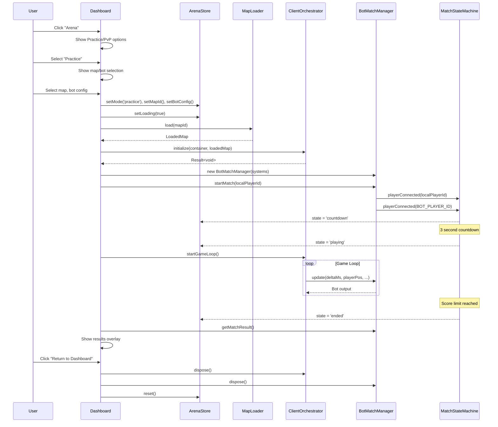

# Arena Dashboard Integration - Design Document

## Overview

This design document outlines the technical approach for refactoring the Arena system to use existing enterprise-grade modules instead of inline code. The primary goal is to reduce `ArenaPlayTest.tsx` from ~1,480 lines to ~300 lines by leveraging the orchestrators, managers, and state machines that have already been built.

## Architecture

### Current Architecture (Problematic)

```
ArenaPlayTest.tsx (1,480 lines)
├── Inline game loop (requestAnimationFrame)
├── Inline system initialization
├── Inline bot logic (~350 lines)
├── Inline match state management
├── Inline performance tracking
├── Inline debug HUD (~150 lines)
└── Inline UI overlays (~200 lines)
```

### Target Architecture (Enterprise Pattern)

```
Arena.tsx (~300 lines)
├── Uses ClientOrchestrator for game loop
├── Uses BotMatchManager for bot lifecycle
├── Uses MatchStateMachine for match flow
├── Uses GameConfig for all settings
├── Uses DiagnosticsRecorder for performance
├── Imports ArenaDebugHUD component
├── Imports ArenaOverlays component
└── Imports BotVisualController class
```


## Components and Interfaces

### 1. BotVisualController (New)

Extracted from ArenaPlayTest.tsx to handle smooth bot movement interpolation.

```typescript
// frontend/src/arena/bot/BotVisualController.ts

export interface BotVisualConfig {
  positionLerp: number;      // Default: 6
  rotationLerp: number;      // Default: 5
  acceleration: number;      // Default: 8
  deceleration: number;      // Default: 12
  maxSpeed: number;          // Default: 5.0
}

export const DEFAULT_BOT_VISUAL_CONFIG: BotVisualConfig = {
  positionLerp: 6,
  rotationLerp: 5,
  acceleration: 8,
  deceleration: 12,
  maxSpeed: 5.0,
};

export class BotVisualController {
  private mesh: THREE.Mesh | null = null;
  private visualPos: THREE.Vector3;
  private visualVel: THREE.Vector3;
  private visualRotY: number = 0;
  private config: BotVisualConfig;
  private animationMixer: THREE.AnimationMixer | null = null;
  private animationLOD: AnimationLOD;

  constructor(config: BotVisualConfig = DEFAULT_BOT_VISUAL_CONFIG);
  
  // Initialize with mesh and optional character model
  initialize(scene: THREE.Scene, initialPosition: Vector3): void;
  
  // Update visual position toward target (called each frame)
  update(targetPosition: Vector3, targetRotation: number, deltaTime: number): void;
  
  // Reset visual position instantly (for spawn/respawn)
  resetPosition(position: Vector3): void;
  
  // Update animation mixer with LOD
  updateAnimation(deltaTime: number, distanceToCamera: number): void;
  
  // Set visibility (for death/respawn)
  setVisible(visible: boolean): void;
  
  // Cleanup
  dispose(): void;
}
```

### 2. ArenaDebugHUD Component (New)

Extracted React component for the debug overlay.

```typescript
// frontend/src/arena/ui/ArenaDebugHUD.tsx

export interface ArenaDebugInfo {
  // Performance
  fps: number;
  frameTime: number;
  worstFrame: number;
  physicsMs: number;
  renderMs: number;
  botMs: number;
  memoryMB?: number;
  gcWarning: boolean;
  drawCalls: number;
  triangles: number;
  
  // Player
  position: { x: number; y: number; z: number };
  velocity: { x: number; y: number; z: number };
  isGrounded: boolean;
  health: number;
  ammo: number;
  
  // Bot
  botHealth?: number;
  botState?: string;
  botScore?: number;
  playerScore?: number;
  botTacticalIntent?: BotTacticalIntent;
}

export interface ArenaDebugHUDProps {
  debugInfo: ArenaDebugInfo;
  visible: boolean;
  botEnabled: boolean;
  botPersonality: BotPersonalityType;
}

export function ArenaDebugHUD(props: ArenaDebugHUDProps): JSX.Element;
```


### 3. ArenaOverlays Component (New)

Extracted React component for loading, instructions, and results overlays.

```typescript
// frontend/src/arena/ui/ArenaOverlays.tsx

export interface ArenaOverlaysProps {
  // Loading state
  isLoading: boolean;
  loadProgress: number;
  loadError: string | null;
  
  // Instructions state
  showInstructions: boolean;
  onStartGame: () => void;
  
  // Match state
  matchState: MatchState;
  countdownRemaining: number;
  
  // Results state
  matchResult?: MatchResult;
  onPlayAgain: () => void;
  onReturnToDashboard: () => void;
  
  // Bot config (for instructions display)
  botEnabled: boolean;
  botPersonality: BotPersonalityType;
  botDifficulty: DifficultyLevel;
}

export function ArenaOverlays(props: ArenaOverlaysProps): JSX.Element;
```

### 4. ArenaStore (New)

Zustand store for arena state management.

```typescript
// frontend/src/stores/arenaStore.ts

export type ArenaMode = 'practice' | 'pvp' | 'spectate';

export interface ArenaState {
  // Mode
  mode: ArenaMode;
  mapId: string | null;
  
  // Match state (from MatchStateMachine)
  matchState: MatchState;
  countdownRemaining: number;
  timeRemaining: number;
  
  // Scores
  playerScore: number;
  opponentScore: number;
  
  // Bot config (practice mode)
  botPersonality: BotPersonalityType;
  botDifficulty: DifficultyLevel;
  
  // Loading
  isLoading: boolean;
  loadProgress: number;
  loadError: string | null;
  
  // Actions
  setMode: (mode: ArenaMode) => void;
  setMapId: (mapId: string) => void;
  setMatchState: (state: MatchState) => void;
  setScores: (player: number, opponent: number) => void;
  setBotConfig: (personality: BotPersonalityType, difficulty: DifficultyLevel) => void;
  setLoading: (loading: boolean, progress?: number, error?: string | null) => void;
  reset: () => void;
}

export const useArenaStore = create<ArenaState>(...);
```


### 5. Enhanced ClientOrchestrator

The existing ClientOrchestrator needs minor enhancements to support the arena use case.

```typescript
// Additions to frontend/src/arena/orchestrator/ClientOrchestrator.ts

export interface ClientSystems {
  // Existing systems...
  eventBus: IEventBus;
  collisionWorld: CollisionWorld;
  spawnSystem: SpawnSystem;
  physics: Physics3D;
  inputManager: InputManager;
  cameraController: CameraController;
  predictionSystem: PredictionSystem;
  interpolationBuffer: InterpolationBuffer;
  hudRenderer: HUDRenderer;
  audioSystem: AudioSystem;
  debugOverlay: DebugOverlay;
  diagnosticsRecorder: DiagnosticsRecorder;
  
  // NEW: Add combat system
  combatSystem: CombatSystem;
  
  // NEW: Add match state machine
  matchStateMachine: MatchStateMachine;
}

// NEW: Add tick callback for custom game logic
export interface IClientOrchestrator {
  // Existing methods...
  
  // NEW: Register a callback to run each frame
  onTick(callback: (deltaTime: number, currentTime: number) => void): () => void;
  
  // NEW: Get current tick number
  getCurrentTick(): number;
}
```

### 6. Enhanced BotMatchManager

The existing BotMatchManager needs enhancements for visual controller integration.

```typescript
// Additions to frontend/src/arena/bot/BotMatchManager.ts

export interface BotMatchConfig {
  // Existing config...
  matchDurationSeconds: number;
  scoreLimit: number;
  botPersonality?: BotPersonalityType | 'random';
  botDifficulty?: DifficultyLevel;
  mapBounds: { min: ThreeVector3; max: ThreeVector3 };
  coverPositions?: CoverPosition[];
  
  // NEW: Visual config
  visualConfig?: BotVisualConfig;
  
  // NEW: Collision world for LOS checks
  collisionWorld?: CollisionWorld;
}

export class BotMatchManager {
  // NEW: Visual controller
  private visualController: BotVisualController | null = null;
  
  // NEW: Get visual controller for external rendering
  getVisualController(): BotVisualController | null;
  
  // NEW: Initialize visuals in scene
  initializeVisuals(scene: THREE.Scene): void;
}
```


## Data Models

### ArenaSessionConfig

Configuration passed when starting an arena session.

```typescript
export interface ArenaSessionConfig {
  mode: ArenaMode;
  mapId: string;
  localPlayerId: number;
  
  // Practice mode
  botPersonality?: BotPersonalityType;
  botDifficulty?: DifficultyLevel;
  
  // PvP mode (Phase 2)
  opponentId?: number;
  serverUrl?: string;
  
  // Game config overrides
  gameConfig?: Partial<GameConfig>;
}
```

### ArenaMatchResult

Result returned when a match ends.

```typescript
export interface ArenaMatchResult {
  winner: 'player' | 'opponent' | 'draw';
  playerScore: number;
  opponentScore: number;
  duration: number;
  mapId: string;
  mode: ArenaMode;
}
```

## Correctness Properties

*A property is a characteristic or behavior that should hold true across all valid executions of a system-essentially, a formal statement about what the system should do. Properties serve as the bridge between human-readable specifications and machine-verifiable correctness guarantees.*

### Property 1: Bot visual position lerps toward logical position
*For any* target position and current visual position, after calling `BotVisualController.update()`, the visual position should be closer to the target position than before (unless already at target).
**Validates: Requirements 3.2**

### Property 2: Bot visual position resets instantly on spawn
*For any* spawn position, after calling `BotVisualController.resetPosition()`, the visual position should exactly equal the spawn position with zero velocity.
**Validates: Requirements 3.3**

### Property 3: Match state transitions are valid
*For any* current match state, only valid transitions should be allowed:
- `waiting` → `countdown` (when requiredPlayers reached)
- `countdown` → `playing` (when countdown expires)
- `countdown` → `waiting` (when player disconnects)
- `playing` → `ended` (when score limit or time expires)
- `ended` → `cleanup` (when results duration expires)
**Validates: Requirements 5.2**

### Property 4: Map selection shows all registered maps
*For any* set of registered maps in MapRegistry, the map selection UI should display all of them with correct names and descriptions.
**Validates: Requirements 6.1, 6.5**

### Property 5: Any registered map can be loaded
*For any* map ID returned by `MapRegistry.getIds()`, calling `MapLoader.load(mapId)` should succeed and return a valid LoadedMap.
**Validates: Requirements 6.4**

### Property 6: Arena store tracks all required state
*For any* arena session, the arenaStore should contain valid values for: mode, mapId, matchState, playerScore, opponentScore, and (for PvP) timeRemaining.
**Validates: Requirements 9.1**

### Property 7: Debug HUD displays all required metrics
*For any* ArenaDebugInfo object with all fields populated, the ArenaDebugHUD component should render all metrics without errors.
**Validates: Requirements 4.2**


## Error Handling

### Initialization Errors

```typescript
export type ArenaInitError =
  | { type: 'MAP_NOT_FOUND'; mapId: string }
  | { type: 'ASSET_LOAD_FAILED'; assetUrl: string; cause: Error }
  | { type: 'ORCHESTRATOR_INIT_FAILED'; systemName: string; cause: Error }
  | { type: 'WEBGL_NOT_SUPPORTED' }
  | { type: 'AUDIO_INIT_FAILED'; cause: Error };
```

### Runtime Errors

```typescript
export type ArenaRuntimeError =
  | { type: 'DESYNC_DETECTED'; predictionError: number }
  | { type: 'CONNECTION_LOST'; reason: string }
  | { type: 'OPPONENT_DISCONNECTED' }
  | { type: 'MATCH_TIMEOUT' };
```

### Error Recovery

1. **Map load failure**: Show error overlay with retry button
2. **WebGL not supported**: Show fallback message, no retry
3. **Audio init failure**: Continue without audio, show warning
4. **Desync detected**: Reconcile automatically (PredictionSystem handles this)
5. **Connection lost**: Show reconnecting overlay, attempt reconnect
6. **Opponent disconnected**: Award victory, show results

## Testing Strategy

### Unit Tests

- `BotVisualController`: Test lerping math, reset behavior, config injection
- `ArenaDebugHUD`: Test rendering with various debug info states
- `ArenaOverlays`: Test rendering for each overlay state
- `arenaStore`: Test all state transitions and actions

### Property-Based Tests

Using fast-check for property-based testing:

1. **Property 1 (Bot lerping)**: Generate random positions, verify lerp moves toward target
2. **Property 2 (Bot reset)**: Generate random spawn positions, verify instant reset
3. **Property 3 (State transitions)**: Generate random state sequences, verify only valid transitions
4. **Property 4 (Map selection)**: Generate random map registrations, verify all appear in UI
5. **Property 5 (Map loading)**: For all registered maps, verify load succeeds
6. **Property 6 (Store state)**: Generate random arena sessions, verify store has all fields
7. **Property 7 (Debug HUD)**: Generate random debug info, verify render succeeds

### Integration Tests

- Full arena session: Load map → Start match → Play → End → Cleanup
- Bot match flow: Start → Bot spawns → Combat → Score → End
- Dashboard integration: Navigate to arena → Select options → Start game


## Sequence Diagrams

### Practice Mode Flow



### Refactored Arena.tsx Structure

```typescript
// frontend/src/pages/Arena.tsx (~300 lines)

export default function Arena() {
  // Store
  const arenaStore = useArenaStore();
  
  // Refs for systems (not React state - these are game objects)
  const orchestratorRef = useRef<ClientOrchestrator | null>(null);
  const botManagerRef = useRef<BotMatchManager | null>(null);
  const sceneRef = useRef<ArenaScene | null>(null);
  
  // Debug state
  const [debugInfo, setDebugInfo] = useState<ArenaDebugInfo>(DEFAULT_DEBUG_INFO);
  const [showDebug, setShowDebug] = useState(false);
  
  // Initialize arena
  useEffect(() => {
    const init = async () => {
      // 1. Load map from registry
      const mapResult = await mapLoader.load(arenaStore.mapId);
      if (!mapResult.ok) { /* handle error */ }
      
      // 2. Create scene
      sceneRef.current = new ArenaScene(mapResult.value);
      
      // 3. Initialize orchestrator
      orchestratorRef.current = createClientOrchestrator(createDevConfig());
      await orchestratorRef.current.initialize(containerRef.current, mapResult.value);
      
      // 4. Create bot manager (practice mode)
      if (arenaStore.mode === 'practice') {
        const systems = orchestratorRef.current.getSystems();
        botManagerRef.current = new BotMatchManager(
          systems.spawnSystem,
          systems.combatSystem,
          systems.eventBus,
          { botPersonality: arenaStore.botPersonality, botDifficulty: arenaStore.botDifficulty }
        );
        botManagerRef.current.startMatch(LOCAL_PLAYER_ID);
      }
      
      // 5. Register tick callback
      orchestratorRef.current.onTick((deltaTime, currentTime) => {
        // Update bot
        botManagerRef.current?.update(deltaTime * 1000, playerPos, playerVel, playerHealth);
        
        // Update debug info
        setDebugInfo(collectDebugInfo());
      });
      
      // 6. Start game loop
      orchestratorRef.current.startGameLoop();
    };
    
    init();
    return () => cleanup();
  }, []);
  
  return (
    <div ref={containerRef}>
      <ArenaOverlays {...overlayProps} />
      {showDebug && <ArenaDebugHUD debugInfo={debugInfo} />}
    </div>
  );
}
```


## File Changes Summary

### New Files to Create

| File | Lines | Description |
|------|-------|-------------|
| `arena/bot/BotVisualController.ts` | ~150 | Bot visual interpolation |
| `arena/ui/ArenaDebugHUD.tsx` | ~150 | Debug overlay component |
| `arena/ui/ArenaOverlays.tsx` | ~200 | Loading/instructions/results |
| `arena/ui/ArenaCountdown.tsx` | ~50 | Match countdown display |
| `arena/ui/ArenaResults.tsx` | ~100 | End-of-match results |
| `stores/arenaStore.ts` | ~80 | Arena state management |
| `pages/Arena.tsx` | ~300 | Dashboard-integrated arena |
| `components/dashboard/ArenaCard.tsx` | ~80 | Dashboard mode card |

### Files to Modify

| File | Changes |
|------|---------|
| `orchestrator/ClientOrchestrator.ts` | Add CombatSystem, MatchStateMachine, onTick callback |
| `bot/BotMatchManager.ts` | Add BotVisualController integration |
| `pages/ArenaPlayTest.tsx` | Refactor to use orchestrators (keep as test page) |

### Files to Delete (Dead Code)

| File | Reason |
|------|--------|
| `config/ArenaConfig.ts` | Deprecated, use MapDefinition.arenaConfig |

## Migration Path

### Phase 1: Extract Components (No Breaking Changes)
1. Create `BotVisualController` - extract from ArenaPlayTest
2. Create `ArenaDebugHUD` - extract from ArenaPlayTest
3. Create `ArenaOverlays` - extract from ArenaPlayTest
4. Create `arenaStore` - new file

### Phase 2: Enhance Orchestrators
1. Add `CombatSystem` to `ClientOrchestrator.ClientSystems`
2. Add `MatchStateMachine` to `ClientOrchestrator.ClientSystems`
3. Add `onTick` callback to `ClientOrchestrator`
4. Add `BotVisualController` to `BotMatchManager`

### Phase 3: Create Dashboard Integration
1. Create `Arena.tsx` using new components and orchestrators
2. Create `ArenaCard.tsx` for dashboard
3. Add arena route to router

### Phase 4: Refactor ArenaPlayTest
1. Update `ArenaPlayTest.tsx` to use new components
2. Keep as development/test page
3. Verify all functionality works

---

*Document Version: 1.0*
*Created: December 18, 2024*
