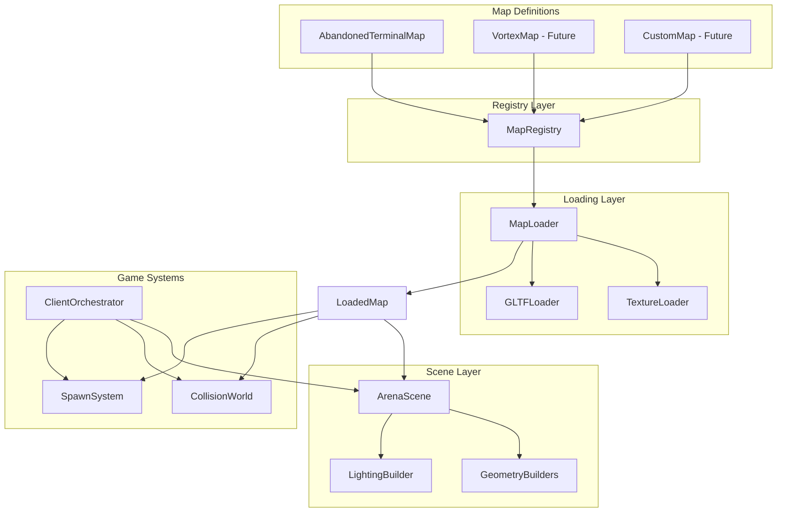
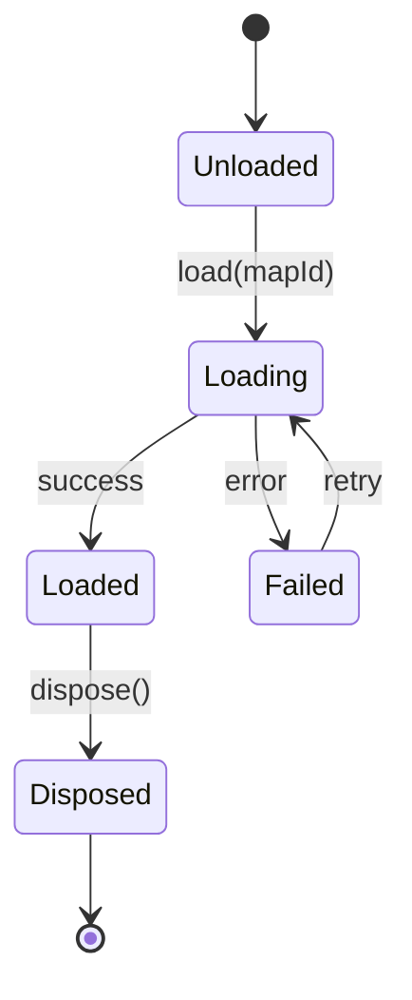
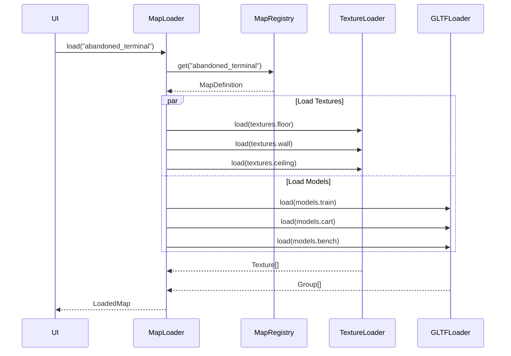

# Design Document: Arena Map Registry

## Overview

The Arena Map Registry system transforms the current hardcoded, single-map architecture into a flexible, data-driven multi-map system. The core insight is that all map-specific data (dimensions, assets, collision, spawns, lighting, props) can be encapsulated in a single `MapDefinition` interface, enabling new maps to be added by simply creating a new definition file.

The system consists of three main components:
1. **MapDefinition** - A comprehensive TypeScript interface defining all map data
2. **MapRegistry** - A singleton service for registering and retrieving map definitions
3. **MapLoader** - An async service that loads all assets and returns a ready-to-use `LoadedMap`

All geometry builders will be refactored to accept configuration as parameters, eliminating global imports and enabling the same builder code to work with any map.

## Architecture



## Components and Interfaces

### MapDefinition Interface

```typescript
// frontend/src/arena/maps/types.ts

// Re-export existing types from physics and game modules
import type { CollisionManifest } from '../physics/CollisionWorld';
import type { SpawnManifest } from '../game/SpawnSystem';
export type { CollisionManifest, SpawnManifest };

// Use tuple format for positions (consistent with existing manifests)
export type Position3 = [number, number, number];

// Object format for configs that need named fields
export interface Vector3Config {
  x: number;
  y: number;
  z: number;
}

export interface TrackConfig {
  width: number;
  depth: number;
  railWidth: number;
  railHeight: number;
  railSpacing: number;
  sleeperWidth: number;
  sleeperDepth: number;
  sleeperSpacing: number;
}

export interface ColorConfig {
  floor: number;
  wall: number;
  ceiling: number;
  windowFrame: number;
  lightFixture: number;
  lightEmissive: number;
  ambient: number;
  fog: number;
  trackBed: number;
  rail: number;
  sleeper: number;
  yellowLine: number;
  tactileStrip: number;
  gate: number;
}

export interface ArenaConfig {
  width: number;
  depth: number;
  wallHeight: number;
  wallThickness: number;
  windowHeight: number;
  windowBottom: number;
  windowWidth: number;
  windowSpacing: number;
  ceilingHeight: number;
  tracks: TrackConfig;
  platformEdge: {
    width: number;
    tactileWidth: number;
  };
  subwayEntrance: {
    width: number;
    depth: number;
    stairDepth: number;
    stairSteps: number;
    gateHeight: number;
  };
  spawns: {
    player1: Vector3;
    player2: Vector3;
  };
  lightPositions: Array<{ x: number; z: number }>;
  colors: ColorConfig;
}

export interface TextureAssets {
  floor?: string;
  wall?: string;
  ceiling?: string;
  track?: string;
  tunnel?: string;
}

export interface ModelAssets {
  train?: string;
  subwayEntrance?: string;
  cart?: string;
  fareTerminal?: string;
  bench?: string;
  luggage?: string;
  wallExpression?: string;
}

// Shared constants (extracted from individual builders)
export const DRACO_DECODER_PATH = 'https://www.gstatic.com/draco/versioned/decoders/1.5.6/';

export interface AssetManifest {
  textures: TextureAssets;
  models: ModelAssets;
}

export interface AmbientLightConfig {
  color: number;
  intensity: number;
}

export interface HemisphereLightConfig {
  skyColor: number;
  groundColor: number;
  intensity: number;
}

export interface DirectionalLightConfig {
  color: number;
  intensity: number;
  position: Vector3Config;
  shadowMapSize?: number;
  shadowBias?: number;
  castShadow?: boolean;
}

export interface PointLightConfig {
  type: 'emergency' | 'utility' | 'trackGlow' | 'tunnelGlow' | 'wallWash';
  color: number;
  intensity: number;
  position: Vector3Config;
  distance: number;
  decay: number;
}

export interface LightingConfig {
  ambient: AmbientLightConfig;
  hemisphere: HemisphereLightConfig;
  keyLight: DirectionalLightConfig;
  fillLight: DirectionalLightConfig;
  pointLights: PointLightConfig[];
}

export interface PropInstance {
  x: number;
  y: number;
  z: number;
  rotationY: number;
  scale: number;
}

export interface PropPlacement {
  assetKey: keyof ModelAssets;
  positions: PropInstance[];
}

export interface MapDefinition {
  id: string;
  name: string;
  description: string;
  arenaConfig: ArenaConfig;
  assets: AssetManifest;
  collisionManifest: CollisionManifest;
  spawnManifest: SpawnManifest;
  lightingConfig: LightingConfig;
  props: PropPlacement[];
}
```

### MapRegistry

```typescript
// frontend/src/arena/maps/MapRegistry.ts

export class MapRegistry {
  private static instance: MapRegistry;
  private maps: Map<string, MapDefinition> = new Map();
  
  static getInstance(): MapRegistry;
  
  register(definition: MapDefinition): void;
  get(id: string): MapDefinition | undefined;
  has(id: string): boolean;
  getAll(): MapDefinition[];
  getIds(): string[];
}
```

### MapLoader

```typescript
// frontend/src/arena/maps/MapLoader.ts

export interface LoadedTextures {
  floor?: THREE.Texture;
  wall?: THREE.Texture;
  ceiling?: THREE.Texture;
  track?: THREE.Texture;
  tunnel?: THREE.Texture;
}

export interface LoadedModels {
  train?: THREE.Group;
  subwayEntrance?: THREE.Group;
  cart?: THREE.Group;
  fareTerminal?: THREE.Group;
  bench?: THREE.Group;
  luggage?: THREE.Group;
  wallExpression?: THREE.Group;
}

export interface LoadedMap {
  definition: MapDefinition;
  textures: LoadedTextures;
  models: LoadedModels;
}

export interface LoadProgress {
  loaded: number;
  total: number;
  currentAsset: string;
}

export type ProgressCallback = (progress: LoadProgress) => void;

export class MapLoader {
  async load(
    mapId: string, 
    onProgress?: ProgressCallback
  ): Promise<Result<LoadedMap, MapLoadError>>;
  
  private loadTextures(assets: TextureAssets): Promise<LoadedTextures>;
  private loadModels(assets: ModelAssets): Promise<LoadedModels>;
}
```

### Updated ArenaScene

```typescript
// frontend/src/arena/ArenaScene.ts

export class ArenaScene {
  constructor(loadedMap: LoadedMap);
  
  // All methods now use this.loadedMap.definition.arenaConfig
  // instead of importing ARENA_CONFIG
}
```

### Updated Geometry Builders

```typescript
// Example: FloorBuilder
export function createFloor(
  materials: ArenaMaterials, 
  config: ArenaConfig
): THREE.Group;

// Example: LightingBuilder
export function createAmbientLighting(
  config: LightingConfig
): THREE.Group;
```

## Data Models

### LoadedMap State



### Asset Loading Flow




## Correctness Properties

*A property is a characteristic or behavior that should hold true across all valid executions of a system-essentially, a formal statement about what the system should do. Properties serve as the bridge between human-readable specifications and machine-verifiable correctness guarantees.*

### Property 1: Registry Registration Round-Trip

*For any* valid MapDefinition, registering it with the MapRegistry and then retrieving it by id should return an equivalent MapDefinition.

**Validates: Requirements 2.1, 2.2**

### Property 2: Registry Has Consistency

*For any* MapRegistry state and any map id, `has(id)` should return true if and only if `get(id)` returns a defined value.

**Validates: Requirements 2.2, 2.5**

### Property 3: Registry GetAll Completeness

*For any* set of MapDefinitions registered with the MapRegistry, `getAll()` should return an array containing exactly those definitions (no more, no less).

**Validates: Requirements 2.1, 2.3**

### Property 4: Geometry Builder Dimension Consistency

*For any* valid ArenaConfig, when `createFloor` is called with that config, the resulting geometry's bounding box width should equal `config.width - config.tracks.width` (the two platform widths combined) and depth should equal `config.depth`.

**Validates: Requirements 4.1, 4.6**

### Property 5: Spawn Point Validity

*For any* SpawnManifest and any spawn operation, the returned spawn position should be one of the positions defined in the manifest's spawnPoints array.

**Validates: Requirements 7.3**

### Property 6: Lighting Config Point Light Count

*For any* LightingConfig passed to `createAmbientLighting`, the resulting THREE.Group should contain exactly `config.pointLights.length` PointLight objects plus the ambient, hemisphere, key, and fill lights.

**Validates: Requirements 4.5**

## Error Handling

### MapRegistry Errors

| Error | Condition | Handling |
|-------|-----------|----------|
| DuplicateMapIdError | Registering a map with an id that already exists | Throw error with conflicting id |
| MapNotFoundError | Requesting a map id that doesn't exist | Return undefined (get) or false (has) |

### MapLoader Errors

| Error | Condition | Handling |
|-------|-----------|----------|
| MapNotFoundError | Loading a map id not in registry | Return Result.err with error details |
| TextureLoadError | Texture URL fails to load | Log warning, continue loading, mark texture as undefined in LoadedMap |
| ModelLoadError | Model URL fails to load | Log warning, continue loading, mark model as undefined in LoadedMap |
| NetworkError | Network failure during asset load | Retry up to 3 times, then fail gracefully |

### Graceful Degradation

The system should continue functioning even with missing assets:
- Missing textures: Use fallback procedural materials
- Missing models: Use placeholder geometry (existing behavior)
- Missing collision: Log error, use empty collision manifest (unsafe but visible)
- Missing spawns: Log error, use center of arena as fallback

## Testing Strategy

### Dual Testing Approach

This feature requires both unit tests and property-based tests:

- **Unit tests** verify specific examples, integration points, and error conditions
- **Property tests** verify universal properties that should hold across all valid inputs

### Property-Based Testing

**Library:** fast-check (already used in the codebase for frontend tests)

**Configuration:** Each property test will run a minimum of 100 iterations.

**Test Annotation Format:** Each property-based test will be tagged with:
```typescript
// **Feature: arena-map-registry, Property {number}: {property_text}**
```

### Property Test Generators

```typescript
// Generator for valid ArenaConfig
const arenaConfigGen = fc.record({
  width: fc.integer({ min: 20, max: 100 }),
  depth: fc.integer({ min: 20, max: 100 }),
  wallHeight: fc.integer({ min: 3, max: 20 }),
  wallThickness: fc.float({ min: 0.1, max: 1.0 }),
  ceilingHeight: fc.integer({ min: 4, max: 25 }),
  tracks: fc.record({
    width: fc.integer({ min: 3, max: 10 }),
    depth: fc.float({ min: 0.3, max: 2.0 }),
    // ... other track fields
  }),
  colors: fc.record({
    floor: fc.integer({ min: 0, max: 0xffffff }),
    // ... other color fields
  }),
  // ... other fields
});

// Generator for valid MapDefinition
const mapDefinitionGen = fc.record({
  id: fc.string({ minLength: 1, maxLength: 50 }),
  name: fc.string({ minLength: 1, maxLength: 100 }),
  arenaConfig: arenaConfigGen,
  // ... other fields
});
```

### Unit Test Coverage

| Component | Test Focus |
|-----------|------------|
| MapRegistry | Registration, retrieval, duplicate handling, getAll |
| MapLoader | Successful load, partial failure, progress callbacks |
| GeometryBuilders | Signature changes, config usage, output dimensions |
| ArenaScene | Constructor with LoadedMap, resource disposal |
| AbandonedTerminalMap | Migration completeness, value equivalence |

### Integration Tests

- Full load cycle: Register map → Load map → Build scene → Verify rendering
- Collision integration: Load map → Initialize CollisionWorld → Verify colliders
- Spawn integration: Load map → Initialize SpawnSystem → Verify spawn points

## File Structure

```
frontend/src/arena/
├── maps/
│   ├── types.ts                    # All type definitions
│   ├── MapRegistry.ts              # Singleton registry
│   ├── MapLoader.ts                # Asset loading service
│   ├── definitions/
│   │   ├── index.ts                # Re-exports all maps
│   │   └── AbandonedTerminalMap.ts # First map definition
│   └── index.ts                    # Public API
├── geometry/
│   ├── FloorBuilder.ts             # Updated to accept config
│   ├── WallBuilder.ts              # Updated to accept config
│   ├── LightingBuilder.ts          # Updated to accept LightingConfig
│   └── ...                         # Other builders updated
├── ArenaScene.ts                   # Updated to accept LoadedMap
└── config/
    ├── ArenaConfig.ts              # DEPRECATED - delete after migration verified
    ├── AbandonedTerminalManifest.ts # DEPRECATED - migrated to maps/definitions/
    └── GameConfig.ts               # Kept - game-wide settings not map-specific
```

## Migration Notes

### ArenaConfig.ts Deprecation

The `ARENA_CONFIG` constant in `config/ArenaConfig.ts` will be deprecated:
1. After `AbandonedTerminalMap.ts` is created and verified working
2. After all geometry builders are updated to accept config parameters
3. After all tests pass with the new architecture
4. The file can be deleted once no imports remain

### Prop Position Extraction

Current prop positions are hardcoded in individual builders:
- `LuggageBuilder.ts` - 6 luggage stack positions
- `PropBuilder.ts` - bench and wall expression positions
- `CartBuilder.ts` - 2 cart positions
- `FareTerminalBuilder.ts` - 2 terminal positions

These positions must be extracted into the `AbandonedTerminalMap.props` array during migration.

### Draco Loader Consolidation

The Draco decoder path is currently duplicated in:
- `TrainBuilder.ts`
- `CartBuilder.ts`
- `SubwayEntranceBuilder.ts`
- `FareTerminalBuilder.ts`
- `LuggageBuilder.ts`
- `PropBuilder.ts`

This will be consolidated into `DRACO_DECODER_PATH` in `maps/types.ts`.
