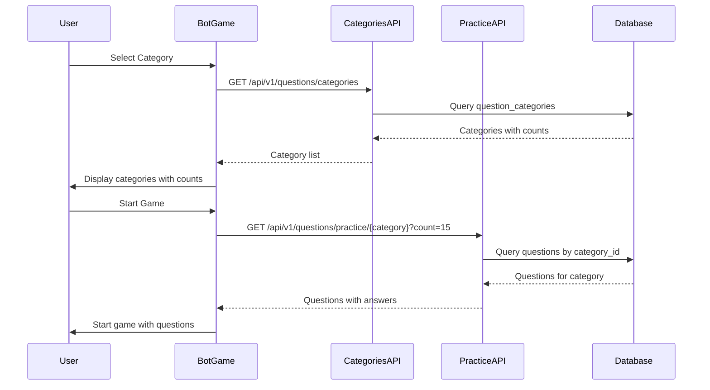

# Design Document: Bot Game Full Quiz Experience

## Overview

This feature fixes the Bot Game (practice mode) to properly fetch and display questions from the database based on the user's selected category. The current implementation has issues where:
1. NFL category may return Fortnite questions due to fallback logic
2. Only 10 hardcoded fallback questions are used when API fails
3. No proper error handling for empty categories or API failures

The solution involves:
- Fixing the question fetching logic to properly use the selected category
- Increasing the default question count from 10 to 15
- Adding proper error states and user feedback
- Removing reliance on hardcoded fallback questions in favor of proper error handling

## Architecture



## Components and Interfaces

### Frontend Components

#### BotGame.tsx (Modified)
- Remove `FALLBACK_QUESTIONS` constant
- Update `QUESTIONS_PER_GAME` from 10 to 15
- Add error state handling for API failures
- Add empty category handling
- Ensure category slug is correctly passed to API

```typescript
interface BotGameState {
  questions: PracticeQuestion[];
  questionsLoading: boolean;
  questionsError: string | null;
  selectedCategory: string;
}
```

#### useCategories.ts (No changes needed)
- Already fetches categories with question counts
- Already has fallback handling

### Backend Components

#### Practice API Endpoint (No changes needed)
- `/api/v1/questions/practice/{category}` already correctly filters by category
- Returns questions with correct_answer field

#### Question Service (No changes needed)
- `load_questions_async()` already filters by category_slug
- Properly queries database with category_id filter

## Data Models

### PracticeQuestion (Frontend)
```typescript
interface PracticeQuestion {
  id: number;
  text: string;
  options: string[];
  correct_answer: string; // A, B, C, or D
  category: string;
}
```

### API Response
```typescript
interface PracticeQuestionsResponse {
  questions: PracticeQuestion[];
}
```

## Correctness Properties

*A property is a characteristic or behavior that should hold true across all valid executions of a system-essentially, a formal statement about what the system should do. Properties serve as the bridge between human-readable specifications and machine-verifiable correctness guarantees.*

### Property Reflection

After analyzing the acceptance criteria, the following redundancies were identified:
- Properties 1.3 and 1.4 (NFL and Fortnite category isolation) can be combined into a single "category isolation" property
- Properties 1.1 and 2.1 (API call parameters) can be combined into a single "API request correctness" property

### Properties

**Property 1: API Request Category Correctness**
*For any* selected category slug, when fetching practice questions, the API request URL SHALL contain that exact category slug in the path.
**Validates: Requirements 1.1, 2.1**

**Property 2: Category Isolation**
*For any* set of questions returned from the Practice API for a given category, all questions in the set SHALL have a category field matching the requested category.
**Validates: Requirements 1.2, 1.3, 1.4**

**Property 3: Question Count Consistency**
*For any* game session, the displayed total question count SHALL equal the length of the questions array received from the API.
**Validates: Requirements 2.2, 2.3**

**Property 4: Category Display Accuracy**
*For any* category displayed in the selection UI, the shown question count SHALL match the question_count value from the categories API response.
**Validates: Requirements 4.1**

## Error Handling

| Error Condition | Handling Strategy |
|-----------------|-------------------|
| API returns error (4xx/5xx) | Display error message, offer retry button |
| API returns empty questions array | Display "No questions available for this category" message |
| Network failure | Display network error, offer retry or category change |
| Category has zero questions | Disable category selection or show warning badge |

### Error States

```typescript
type QuestionLoadState = 
  | { status: 'idle' }
  | { status: 'loading' }
  | { status: 'success'; questions: PracticeQuestion[] }
  | { status: 'error'; message: string }
  | { status: 'empty'; category: string };
```

## Testing Strategy

### Dual Testing Approach

This feature requires both unit tests and property-based tests:

#### Unit Tests
- Test error state rendering (API error, empty response, network failure)
- Test category selection UI with zero-question categories
- Test game start flow with valid questions

#### Property-Based Tests

**Testing Library:** Vitest with fast-check

**Configuration:** Each property test runs minimum 100 iterations.

**Property Tests:**

1. **API Request Category Correctness Test**
   - Generate random category slugs
   - Mock fetch to capture request URL
   - Verify URL contains the category slug
   - Tag: `**Feature: bot-game-full-quiz, Property 1: API Request Category Correctness**`

2. **Category Isolation Test**
   - Generate random questions with various categories
   - Filter to simulate API response for specific category
   - Verify all returned questions match requested category
   - Tag: `**Feature: bot-game-full-quiz, Property 2: Category Isolation**`

3. **Question Count Consistency Test**
   - Generate random question arrays of varying lengths
   - Verify displayed count matches array length
   - Tag: `**Feature: bot-game-full-quiz, Property 3: Question Count Consistency**`

4. **Category Display Accuracy Test**
   - Generate random category objects with question_count values
   - Verify UI displays matching counts
   - Tag: `**Feature: bot-game-full-quiz, Property 4: Category Display Accuracy**`
