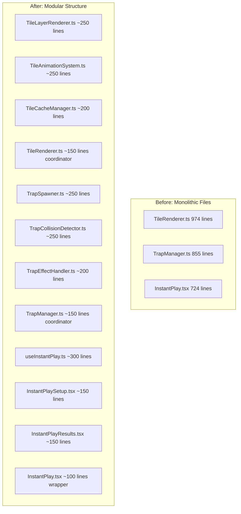

# Design Document: Codebase Modularization

## Overview

This refactoring effort splits 14 large files (500+ lines) into smaller, focused modules. The goal is to improve maintainability by ensuring each file has a single responsibility and stays under 300 lines (200 for React components, 150 for hooks).

This is a pure refactoring effort - no new functionality is added. All existing tests must continue to pass.

## Architecture



## Components and Interfaces

### 1. TileRenderer Split

| New Module | Responsibility | Target Lines |
|------------|----------------|--------------|
| TileLayerRenderer.ts | Renders individual tile layers | ~250 |
| TileAnimationSystem.ts | Handles tile animations | ~250 |
| TileCacheManager.ts | Manages tile texture caching | ~200 |
| TileRenderer.ts | Coordinates modules | ~150 |

### 2. TrapManager Split

| New Module | Responsibility | Target Lines |
|------------|----------------|--------------|
| TrapSpawner.ts | Spawns and positions traps | ~250 |
| TrapCollisionDetector.ts | Detects trap collisions | ~250 |
| TrapEffectHandler.ts | Applies trap effects | ~200 |
| TrapManager.ts | Coordinates modules | ~150 |

### 3. BarrierManager Split

| New Module | Responsibility | Target Lines |
|------------|----------------|--------------|
| BarrierSpawner.ts | Spawns barriers | ~200 |
| BarrierPhysics.ts | Handles barrier physics | ~250 |
| BarrierRenderer.ts | Renders barriers | ~200 |
| BarrierManager.ts | Coordinates modules | ~100 |

### 4. InstantPlay Split

| New Module | Responsibility | Target Lines |
|------------|----------------|--------------|
| useInstantPlay.ts | Game state and logic | ~300 |
| InstantPlaySetup.tsx | Setup screen UI | ~150 |
| InstantPlayResults.tsx | Results screen UI | ~150 |
| InstantPlay.tsx | Thin wrapper | ~100 |

### 5. TilesetLoader Split

| New Module | Responsibility | Target Lines |
|------------|----------------|--------------|
| TilesetParser.ts | Parses tileset data | ~200 |
| TilesetCache.ts | Caches loaded tilesets | ~200 |
| TilesetValidator.ts | Validates tileset format | ~150 |
| TilesetLoader.ts | Coordinates loading | ~150 |

### 6. GameArena Split

| New Module | Responsibility | Target Lines |
|------------|----------------|--------------|
| useGameLoop.ts | Game loop management | ~200 |
| useArenaInput.ts | Input handling | ~150 |
| ArenaOverlays.tsx | HUD overlays | ~150 |
| GameArena.tsx | Thin wrapper | ~150 |

### 7. GameEngine Split

| New Module | Responsibility | Target Lines |
|------------|----------------|--------------|
| GameLoop.ts | Main game loop | ~200 |
| EntityManager.ts | Entity lifecycle | ~200 |
| PhysicsIntegration.ts | Physics updates | ~150 |
| GameEngine.ts | Coordinates modules | ~100 |

### 8. DemoGameEngine Split

| New Module | Responsibility | Target Lines |
|------------|----------------|--------------|
| DemoLoop.ts | Demo game loop | ~200 |
| DemoEntityController.ts | Demo entity AI | ~200 |
| DemoScenarioManager.ts | Demo scenarios | ~150 |
| DemoGameEngine.ts | Coordinates modules | ~100 |

### 9. RewardDisplayBox Split

| New Module | Responsibility | Target Lines |
|------------|----------------|--------------|
| RewardIcon.tsx | Reward icon display | ~100 |
| RewardProgress.tsx | Progress indicators | ~150 |
| RewardAnimation.tsx | Unlock animations | ~150 |
| RewardDisplayBox.tsx | Composition wrapper | ~150 |

### 10. CombatSystem Split

| New Module | Responsibility | Target Lines |
|------------|----------------|--------------|
| DamageCalculator.ts | Damage calculations | ~150 |
| ProjectileManager.ts | Projectile lifecycle | ~200 |
| HitDetection.ts | Collision detection | ~200 |
| CombatSystem.ts | Coordinates modules | ~100 |

### 11. HazardManager Split

| New Module | Responsibility | Target Lines |
|------------|----------------|--------------|
| HazardSpawner.ts | Spawns hazards | ~200 |
| HazardCollision.ts | Hazard collision | ~150 |
| HazardEffects.ts | Hazard effects | ~150 |
| HazardManager.ts | Coordinates modules | ~100 |

### 12. ArenaManager Split

| New Module | Responsibility | Target Lines |
|------------|----------------|--------------|
| ArenaStateManager.ts | Arena state | ~200 |
| ArenaEventDispatcher.ts | Event handling | ~150 |
| ArenaEntityCoordinator.ts | Entity coordination | ~150 |
| ArenaManager.ts | Coordinates modules | ~100 |

### 13. useSettings Split

| New Module | Responsibility | Target Lines |
|------------|----------------|--------------|
| useAudioSettings.ts | Audio settings | ~100 |
| useVideoSettings.ts | Video settings | ~100 |
| useControlSettings.ts | Control settings | ~100 |
| useSettingsPersistence.ts | Storage logic | ~150 |
| useSettings.ts | Composition hook | ~100 |

### 14. ArenaGame Split

| New Module | Responsibility | Target Lines |
|------------|----------------|--------------|
| useArenaGame.ts | Game state and logic | ~300 |
| ArenaGameSetup.tsx | Setup screen UI | ~100 |
| ArenaGameResults.tsx | Results screen UI | ~100 |
| ArenaGame.tsx | Thin wrapper | ~100 |

## Data Models

No new data models are introduced. All existing interfaces and types are preserved and may be moved to dedicated type files if needed.

## Correctness Properties

*A property is a characteristic or behavior that should hold true across all valid executions of a system-essentially, a formal statement about what the system should do. Properties serve as the bridge between human-readable specifications and machine-verifiable correctness guarantees.*

This is a pure refactoring effort focused on code organization. All acceptance criteria relate to:
- Code structure (not testable as properties)
- Regression prevention (covered by existing tests)
- Line count metrics (not functional properties)

**No new correctness properties are required.** The existing test suite validates that all functionality is preserved after refactoring.

## Risk Mitigation

### Key Risks and Mitigations

| Risk | Impact | Mitigation |
|------|--------|------------|
| Breaking public API exports | High - other files import from these modules | Preserve all existing exports in coordinator files; add re-exports from new modules |
| Circular dependencies | Medium - extracted modules may reference each other | Design modules with clear dependency direction; use dependency injection where needed |
| State synchronization bugs | High - splitting stateful classes may cause race conditions | Keep shared state in coordinator; pass state down to extracted modules |
| Performance regression | Medium - additional function calls and module boundaries | Profile before/after; inline hot paths if needed |
| Test failures from import changes | Low - tests may import internal functions | Update test imports; ensure all public APIs remain accessible |
| Missing functionality | High - logic may be accidentally omitted during extraction | Run full test suite after each file; manual smoke test critical paths |

### Safeguards Built Into Tasks

1. **Checkpoint tasks** after each major module group to catch regressions early
2. **Preserve all exports** - coordinator files re-export everything for backward compatibility
3. **Incremental approach** - one file at a time, validate before moving to next
4. **TypeScript compiler** catches missing exports and type mismatches immediately

### Pre-Refactoring Checklist (per file)

Before refactoring each file:
1. Run `npm run test -- --run` to establish baseline
2. Note all exported functions/classes/types
3. Identify all files that import from this module
4. Document any singleton patterns or shared state

### Post-Refactoring Checklist (per file)

After refactoring each file:
1. Run `npm run test -- --run` - all tests must pass
2. Verify all original exports still work
3. Check TypeScript compilation succeeds
4. Verify no new circular dependency warnings

## Error Handling

No changes to error handling. All existing error handling patterns are preserved in the extracted modules.

## Testing Strategy

### Regression Testing

This refactoring relies entirely on the existing test suite:

1. **Before refactoring each file**: Run all related tests to establish baseline
2. **After refactoring each file**: Run all related tests to verify no regression
3. **Final validation**: Run full test suite to ensure no cross-module regressions

### Test Commands

```bash
# Run all frontend tests
npm run test -- --run

# Run specific module tests
npm run test -- --run src/game/terrain
npm run test -- --run src/game/traps
npm run test -- --run src/pages
```

### No New Tests Required

Since this is pure refactoring with no new functionality, no new tests are needed. The existing tests serve as the correctness guarantee.
