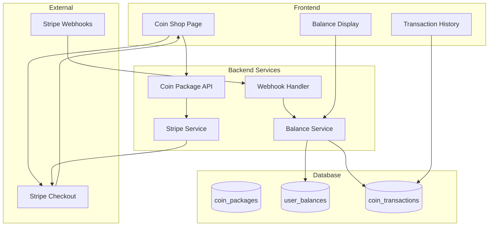

# Design Document: Coin Purchase System

## Overview

The Coin Purchase System enables players to buy in-game currency through Stripe-powered micro-transactions. The system is designed for small purchases ($1-$20) with bonus multipliers that reward larger purchases.

The implementation consists of:
1. **Backend coin package API** - Serves package catalog and creates Stripe sessions
2. **Stripe webhook handler** - Processes payment completion and credits coins
3. **Balance service** - Manages coin balances with atomic transactions
4. **Frontend coin shop** - Enterprise-grade purchase UI with package cards
5. **Transaction history** - Records and displays purchase history

## Architecture



## Components and Interfaces

### 1. Coin Package Schema

```python
class CoinPackage(BaseSchema):
    """A purchasable coin bundle."""
    
    id: str = Field(..., description="Package UUID")
    name: str = Field(..., description="Display name (e.g., 'Starter Pack')")
    price_cents: int = Field(..., description="Price in cents (e.g., 299 = $2.99)")
    base_coins: int = Field(..., description="Base coins without bonus")
    bonus_coins: int = Field(default=0, description="Bonus coins from multiplier")
    total_coins: int = Field(..., description="Total coins received")
    bonus_percent: int = Field(default=0, description="Bonus percentage (e.g., 17 = 17%)")
    badge: Optional[str] = Field(None, description="Badge text (e.g., 'Best Value')")
    sort_order: int = Field(default=0, description="Display order")
    is_active: bool = Field(default=True, description="Whether package is available")
    stripe_price_id: Optional[str] = Field(None, description="Stripe Price ID if using Stripe Products")


# Predefined packages
COIN_PACKAGES = [
    CoinPackage(
        id="pkg_starter",
        name="Starter",
        price_cents=99,
        base_coins=100,
        bonus_coins=0,
        total_coins=100,
        bonus_percent=0,
        badge=None,
        sort_order=1,
    ),
    CoinPackage(
        id="pkg_basic",
        name="Basic",
        price_cents=299,
        base_coins=300,
        bonus_coins=50,
        total_coins=350,
        bonus_percent=17,
        badge=None,
        sort_order=2,
    ),
    CoinPackage(
        id="pkg_popular",
        name="Popular",
        price_cents=499,
        base_coins=500,
        bonus_coins=150,
        total_coins=650,
        bonus_percent=30,
        badge="Most Popular",
        sort_order=3,
    ),
    CoinPackage(
        id="pkg_value",
        name="Value",
        price_cents=999,
        base_coins=1000,
        bonus_coins=500,
        total_coins=1500,
        bonus_percent=50,
        badge="Best Value",
        sort_order=4,
    ),
    CoinPackage(
        id="pkg_premium",
        name="Premium",
        price_cents=1999,
        base_coins=2000,
        bonus_coins=1500,
        total_coins=3500,
        bonus_percent=75,
        badge=None,
        sort_order=5,
    ),
]
```

### 2. Stripe Service

```python
class StripeService:
    """Service for Stripe payment operations."""
    
    def __init__(self, secret_key: str, webhook_secret: str):
        self.secret_key = secret_key
        self.webhook_secret = webhook_secret
        stripe.api_key = secret_key
    
    async def create_checkout_session(
        self,
        user_id: str,
        package: CoinPackage,
        success_url: str,
        cancel_url: str,
    ) -> CheckoutSessionResponse:
        """
        Create a Stripe Checkout Session for coin purchase.
        
        Args:
            user_id: The purchasing user's ID
            package: The coin package being purchased
            success_url: URL to redirect after successful payment
            cancel_url: URL to redirect if payment is cancelled
            
        Returns:
            CheckoutSessionResponse with session_id and checkout_url
        """
        session = stripe.checkout.Session.create(
            payment_method_types=["card"],
            line_items=[{
                "price_data": {
                    "currency": "usd",
                    "product_data": {
                        "name": f"{package.total_coins} Coins",
                        "description": f"{package.name} - {package.bonus_percent}% bonus" if package.bonus_percent else package.name,
                    },
                    "unit_amount": package.price_cents,
                },
                "quantity": 1,
            }],
            mode="payment",
            success_url=f"{success_url}?session_id={{CHECKOUT_SESSION_ID}}",
            cancel_url=cancel_url,
            metadata={
                "user_id": user_id,
                "package_id": package.id,
                "coin_amount": str(package.total_coins),
            },
            idempotency_key=f"{user_id}_{package.id}_{int(time.time())}",
        )
        
        return CheckoutSessionResponse(
            session_id=session.id,
            checkout_url=session.url,
        )
    
    def verify_webhook_signature(
        self,
        payload: bytes,
        signature: str,
    ) -> stripe.Event:
        """Verify and parse a Stripe webhook event."""
        return stripe.Webhook.construct_event(
            payload,
            signature,
            self.webhook_secret,
        )
    
    async def get_session(self, session_id: str) -> stripe.checkout.Session:
        """Retrieve a checkout session by ID."""
        return stripe.checkout.Session.retrieve(session_id)
```

### 3. Balance Service

```python
class BalanceService:
    """Service for managing user coin balances."""
    
    def __init__(self, client: Client):
        self.client = client
    
    async def get_balance(self, user_id: str) -> int:
        """Get current coin balance for a user."""
        result = (
            self.client.table("user_balances")
            .select("coins")
            .eq("user_id", user_id)
            .single()
            .execute()
        )
        return result.data["coins"] if result.data else 0
    
    async def credit_coins(
        self,
        user_id: str,
        amount: int,
        transaction_id: str,
        source: str = "purchase",
    ) -> int:
        """
        Credit coins to a user's balance atomically.
        
        Returns the new balance.
        """
        # Use RPC for atomic increment
        result = self.client.rpc(
            "credit_coins",
            {
                "p_user_id": user_id,
                "p_amount": amount,
                "p_transaction_id": transaction_id,
                "p_source": source,
            }
        ).execute()
        
        return result.data
    
    async def debit_coins(
        self,
        user_id: str,
        amount: int,
        transaction_id: str,
        source: str = "purchase",
    ) -> int:
        """
        Debit coins from a user's balance atomically.
        
        Raises InsufficientFundsError if balance is too low.
        Returns the new balance.
        """
        result = self.client.rpc(
            "debit_coins",
            {
                "p_user_id": user_id,
                "p_amount": amount,
                "p_transaction_id": transaction_id,
                "p_source": source,
            }
        ).execute()
        
        if result.data is None:
            raise InsufficientFundsError(f"Insufficient balance for {amount} coins")
        
        return result.data
    
    async def check_fulfillment(self, stripe_session_id: str) -> bool:
        """Check if a session has already been fulfilled."""
        result = (
            self.client.table("coin_transactions")
            .select("id")
            .eq("stripe_session_id", stripe_session_id)
            .execute()
        )
        return bool(result.data)
```

### 4. Webhook Handler

```python
class CoinWebhookHandler:
    """Handler for Stripe webhook events."""
    
    def __init__(
        self,
        stripe_service: StripeService,
        balance_service: BalanceService,
    ):
        self.stripe_service = stripe_service
        self.balance_service = balance_service
    
    async def handle_checkout_completed(
        self,
        event: stripe.Event,
    ) -> WebhookResult:
        """
        Handle checkout.session.completed event.
        
        Credits coins to user and records transaction.
        """
        session = event.data.object
        
        # Check for duplicate fulfillment (idempotency)
        if await self.balance_service.check_fulfillment(session.id):
            return WebhookResult(
                success=True,
                message="Already fulfilled",
                duplicate=True,
            )
        
        # Extract metadata
        user_id = session.metadata.get("user_id")
        package_id = session.metadata.get("package_id")
        coin_amount = int(session.metadata.get("coin_amount", 0))
        
        if not all([user_id, package_id, coin_amount]):
            return WebhookResult(
                success=False,
                message="Missing metadata",
            )
        
        # Credit coins
        new_balance = await self.balance_service.credit_coins(
            user_id=user_id,
            amount=coin_amount,
            transaction_id=session.id,
            source="stripe_purchase",
        )
        
        # Record transaction
        await self._record_transaction(
            user_id=user_id,
            package_id=package_id,
            coin_amount=coin_amount,
            stripe_session_id=session.id,
            stripe_payment_intent=session.payment_intent,
            amount_cents=session.amount_total,
        )
        
        return WebhookResult(
            success=True,
            message=f"Credited {coin_amount} coins",
            new_balance=new_balance,
        )
```

### 5. Frontend Coin Shop Components

```typescript
/**
 * CoinPackageCard - Display card for a coin package
 * 
 * Features:
 * - Price display with currency formatting
 * - Coin amount with bonus breakdown
 * - Badge for featured packages
 * - Buy button with loading state
 * - Hover lift effect
 */

interface CoinPackageCardProps {
  package: CoinPackage;
  onPurchase: (packageId: string) => Promise<void>;
  loading?: boolean;
}

interface CoinPackage {
  id: string;
  name: string;
  price_cents: number;
  base_coins: number;
  bonus_coins: number;
  total_coins: number;
  bonus_percent: number;
  badge?: string;
}

/**
 * CoinShopPage - Main coin purchase page
 * 
 * Features:
 * - Header with current balance
 * - Package grid
 * - Trust indicators
 * - FAQ section
 */

interface CoinShopPageProps {
  // Uses hooks for data fetching
}

/**
 * useCoinPurchase - Hook for coin purchase flow
 */
interface UseCoinPurchaseReturn {
  packages: CoinPackage[];
  loading: boolean;
  error: string | null;
  purchasePackage: (packageId: string) => Promise<void>;
  verifyPurchase: (sessionId: string) => Promise<PurchaseResult>;
}

/**
 * BalanceDisplay - Shows current coin balance
 */
interface BalanceDisplayProps {
  balance: number;
  loading?: boolean;
  showIcon?: boolean;
  size?: 'sm' | 'md' | 'lg';
}
```

## Data Models

### Database Schema

```sql
-- User coin balances
CREATE TABLE IF NOT EXISTS user_balances (
    user_id UUID PRIMARY KEY REFERENCES user_profiles(id) ON DELETE CASCADE,
    coins INTEGER NOT NULL DEFAULT 0 CHECK (coins >= 0),
    lifetime_purchased INTEGER NOT NULL DEFAULT 0,
    lifetime_spent INTEGER NOT NULL DEFAULT 0,
    updated_at TIMESTAMPTZ DEFAULT NOW()
);

-- Coin packages (admin-configurable)
CREATE TABLE IF NOT EXISTS coin_packages (
    id VARCHAR(50) PRIMARY KEY,
    name VARCHAR(100) NOT NULL,
    price_cents INTEGER NOT NULL CHECK (price_cents > 0),
    base_coins INTEGER NOT NULL CHECK (base_coins > 0),
    bonus_coins INTEGER NOT NULL DEFAULT 0 CHECK (bonus_coins >= 0),
    total_coins INTEGER NOT NULL CHECK (total_coins > 0),
    bonus_percent INTEGER NOT NULL DEFAULT 0 CHECK (bonus_percent >= 0),
    badge VARCHAR(50),
    sort_order INTEGER NOT NULL DEFAULT 0,
    is_active BOOLEAN NOT NULL DEFAULT true,
    stripe_price_id VARCHAR(100),
    created_at TIMESTAMPTZ DEFAULT NOW(),
    updated_at TIMESTAMPTZ DEFAULT NOW()
);

-- Transaction history
CREATE TABLE IF NOT EXISTS coin_transactions (
    id UUID PRIMARY KEY DEFAULT gen_random_uuid(),
    user_id UUID NOT NULL REFERENCES user_profiles(id) ON DELETE CASCADE,
    type VARCHAR(20) NOT NULL CHECK (type IN ('credit', 'debit')),
    amount INTEGER NOT NULL CHECK (amount > 0),
    source VARCHAR(50) NOT NULL, -- 'stripe_purchase', 'cosmetic_purchase', 'battlepass', 'refund', 'admin'
    package_id VARCHAR(50) REFERENCES coin_packages(id),
    stripe_session_id VARCHAR(100) UNIQUE,
    stripe_payment_intent VARCHAR(100),
    amount_cents INTEGER, -- For purchases, the USD amount paid
    balance_after INTEGER NOT NULL,
    metadata JSONB DEFAULT '{}',
    created_at TIMESTAMPTZ DEFAULT NOW()
);

-- Indexes
CREATE INDEX idx_user_balances_user ON user_balances(user_id);
CREATE INDEX idx_coin_transactions_user ON coin_transactions(user_id);
CREATE INDEX idx_coin_transactions_stripe ON coin_transactions(stripe_session_id);
CREATE INDEX idx_coin_transactions_created ON coin_transactions(created_at DESC);
CREATE INDEX idx_coin_packages_active ON coin_packages(is_active, sort_order);

-- RLS Policies
ALTER TABLE user_balances ENABLE ROW LEVEL SECURITY;
ALTER TABLE coin_transactions ENABLE ROW LEVEL SECURITY;

CREATE POLICY "Users can view own balance" ON user_balances
    FOR SELECT USING (auth.uid() = user_id);

CREATE POLICY "Users can view own transactions" ON coin_transactions
    FOR SELECT USING (auth.uid() = user_id);

-- Atomic credit function
CREATE OR REPLACE FUNCTION credit_coins(
    p_user_id UUID,
    p_amount INTEGER,
    p_transaction_id VARCHAR,
    p_source VARCHAR
) RETURNS INTEGER AS $$
DECLARE
    v_new_balance INTEGER;
BEGIN
    -- Upsert balance
    INSERT INTO user_balances (user_id, coins, lifetime_purchased, updated_at)
    VALUES (p_user_id, p_amount, p_amount, NOW())
    ON CONFLICT (user_id) DO UPDATE SET
        coins = user_balances.coins + p_amount,
        lifetime_purchased = user_balances.lifetime_purchased + p_amount,
        updated_at = NOW()
    RETURNING coins INTO v_new_balance;
    
    -- Record transaction
    INSERT INTO coin_transactions (user_id, type, amount, source, balance_after, stripe_session_id)
    VALUES (p_user_id, 'credit', p_amount, p_source, v_new_balance, p_transaction_id);
    
    RETURN v_new_balance;
END;
$$ LANGUAGE plpgsql;

-- Atomic debit function
CREATE OR REPLACE FUNCTION debit_coins(
    p_user_id UUID,
    p_amount INTEGER,
    p_transaction_id VARCHAR,
    p_source VARCHAR
) RETURNS INTEGER AS $$
DECLARE
    v_current_balance INTEGER;
    v_new_balance INTEGER;
BEGIN
    -- Get current balance with lock
    SELECT coins INTO v_current_balance
    FROM user_balances
    WHERE user_id = p_user_id
    FOR UPDATE;
    
    IF v_current_balance IS NULL OR v_current_balance < p_amount THEN
        RETURN NULL; -- Insufficient funds
    END IF;
    
    v_new_balance := v_current_balance - p_amount;
    
    -- Update balance
    UPDATE user_balances SET
        coins = v_new_balance,
        lifetime_spent = lifetime_spent + p_amount,
        updated_at = NOW()
    WHERE user_id = p_user_id;
    
    -- Record transaction
    INSERT INTO coin_transactions (user_id, type, amount, source, balance_after)
    VALUES (p_user_id, 'debit', p_amount, p_source, v_new_balance);
    
    RETURN v_new_balance;
END;
$$ LANGUAGE plpgsql;
```

## Correctness Properties

*A property is a characteristic or behavior that should hold true across all valid executions of a system-essentially, a formal statement about what the system should do. Properties serve as the bridge between human-readable specifications and machine-verifiable correctness guarantees.*

### Property 1: Package total calculation
*For any* coin package, the total_coins field SHALL equal base_coins + bonus_coins, and if bonus_percent > 0, bonus_coins SHALL equal floor(base_coins * bonus_percent / 100).
**Validates: Requirements 1.1, 1.3**

### Property 2: Package display completeness
*For any* coin package rendered in the shop, the display SHALL include price, base_coins, bonus_coins (if > 0), total_coins, and badge (if present).
**Validates: Requirements 1.2, 1.3**

### Property 3: Checkout session metadata
*For any* created Stripe Checkout Session, the metadata SHALL contain user_id, package_id, and coin_amount fields with correct values.
**Validates: Requirements 2.1**

### Property 4: Checkout URL formatting
*For any* created Stripe Checkout Session, the success_url SHALL contain the {CHECKOUT_SESSION_ID} placeholder and the cancel_url SHALL point to the coin shop.
**Validates: Requirements 2.1, 2.3, 2.4**

### Property 5: Idempotency key uniqueness
*For any* two checkout session creation requests, the idempotency keys SHALL be different.
**Validates: Requirements 2.5**

### Property 6: Webhook signature verification
*For any* incoming webhook request, the system SHALL reject requests with invalid signatures and accept requests with valid signatures.
**Validates: Requirements 3.1, 6.2, 7.3**

### Property 7: Fulfillment idempotency
*For any* Stripe session ID, calling the fulfillment handler multiple times SHALL credit coins exactly once.
**Validates: Requirements 3.4**

### Property 8: Balance credit atomicity
*For any* coin credit operation, the user's balance SHALL increase by exactly the credited amount and a transaction record SHALL be created atomically.
**Validates: Requirements 3.1, 3.5, 5.2**

### Property 9: Balance debit with insufficient funds
*For any* coin debit operation where balance < amount, the operation SHALL fail without modifying balance and return an insufficient funds error.
**Validates: Requirements 5.5**

### Property 10: Balance non-negativity invariant
*For any* sequence of credit and debit operations, the user's balance SHALL never become negative.
**Validates: Requirements 5.5**

### Property 11: Transaction record completeness
*For any* completed coin credit or debit, a transaction record SHALL exist with correct user_id, amount, type, source, and balance_after fields.
**Validates: Requirements 4.1**

### Property 12: Transaction ordering
*For any* user's transaction history query, results SHALL be ordered by created_at descending (newest first).
**Validates: Requirements 4.2**

### Property 13: Balance formatting
*For any* balance value >= 1000, the formatted display SHALL include comma separators (e.g., 1,500).
**Validates: Requirements 5.4**

### Property 14: Package serialization round-trip
*For any* valid CoinPackage object, serializing to JSON and deserializing back SHALL produce an equivalent object.
**Validates: Requirements 1.4**

## Error Handling

### Stripe Errors

| Error | Handling |
|-------|----------|
| Card declined | Display user-friendly message, suggest different card |
| Session expired | Redirect to coin shop, show expiration message |
| Network error | Show retry button, log error |
| Invalid session ID | Redirect to coin shop with error |

### Fulfillment Errors

| Error | Handling |
|-------|----------|
| Missing metadata | Log error, do not credit coins, return 400 |
| Invalid signature | Reject webhook, log attempt, return 400 |
| Database error | Retry with exponential backoff, alert on failure |
| Duplicate fulfillment | Return success (idempotent), do not credit again |

### Balance Errors

| Error | Handling |
|-------|----------|
| Insufficient funds | Return error with current balance |
| User not found | Create balance record with 0 coins |
| Concurrent modification | Retry with database lock |

## Testing Strategy

### Property-Based Testing (Hypothesis/fast-check)

Each correctness property will have a corresponding property-based test with minimum 100 iterations:

```python
# Property 1: Package total equals base plus bonus
@given(base=st.integers(min_value=1, max_value=10000),
       bonus=st.integers(min_value=0, max_value=5000))
@settings(max_examples=100)
def test_package_total_calculation(base: int, bonus: int):
    """
    **Feature: coin-purchase-system, Property 1: Package total equals base plus bonus**
    **Validates: Requirements 1.1**
    """
    package = CoinPackage(
        id="test",
        name="Test",
        price_cents=100,
        base_coins=base,
        bonus_coins=bonus,
        total_coins=base + bonus,
        bonus_percent=0,
    )
    assert package.total_coins == package.base_coins + package.bonus_coins
```

```typescript
// Property 6: Fulfillment idempotency (frontend verification)
fc.assert(
  fc.asyncProperty(
    fc.uuid(),
    async (sessionId) => {
      /**
       * **Feature: coin-purchase-system, Property 6: Fulfillment idempotency**
       * **Validates: Requirements 3.4**
       */
      const result1 = await verifyPurchase(sessionId);
      const result2 = await verifyPurchase(sessionId);
      
      // Both should succeed, but coins credited only once
      expect(result1.success).toBe(result2.success);
    }
  ),
  { numRuns: 100 }
);
```

### Unit Tests

- Package validation logic
- Price formatting utilities
- Balance calculation functions
- Webhook signature verification

### Integration Tests

- Full purchase flow (create session → webhook → verify)
- Balance credit/debit with concurrent requests
- Transaction history pagination
- Error recovery scenarios

## API Endpoints

### Coin Package Endpoints

```
GET /api/v1/coins/packages
  - Returns list of active coin packages
  - Public (no auth required for viewing)

POST /api/v1/coins/checkout
  - Creates Stripe Checkout Session
  - Requires authentication
  - Body: { package_id: string }
  - Returns: { session_id: string, checkout_url: string }

GET /api/v1/coins/verify?session_id={id}
  - Verifies purchase completion
  - Requires authentication
  - Returns: { success: boolean, coins_credited: number, new_balance: number }
```

### Balance Endpoints

```
GET /api/v1/coins/balance
  - Returns current user balance
  - Requires authentication
  - Returns: { coins: number }

GET /api/v1/coins/transactions
  - Returns transaction history
  - Requires authentication
  - Query: page, page_size
  - Returns: { items: Transaction[], total: number, page: number }
```

### Webhook Endpoint

```
POST /api/v1/webhooks/stripe
  - Receives Stripe webhook events
  - Verifies signature header
  - Handles checkout.session.completed
```

## Frontend Routes

```
/coins           - Coin shop page
/coins/success   - Purchase success page (with session_id param)
/coins/history   - Transaction history page
```

## Environment Variables

```
STRIPE_SECRET_KEY=sk_live_...
STRIPE_WEBHOOK_SECRET=whsec_...
STRIPE_PUBLISHABLE_KEY=pk_live_...  # Frontend only
```

