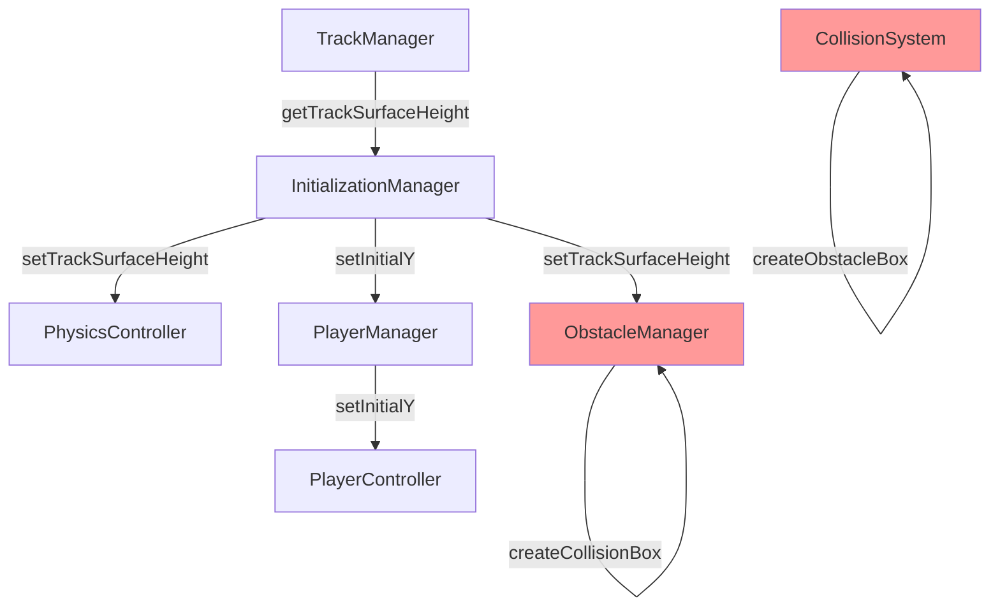
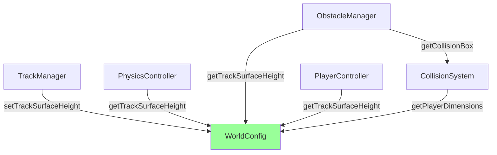

# Design Document: Collision & Positioning System Refactor

## Overview

This design refactors the survival game's collision, physics, and positioning systems to establish clear ownership of world-space constants and collision definitions. The primary change is introducing a `WorldConfig` singleton that serves as the single source of truth for track surface height and player dimensions. This eliminates the current pattern of passing `trackSurfaceHeight` to 4+ systems independently and consolidates collision box definitions into `ObstacleManager`.

### Design Principles

1. **Direct reads over subscriptions** - Since `trackSurfaceHeight` is static after initialization, systems read directly from WorldConfig rather than subscribing. This reduces complexity.
2. **WorldConfig complements getSurvivalConfig()** - WorldConfig holds runtime-calculated values (track surface height from model, player dimensions from model). `getSurvivalConfig()` continues to hold static configuration (lane width, speeds, scales). No duplication.
3. **Single ownership** - Each piece of data has exactly one owner that can modify it.

### Current Data Flow (Before Refactor)



### Proposed Data Flow (After Refactor)



### Config Separation

| Config Source | Purpose | Examples |
|--------------|---------|----------|
| `getSurvivalConfig()` | Static game balance values | laneWidth, baseSpeed, obstacleScale, runnerScale |
| `getMobileConfig()` | Device-specific adjustments | hitboxTolerance, coyoteTimeMs, speedMultiplier |
| `WorldConfig` | Runtime-calculated geometry | trackSurfaceHeight (from model), playerDimensions (from model) |

## Architecture

### New Component: WorldConfig

A singleton that holds runtime-calculated world geometry. Systems read directly from it - no subscription needed since values are static after initialization.

```typescript
// frontend/src/survival/config/WorldConfig.ts
class WorldConfig {
  private static instance: WorldConfig | null = null
  
  // Runtime-calculated geometry (from models)
  private trackSurfaceHeight: number = 1.3  // Safe default until track loads
  private playerWidth: number = 1.0
  private playerHeight: number = 2.0
  private playerDepth: number = 0.8
  private playerFootOffset: number = 0
  
  // Initialization state
  private isTrackInitialized: boolean = false
  private isPlayerInitialized: boolean = false
  
  static getInstance(): WorldConfig
  
  // Setters (called once during init)
  setTrackSurfaceHeight(height: number): void
  setPlayerDimensions(width: number, height: number, depth: number, footOffset: number): void
  
  // Getters (called by systems when needed)
  getTrackSurfaceHeight(): number  // Logs warning if not initialized
  getPlayerDimensions(): PlayerDimensions
  isInitialized(): boolean
  
  // Reset for new game (keeps geometry, just resets state flags if needed)
  reset(): void
}
```

**Note**: Static config values like `laneWidth`, `obstacleScale`, `baseSpeed` remain in `getSurvivalConfig()`. WorldConfig only holds values calculated from loaded 3D models.

### Modified Components

#### TrackManager
- **Change**: After calculating track surface height from model, calls `WorldConfig.getInstance().setTrackSurfaceHeight()`
- **Keeps**: `getTrackSurfaceHeight()` method for backward compatibility (delegates to WorldConfig)

#### PhysicsController
- **Change**: Reads `trackSurfaceHeight` from `WorldConfig.getInstance().getTrackSurfaceHeight()` when needed
- **Removes**: `setTrackSurfaceHeight()` method
- **Removes**: Internal `trackSurfaceHeight` field (reads from WorldConfig)

#### ObstacleManager
- **Change**: Reads `trackSurfaceHeight` from WorldConfig in `createCollisionBox()`
- **Removes**: `setTrackSurfaceHeight()` method
- **Removes**: Internal `trackSurfaceHeight` field
- **Keeps**: All collision box definitions (sole owner)

#### PlayerController
- **Change**: Reads initial Y from `WorldConfig.getInstance().getTrackSurfaceHeight()` in `reset()` and `initialize()`
- **Removes**: `setInitialY()` method
- **Removes**: Internal `trackSurfaceHeight` field

#### PlayerManager
- **Change**: Sets player dimensions on WorldConfig after loading model
- **Removes**: `setInitialY()` method (PlayerController handles this internally)

#### CollisionSystem
- **Change**: Reads player dimensions from WorldConfig instead of storing locally
- **Removes**: `setPlayerDimensions()` method
- **Removes**: `createObstacleBox()` method (duplicate - ObstacleManager owns collision boxes via `Collidable.getCollisionBox()`)

#### InitializationManager
- **Change**: Sets WorldConfig.trackSurfaceHeight once after track loads
- **Removes**: Individual `setTrackSurfaceHeight()` calls to PhysicsController, ObstacleManager
- **Removes**: `setInitialY()` call to PlayerManager

## Components and Interfaces

### WorldConfig Interface

```typescript
interface IWorldConfig {
  // Track geometry (runtime-calculated from model)
  getTrackSurfaceHeight(): number
  
  // Player geometry (runtime-calculated from model)
  getPlayerDimensions(): PlayerDimensions
  
  // Initialization state
  isInitialized(): boolean
}

interface PlayerDimensions {
  width: number
  height: number
  depth: number
  footOffset: number  // Distance from model origin to feet
}
```

**Note**: `laneWidth` and `trackWidth` remain in `getSurvivalConfig()` - they are static config values, not runtime-calculated.

### Collidable Interface (Unchanged)

```typescript
interface Collidable {
  id: string
  type: ObstacleType
  getCollisionBox(): CollisionBox  // ObstacleManager provides implementation
  lane: Lane
  z: number
}
```

### CollisionBox Interface (Unchanged)

```typescript
interface CollisionBox {
  minX: number
  maxX: number
  minY: number
  maxY: number
  minZ: number
  maxZ: number
}
```

## Data Models

### WorldConfig State

```typescript
interface WorldConfigState {
  // Track geometry (runtime-calculated from TrackManager)
  trackSurfaceHeight: number  // Y position of walking surface (from model bounding box)
  
  // Player geometry (runtime-calculated from PlayerManager)
  playerDimensions: PlayerDimensions
  
  // Initialization state
  isTrackInitialized: boolean
  isPlayerInitialized: boolean
}

// Static config remains in getSurvivalConfig():
// - laneWidth: number (1.5)
// - trackWidth: number (7)
// - obstacleScale: number (10)
// - runnerScale: number (2)
```

### Collision Box Definitions (ObstacleManager)

All collision box definitions remain in ObstacleManager. The key change is that Y values are calculated relative to `WorldConfig.getTrackSurfaceHeight()`:

```typescript
// Example: lowBarrier collision box
const baseY = WorldConfig.getInstance().getTrackSurfaceHeight()
return {
  minX: x - 1.8,
  maxX: x + 1.8,
  minY: baseY - 0.3,  // Relative to track surface
  maxY: baseY + 0.8,
  minZ: z - 0.8,
  maxZ: z + 0.8,
}
```

## Correctness Properties

*A property is a characteristic or behavior that should hold true across all valid executions of a system-essentially, a formal statement about what the system should do. Properties serve as the bridge between human-readable specifications and machine-verifiable correctness guarantees.*

### Property 1: Track surface height storage
*For any* track model with a known bounding box, after initialization, WorldConfig.getTrackSurfaceHeight() SHALL return the model's max.y value (scaled).
**Validates: Requirements 1.1**

### Property 2: Default value before initialization
*For any* query to WorldConfig.getTrackSurfaceHeight() before track initialization, the system SHALL return a safe default value (1.3) and log a warning.
**Validates: Requirements 1.3**

### Property 3: Collision box Y offset
*For any* obstacle type and any track surface height, the collision box Y coordinates SHALL be offset by the track surface height value from WorldConfig.
**Validates: Requirements 2.4**

### Property 4: Player collision box dimensions
*For any* player position and state, the collision box dimensions SHALL match the authoritative player dimensions from WorldConfig.
**Validates: Requirements 3.4**

### Property 5: Player Y positioning consistency
*For any* track surface height value, after initialization, track load, or reset, the player's Y position SHALL equal WorldConfig.getTrackSurfaceHeight().
**Validates: Requirements 4.1, 4.2, 4.3**

### Property 6: Coyote time jump allowance
*For any* coyote time configuration and any time elapsed since leaving ground, jump SHALL succeed if and only if elapsed time is less than coyote time.
**Validates: Requirements 6.1**

### Property 7: Jump buffer execution
*For any* jump buffer configuration and any buffered jump input, the jump SHALL execute upon landing if and only if the buffer time has not expired.
**Validates: Requirements 6.2**

### Property 8: Variable jump height gravity
*For any* jump where the button is released while rising, the gravity multiplier SHALL be GRAVITY_SCALE_JUMP_RELEASE (2.2).
**Validates: Requirements 6.3**

### Property 9: Falling gravity scale
*For any* falling state (velocityY < 0), the gravity multiplier SHALL be GRAVITY_SCALE_FALLING (1.6).
**Validates: Requirements 6.4**

### Property 10: Air control influence
*For any* airborne state and any air control input direction, the horizontal position change SHALL be proportional to input * AIR_CONTROL_STRENGTH.
**Validates: Requirements 6.5**

### Property 11: Near-miss detection accuracy
*For any* player trajectory that passes within NEAR_MISS_THRESHOLD of an obstacle without collision, the system SHALL report a near-miss with the correct distance.
**Validates: Requirements 7.1**

### Property 12: Invincibility duration
*For any* damage event, isInvincible() SHALL return true for exactly INVINCIBILITY_DURATION seconds after the event.
**Validates: Requirements 7.2**

### Property 13: Swept collision detection
*For any* player movement where delta Z exceeds SWEPT_COLLISION_THRESHOLD, the system SHALL check intermediate positions to detect collisions.
**Validates: Requirements 7.3**

### Property 14: Landing squash trigger
*For any* landing with velocity exceeding the threshold, triggerLandingSquash() SHALL be called with the landing velocity.
**Validates: Requirements 7.4**

### Property 15: Mobile config application
*For any* mobile device configuration, the collision tolerance, coyote time, and lane switch speed SHALL match the values from getMobileConfig().
**Validates: Requirements 8.1, 8.2, 8.3**

### Property 16: Obstacle type collision rules
*For any* obstacle type and player state:
- highBarrier: collision occurs unless sliding AND player.maxY < obstacle.minY
- lowBarrier: collision occurs unless player.minY >= obstacle.maxY
- spikes: collision occurs unless player X range does not overlap obstacle X range
- knowledgeGate: always triggers callback, never causes damage
- laneBarrier: collision occurs unless player lane differs from obstacle lane
**Validates: Requirements 9.1, 9.2, 9.3, 9.4, 9.5**

## Error Handling

### WorldConfig Not Initialized
- **Scenario**: System queries WorldConfig before track loads
- **Handling**: Return safe default (1.3 for trackSurfaceHeight), log warning
- **Recovery**: Value updates automatically when track loads via subscription

### Player Dimensions Not Set
- **Scenario**: CollisionSystem needs player dimensions before model loads
- **Handling**: Use default dimensions (1.0 x 2.0 x 0.8)
- **Recovery**: Dimensions update automatically when model loads

### Subscription Cleanup
- **Scenario**: Component unmounts without unsubscribing
- **Handling**: WeakRef-based subscription or explicit dispose() methods
- **Prevention**: All subscribing components must call unsubscribe in dispose()

## Testing Strategy

### Dual Testing Approach

This refactor requires both unit tests and property-based tests:

1. **Unit Tests**: Verify specific integration points and edge cases
2. **Property-Based Tests**: Verify universal properties hold across all inputs

### Property-Based Testing Framework

**Library**: [fast-check](https://github.com/dubzzz/fast-check) for TypeScript

**Configuration**: Minimum 100 iterations per property test

### Test Categories

#### WorldConfig Tests
- Property tests for subscriber notification
- Property tests for value storage and retrieval
- Unit tests for singleton behavior
- Unit tests for default values before initialization

#### Collision System Tests
- Property tests for obstacle collision rules (Property 16)
- Property tests for near-miss detection (Property 11)
- Property tests for swept collision (Property 13)
- Unit tests for invincibility timing

#### Physics Controller Tests
- Property tests for coyote time (Property 6)
- Property tests for jump buffering (Property 7)
- Property tests for gravity scaling (Properties 8, 9)
- Property tests for air control (Property 10)

#### Integration Tests
- Player Y positioning after initialization sequence
- Collision box Y values relative to track surface
- Mobile config value propagation

### Test Annotation Format

Each property-based test must include:
```typescript
/**
 * **Feature: collision-positioning-refactor, Property 1: Track surface height storage**
 * **Validates: Requirements 1.1**
 */
```
