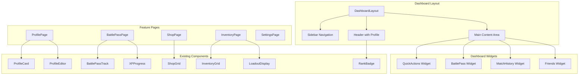

# Dashboard Redesign - Design Document

## Overview

This design document outlines the architecture for a comprehensive dashboard redesign that transforms the current simple Home.tsx into a modern game-launcher style hub. The new dashboard will integrate all features added through the user-services-microservices spec including Profile, Battle Pass, Cosmetics/Shop, and enhanced ELO leaderboards.

The design follows a component-based architecture with a persistent sidebar navigation, modular widgets, and dedicated pages for each feature area. All existing components (ProfileCard, BattlePassTrack, ShopGrid, etc.) will be integrated into this new structure.

## Data Flow Audit Notes

### Backend Endpoints Available
| Feature | Endpoint | Status |
|---------|----------|--------|
| Profile | `GET /api/v1/profiles/me` | ✅ Exists |
| Profile Update | `PUT /api/v1/profiles/me` | ✅ Exists |
| Privacy Settings | `PUT /api/v1/profiles/me/privacy` | ✅ Exists |
| Battle Pass Progress | `GET /api/v1/battlepass/me` | ✅ Exists |
| Battle Pass Tiers | `GET /api/v1/battlepass/tiers/{season_id}` | ✅ Exists |
| ELO Rank | `GET /api/v1/leaderboards/elo/me` | ✅ Exists |
| Match History | `GET /api/v1/games/history` | ✅ Exists |
| Friends List | `GET /api/v1/friends` | ✅ Exists |
| Matchmaking | `WS /ws/matchmaking` | ✅ Exists |

### Schema Alignment Issues (MUST FIX)
1. **Profile Schema Mismatch**: Frontend `Profile.id` vs Backend `Profile.user_id` - frontend hook extracts from API response correctly but types need alignment
2. **SignedUploadUrl Mismatch**: Frontend expects `file_path`, backend returns `storage_path` - needs fix in `useProfile.ts`
3. **BattlePass Progress**: Frontend `PlayerBattlePass` uses different field names than backend:
   - Frontend: `claimed_free_tiers`, `claimed_premium_tiers` 
   - Backend: `claimed_rewards` (single array)
   - Frontend: `claimable_free_tiers`, `claimable_premium_tiers`
   - Backend: `claimable_rewards` (single array)
4. **RankTier Case**: Frontend uses lowercase (`'bronze'`), backend uses PascalCase (`'Bronze'`) - needs normalization

### Missing Endpoints (MUST ADD)
1. **Recent Match History with Opponent Details**: Current `/api/v1/games/history` returns `opponent_id` but not `opponent_name` or `opponent_avatar` - need to join with profiles table
2. **Dashboard Aggregate Endpoint**: Consider adding `GET /api/v1/dashboard` to fetch profile + battlepass + rating in single call for performance

## Architecture



## Components and Interfaces

### DashboardLayout Component
The main layout wrapper providing consistent structure across all dashboard pages.

```typescript
interface DashboardLayoutProps {
  children: React.ReactNode;
  activeNav?: NavItem;
}

type NavItem = 'play' | 'profile' | 'battlepass' | 'shop' | 'inventory' | 'leaderboards' | 'friends' | 'settings';
```

### Sidebar Component
Persistent navigation sidebar with collapsible mobile support.

```typescript
interface SidebarProps {
  activeItem: NavItem;
  isCollapsed: boolean;
  onToggle: () => void;
}

interface NavItemConfig {
  id: NavItem;
  label: string;
  icon: React.ComponentType;
  path: string;
  badge?: number;
}
```

### DashboardHeader Component
Header showing user profile summary with avatar, rank, and level.

```typescript
interface DashboardHeaderProps {
  user: User;
  profile: Profile;
  rating: PlayerRating | null; // Can be null if user hasn't played ranked
  onProfileClick: () => void;
}

// NOTE: PlayerRating comes from GET /api/v1/leaderboards/elo/me
// Returns 404 if user has no ELO rating - handle gracefully with default values
```

### QuickActionsWidget Component
Primary gameplay actions section.

```typescript
interface QuickActionsWidgetProps {
  onFindMatch: () => void;
  onCreateLobby: () => void;
  onJoinLobby: (code: string) => void;
  isInQueue: boolean;
  queueStatus?: QueueStatus;
  cooldownSeconds: number | null;
}
```

### BattlePassWidget Component
Compact battle pass progress display for dashboard.

```typescript
interface BattlePassWidgetProps {
  currentTier: number;
  currentXP: number;
  xpToNextTier: number;
  claimableRewards: number; // Count of claimable_rewards array from backend
  seasonName: string;
  onClick: () => void;
}

// DATA FLOW NOTE:
// Fetch from GET /api/v1/battlepass/me which returns PlayerBattlePass:
// - current_tier: number
// - current_xp: number  
// - xp_to_next_tier: number
// - claimable_rewards: number[] (array of tier numbers - use .length for count)
// - season: { name: string, ... }
//
// Frontend useBattlePass hook fetches from /api/v1/me/battlepass - MISMATCH!
// Should be /api/v1/battlepass/me per backend router
```

### MatchHistoryWidget Component
Recent matches display.

```typescript
interface MatchHistoryWidgetProps {
  matches: RecentMatch[];
  onMatchClick: (matchId: string) => void;
  maxItems?: number;
}

interface RecentMatch {
  id: string;
  opponentId: string;
  opponentName: string | null; // NOTE: Backend GameHistoryItem returns null - need to enhance endpoint
  opponentAvatar?: string | null;
  result: 'win' | 'loss' | 'tie';
  eloChange: number; // NOTE: Must calculate from match_results table, not in games/history
  timestamp: Date;
}

// DATA FLOW NOTE:
// Current GET /api/v1/games/history returns GameHistoryItem with:
// - opponent_id (string)
// - opponent_name (null - not populated)
// - won (boolean)
// - is_tie (boolean)
// - my_score, opponent_score
// 
// MISSING: ELO change data - need to either:
// 1. Enhance games/history to join with match_results table
// 2. Create separate endpoint for recent matches with ELO data
// 3. Fetch from match_results_repo.get_recent_results()
```

### FriendsWidget Component
Online friends quick view.

```typescript
interface FriendsWidgetProps {
  onlineFriends: OnlineFriend[];
  onFriendClick: (friendId: string) => void;
  onViewAll: () => void;
  maxItems?: number;
}

interface OnlineFriend {
  id: string;
  displayName: string;
  avatarUrl?: string;
  status: 'online' | 'in_game' | 'in_lobby';
  currentActivity?: string;
}
```

## Data Models

### Dashboard State
```typescript
interface DashboardState {
  // User data
  user: User | null;
  profile: Profile | null;
  rating: PlayerRating | null; // From GET /api/v1/leaderboards/elo/me (can be null/404)
  
  // Battle Pass - From GET /api/v1/battlepass/me
  battlePassProgress: PlayerBattlePass | null;
  claimableRewards: number; // Derived from battlePassProgress.claimable_rewards.length
  
  // Match History - From enhanced GET /api/v1/games/history
  recentMatches: RecentMatch[];
  
  // Friends - From GET /api/v1/friends, filtered by online status
  onlineFriends: OnlineFriend[];
  
  // Loading states for independent data sources
  loading: {
    profile: boolean;
    rating: boolean;
    battlePass: boolean;
    matches: boolean;
    friends: boolean;
  };
  
  // Error states
  errors: {
    profile: string | null;
    rating: string | null;
    battlePass: string | null;
    matches: string | null;
    friends: string | null;
  };
  
  // UI State
  sidebarCollapsed: boolean;
  activeNav: NavItem;
}

// Enhanced GameHistoryItem from backend (after fix)
interface EnhancedGameHistoryItem {
  id: string;
  opponent_id: string;
  opponent_name: string | null;      // Populated from user_profiles join
  opponent_avatar_url: string | null; // NEW: Populated from user_profiles join
  my_score: number;
  opponent_score: number;
  won: boolean;
  is_tie: boolean;
  elo_change: number;                 // NEW: From match_results table
  created_at: string;
}
```

### Navigation Configuration
```typescript
const NAV_ITEMS: NavItemConfig[] = [
  { id: 'play', label: 'Play', icon: GamepadIcon, path: '/dashboard' },
  { id: 'profile', label: 'Profile', icon: UserIcon, path: '/profile' },
  { id: 'battlepass', label: 'Battle Pass', icon: StarIcon, path: '/battlepass' },
  { id: 'shop', label: 'Shop', icon: ShoppingBagIcon, path: '/shop' },
  { id: 'inventory', label: 'Inventory', icon: BackpackIcon, path: '/inventory' },
  { id: 'leaderboards', label: 'Leaderboards', icon: TrophyIcon, path: '/leaderboards' },
  { id: 'friends', label: 'Friends', icon: UsersIcon, path: '/friends' },
  { id: 'settings', label: 'Settings', icon: SettingsIcon, path: '/settings' },
];
```

## Correctness Properties

*A property is a characteristic or behavior that should hold true across all valid executions of a system-essentially, a formal statement about what the system should do. Properties serve as the bridge between human-readable specifications and machine-verifiable correctness guarantees.*

### Property 1: Rank Badge Tier Correctness
*For any* ELO rating value between 100 and 3000, the RankBadge component should display the correct tier icon and label according to the tier ranges (Bronze: 100-799, Silver: 800-1199, Gold: 1200-1599, Platinum: 1600-1999, Diamond: 2000-2399, Master: 2400-2799, Grandmaster: 2800-3000).
**Validates: Requirements 1.3**

### Property 2: Level Calculation Correctness
*For any* total XP value, the displayed level should equal floor(sqrt(total_xp / 100)), and the XP progress bar should show the correct percentage toward the next level.
**Validates: Requirements 1.4**

### Property 3: Queue Status Display
*For any* queue state where isInQueue is true, the dashboard should display the queue status component with the current queue time and position.
**Validates: Requirements 3.4**

### Property 4: Match Found Modal Display
*For any* state where isMatchFound is true and matchData is present, the dashboard should display the MatchFoundModal component.
**Validates: Requirements 3.5**

### Property 5: Battle Pass Widget Data
*For any* battle pass progress data, the widget should display the current tier, XP progress percentage (currentXP / xpToNextTier * 100), and claimable rewards count.
**Validates: Requirements 4.1, 4.2, 4.3**

### Property 6: Claimable Rewards Badge
*For any* claimable rewards count greater than 0, the Battle Pass widget should display a notification badge showing the count.
**Validates: Requirements 4.5**

### Property 7: Match History Limit
*For any* match history array, the MatchHistoryWidget should display at most maxItems (default 5) matches, showing the most recent first.
**Validates: Requirements 5.1**

### Property 8: Match Display Fields
*For any* match in the history, the display should include the opponent name, result (win/loss indicator), and ELO change (positive for wins, negative for losses).
**Validates: Requirements 5.2**

### Property 9: Online Friends Filter
*For any* friends list, the FriendsWidget should only display friends with status 'online', 'in_game', or 'in_lobby', excluding offline friends.
**Validates: Requirements 6.1**

### Property 10: Friend Display Fields
*For any* online friend displayed, the widget should show the friend's avatar (or placeholder), display name, and current activity status.
**Validates: Requirements 6.2**

## Error Handling

### Data Loading Errors
- Profile fetch failure: Display cached data if available, show retry button
- Battle Pass fetch failure: Hide widget with "Unable to load" message
- Match history fetch failure: Show empty state with retry option
- Friends fetch failure: Show cached friends list or empty state

### Navigation Errors
- Invalid route: Redirect to /dashboard with error toast
- Unauthorized access: Redirect to /login with session expired message

### Matchmaking Errors
- Queue join failure: Display error message, enable retry
- Match accept timeout: Return to dashboard with notification

## Testing Strategy

### Unit Testing
- Test each widget component in isolation with mock data
- Test navigation item rendering and click handlers
- Test responsive behavior with viewport mocking
- Test loading and error states for each widget

### Property-Based Testing
Using fast-check for property-based tests:

1. **Rank tier assignment**: Generate random ELO values, verify correct tier
2. **Level calculation**: Generate random XP values, verify level formula
3. **Queue status rendering**: Generate queue states, verify display
4. **Match history limiting**: Generate match arrays, verify max items
5. **Friends filtering**: Generate friend lists with mixed statuses, verify online filter

### Integration Testing
- Test full dashboard load with mocked API responses
- Test navigation between all pages
- Test matchmaking flow from dashboard
- Test Battle Pass widget click-through to full page
