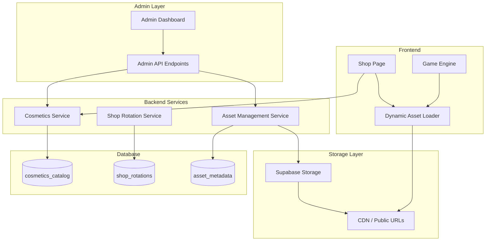

# Design Document: Dynamic Shop CMS

## Overview

The Dynamic Shop CMS system transforms the current hardcoded cosmetics approach into a fully dynamic, cloud-based content management system. This enables content administrators to add, modify, and schedule cosmetic items without code changes or deployments.

The system consists of four main components:
1. **Asset Storage Layer** - Supabase Storage for hosting sprite sheets, images, and videos
2. **Admin API** - Protected endpoints for CRUD operations on cosmetics catalog
3. **Shop Rotation Engine** - Scheduled system for managing featured items and time-limited offers
4. **Dynamic Asset Loader** - Frontend system for loading assets from URLs at runtime

## Architecture



## Components and Interfaces

### 1. Asset Management Service

Handles upload, validation, and management of cosmetic assets in Supabase Storage.

```python
class AssetManagementService:
    """Service for managing cosmetic assets in Supabase Storage."""
    
    BUCKET_NAME = "cosmetics"
    ALLOWED_TYPES = ["image/png", "image/webp", "application/json"]
    MAX_FILE_SIZE = 10 * 1024 * 1024  # 10MB
    
    async def upload_asset(
        self,
        file_data: bytes,
        filename: str,
        content_type: str,
        cosmetic_type: str,
    ) -> AssetUploadResult:
        """
        Upload an asset to Supabase Storage.
        
        Args:
            file_data: Raw file bytes
            filename: Original filename
            content_type: MIME type
            cosmetic_type: Type of cosmetic (skin, emote, etc.)
            
        Returns:
            AssetUploadResult with public_url and metadata
        """
        pass
    
    async def validate_sprite_sheet(
        self,
        file_data: bytes,
        expected_frames: int,
    ) -> ValidationResult:
        """Validate sprite sheet dimensions and frame count."""
        pass
    
    async def delete_asset(self, asset_path: str) -> bool:
        """Delete an asset from storage."""
        pass
    
    async def get_asset_metadata(self, asset_path: str) -> AssetMetadata:
        """Get metadata for an asset."""
        pass
```

### 2. Admin Cosmetics API

Protected endpoints for managing the cosmetics catalog.

```python
# POST /api/v1/admin/cosmetics
class CosmeticCreateRequest(BaseSchema):
    name: str
    type: CosmeticType
    rarity: Rarity
    description: Optional[str]
    price_coins: int
    price_premium: Optional[int]
    event: Optional[str]
    is_limited: bool = False
    is_featured: bool = False
    available_from: Optional[datetime]
    available_until: Optional[datetime]
    skin_id: Optional[str]  # For sprite-based skins
    
# Asset URLs set after upload
class CosmeticAssetUrls(BaseSchema):
    image_url: str
    sprite_sheet_url: Optional[str]
    sprite_meta_url: Optional[str]  # JSON metadata for sprite sheet
    preview_video_url: Optional[str]

# PUT /api/v1/admin/cosmetics/{id}
class CosmeticUpdateRequest(BaseSchema):
    name: Optional[str]
    description: Optional[str]
    price_coins: Optional[int]
    price_premium: Optional[int]
    is_featured: Optional[bool]
    available_from: Optional[datetime]
    available_until: Optional[datetime]
```

### 3. Shop Rotation Service

Manages scheduled shop rotations and featured item selection.

```python
class ShopRotationService:
    """Service for managing shop rotations."""
    
    async def get_current_rotation(self) -> ShopRotation:
        """Get the currently active shop rotation."""
        pass
    
    async def schedule_rotation(
        self,
        rotation: ShopRotationCreate,
    ) -> ShopRotation:
        """Schedule a new shop rotation."""
        pass
    
    async def execute_rotation(self, rotation_id: str) -> bool:
        """Execute a scheduled rotation (called by cron/scheduler)."""
        pass
    
    async def get_featured_items(self) -> List[Cosmetic]:
        """Get currently featured items based on rotation rules."""
        pass
    
    async def check_availability(self, cosmetic_id: str) -> bool:
        """Check if a cosmetic is currently available for purchase."""
        pass
```

### 4. Dynamic Asset Loader (Frontend)

Loads cosmetic assets from URLs at runtime instead of bundled imports.

```typescript
interface DynamicAssetLoader {
  /**
   * Load a cosmetic's display image for shop/inventory
   */
  loadCosmeticImage(imageUrl: string): Promise<HTMLImageElement>;
  
  /**
   * Load a skin sprite sheet and its metadata
   */
  loadSpriteSheet(
    spriteSheetUrl: string,
    metadataUrl: string
  ): Promise<SpriteSheetData>;
  
  /**
   * Get cached asset or load if not present
   */
  getOrLoad(assetUrl: string): Promise<HTMLImageElement | HTMLCanvasElement>;
  
  /**
   * Preload assets for a list of cosmetics
   */
  preloadCosmetics(cosmetics: Cosmetic[]): Promise<void>;
  
  /**
   * Clear cache for memory management
   */
  clearCache(): void;
}

interface SpriteSheetData {
  image: HTMLImageElement;
  frames: SpriteFrame[];
  animations: Record<string, AnimationDef>;
}

interface SpriteFrame {
  x: number;
  y: number;
  width: number;
  height: number;
  duration?: number;
}
```

## Data Models

### Extended Cosmetics Catalog Schema

```sql
-- Add new columns to cosmetics_catalog
ALTER TABLE cosmetics_catalog ADD COLUMN IF NOT EXISTS
    sprite_sheet_url TEXT,
    sprite_meta_url TEXT,
    is_featured BOOLEAN DEFAULT false,
    available_from TIMESTAMPTZ,
    rotation_group VARCHAR(50),
    sort_order INTEGER DEFAULT 0;

-- Asset metadata table for tracking uploads
CREATE TABLE IF NOT EXISTS asset_metadata (
    id UUID PRIMARY KEY DEFAULT gen_random_uuid(),
    cosmetic_id UUID REFERENCES cosmetics_catalog(id) ON DELETE CASCADE,
    asset_type VARCHAR(20) NOT NULL, -- 'image', 'sprite_sheet', 'sprite_meta', 'video'
    storage_path TEXT NOT NULL,
    public_url TEXT NOT NULL,
    content_type VARCHAR(50) NOT NULL,
    file_size INTEGER NOT NULL,
    width INTEGER,
    height INTEGER,
    frame_count INTEGER, -- For sprite sheets
    uploaded_at TIMESTAMPTZ DEFAULT NOW(),
    uploaded_by UUID REFERENCES user_profiles(id)
);

-- Shop rotations table
CREATE TABLE IF NOT EXISTS shop_rotations (
    id UUID PRIMARY KEY DEFAULT gen_random_uuid(),
    name VARCHAR(100) NOT NULL,
    rotation_type VARCHAR(20) NOT NULL, -- 'daily', 'weekly', 'event'
    starts_at TIMESTAMPTZ NOT NULL,
    ends_at TIMESTAMPTZ,
    featured_cosmetic_ids UUID[] DEFAULT '{}',
    rotation_rules JSONB DEFAULT '{}',
    is_active BOOLEAN DEFAULT false,
    created_at TIMESTAMPTZ DEFAULT NOW(),
    created_by UUID REFERENCES user_profiles(id)
);
```

### Sprite Sheet Metadata JSON Schema

```json
{
  "frames": {
    "idle_0": { "x": 0, "y": 0, "w": 64, "h": 64 },
    "idle_1": { "x": 64, "y": 0, "w": 64, "h": 64 },
    "walk_0": { "x": 0, "y": 64, "w": 64, "h": 64 },
    "walk_1": { "x": 64, "y": 64, "w": 64, "h": 64 }
  },
  "animations": {
    "idle": {
      "frames": ["idle_0", "idle_1"],
      "frameDuration": 200,
      "loop": true
    },
    "walk": {
      "frames": ["walk_0", "walk_1"],
      "frameDuration": 150,
      "loop": true
    }
  },
  "meta": {
    "size": { "w": 128, "h": 128 },
    "scale": 1
  }
}
```


## Correctness Properties

*A property is a characteristic or behavior that should hold true across all valid executions of a system-essentially, a formal statement about what the system should do. Properties serve as the bridge between human-readable specifications and machine-verifiable correctness guarantees.*

### Property 1: Asset upload returns valid URL
*For any* valid asset file (image/png, image/webp, or application/json under 10MB), uploading the file SHALL return a public URL that, when fetched, returns the same file content.
**Validates: Requirements 1.1**

### Property 2: Sprite sheet dimension validation
*For any* image file uploaded as a sprite sheet, the system SHALL accept it only if dimensions are divisible by the expected frame size, and reject otherwise with an appropriate error.
**Validates: Requirements 1.2**

### Property 3: Upload error messages
*For any* invalid upload attempt (wrong content type, exceeds size limit, or malformed data), the system SHALL return an error response containing a descriptive message.
**Validates: Requirements 1.3**

### Property 4: Unique filename generation
*For any* two uploads with the same original filename, the system SHALL generate different storage paths, ensuring no collisions occur.
**Validates: Requirements 1.4**

### Property 5: Cosmetic creation stores all fields
*For any* valid cosmetic creation request, the stored cosmetic SHALL contain all provided fields (name, type, rarity, description, asset URLs, pricing) with values matching the request.
**Validates: Requirements 2.1**

### Property 6: Partial update preserves unchanged fields
*For any* cosmetic and any partial update request, fields not included in the update SHALL retain their original values after the update completes.
**Validates: Requirements 2.2**

### Property 7: Delete cascades to assets
*For any* cosmetic with associated assets, deleting the cosmetic SHALL also remove all associated asset files from storage.
**Validates: Requirements 2.3**

### Property 8: Availability window enforcement
*For any* cosmetic with availability dates, the shop listing SHALL include the cosmetic only when current time is within [available_from, available_until] range.
**Validates: Requirements 2.4, 3.2**

### Property 9: Required field validation
*For any* cosmetic creation request missing required fields (name, type, rarity, image_url, price_coins), the system SHALL reject the request with a validation error.
**Validates: Requirements 2.5**

### Property 10: Featured flag behavior
*For any* cosmetic marked as featured, the featured items query SHALL include that cosmetic until the featured flag is set to false.
**Validates: Requirements 3.1**

### Property 11: Rotation execution
*For any* scheduled shop rotation with configured rules, when the rotation executes, the featured items SHALL match the items selected by applying those rules.
**Validates: Requirements 3.3, 3.4**

### Property 12: Asset loading with fallback
*For any* invalid or unreachable asset URL, the dynamic loader SHALL return a placeholder image rather than throwing an error.
**Validates: Requirements 4.3**

### Property 13: Sprite metadata parsing
*For any* valid sprite sheet metadata JSON, parsing SHALL produce a SpriteSheetData object with frames and animations matching the JSON structure.
**Validates: Requirements 4.4**

### Property 14: Skin loading with caching
*For any* skin sprite sheet URL requested multiple times, the loader SHALL make at most one network request and return cached data for subsequent requests.
**Validates: Requirements 5.1, 5.4**

### Property 15: Animation registration
*For any* loaded sprite sheet with animation definitions, all animations SHALL be registered with the game engine and playable by name.
**Validates: Requirements 5.2**

### Property 16: Skin fallback on error
*For any* equipped skin that fails to load, the game engine SHALL use the default skin and the player SHALL receive a notification.
**Validates: Requirements 5.3**

### Property 17: Cosmetic serialization round-trip
*For any* valid Cosmetic object, serializing to JSON and deserializing back SHALL produce an equivalent Cosmetic object.
**Validates: Requirements 6.1**

### Property 18: Deserialization validation
*For any* JSON string missing required cosmetic fields, deserialization SHALL fail with a validation error rather than producing an incomplete object.
**Validates: Requirements 6.2**

### Property 19: Asset metadata completeness
*For any* uploaded asset, the stored metadata SHALL include content_type, file_size, and upload_timestamp fields with valid values.
**Validates: Requirements 6.3**

## Error Handling

### Asset Upload Errors

| Error Code | Condition | Response |
|------------|-----------|----------|
| `INVALID_CONTENT_TYPE` | Content type not in allowed list | 400 with allowed types |
| `FILE_TOO_LARGE` | File exceeds 10MB limit | 400 with max size |
| `INVALID_DIMENSIONS` | Sprite sheet dimensions invalid | 400 with expected dimensions |
| `STORAGE_ERROR` | Supabase Storage failure | 500 with retry suggestion |

### Cosmetic CRUD Errors

| Error Code | Condition | Response |
|------------|-----------|----------|
| `VALIDATION_ERROR` | Missing required fields | 400 with field list |
| `NOT_FOUND` | Cosmetic ID doesn't exist | 404 |
| `DUPLICATE_NAME` | Name already exists | 409 |
| `UNAUTHORIZED` | Non-admin user | 403 |

### Asset Loading Errors (Frontend)

| Error Type | Handling |
|------------|----------|
| Network timeout | Retry 3 times with exponential backoff, then fallback |
| 404 Not Found | Use placeholder immediately |
| Invalid image data | Log error, use placeholder |
| Invalid JSON metadata | Use default animation config |

## Testing Strategy

### Property-Based Testing Library

The system will use **Hypothesis** for Python backend property tests and **fast-check** for TypeScript frontend property tests.

### Unit Tests

Unit tests will cover:
- Asset validation logic (file type, size, dimensions)
- Cosmetic schema validation
- Date range calculations for availability
- Cache key generation

### Property-Based Tests

Each correctness property will have a corresponding property-based test:

```python
# Example: Property 17 - Cosmetic serialization round-trip
@given(cosmetic=cosmetic_strategy())
@settings(max_examples=100)
def test_cosmetic_round_trip(cosmetic: Cosmetic):
    """
    **Feature: dynamic-shop-cms, Property 17: Cosmetic serialization round-trip**
    **Validates: Requirements 6.1**
    """
    json_str = cosmetic.model_dump_json()
    restored = Cosmetic.model_validate_json(json_str)
    assert restored == cosmetic
```

```typescript
// Example: Property 14 - Skin loading with caching
fc.assert(
  fc.asyncProperty(
    fc.string().filter(s => s.startsWith('http')),
    async (skinUrl) => {
      /**
       * **Feature: dynamic-shop-cms, Property 14: Skin loading with caching**
       * **Validates: Requirements 5.1, 5.4**
       */
      const loader = new DynamicAssetLoader();
      const fetchSpy = jest.spyOn(global, 'fetch');
      
      await loader.loadSpriteSheet(skinUrl, `${skinUrl}.json`);
      await loader.loadSpriteSheet(skinUrl, `${skinUrl}.json`);
      
      expect(fetchSpy).toHaveBeenCalledTimes(2); // Once for image, once for meta
    }
  ),
  { numRuns: 100 }
);
```

### Integration Tests

Integration tests will verify:
- Full upload → create cosmetic → display in shop flow
- Shop rotation execution with real database
- Frontend loading cosmetics from actual API responses

### Test Data Generators

```python
# Cosmetic generator for property tests
@st.composite
def cosmetic_strategy(draw):
    return Cosmetic(
        id=draw(st.uuids().map(str)),
        name=draw(st.text(min_size=1, max_size=100)),
        type=draw(st.sampled_from(CosmeticType)),
        rarity=draw(st.sampled_from(Rarity)),
        description=draw(st.text(max_size=500) | st.none()),
        image_url=draw(st.text(min_size=10).map(lambda s: f"https://storage.example.com/{s}.png")),
        price_coins=draw(st.integers(min_value=0, max_value=100000)),
        price_premium=draw(st.integers(min_value=0, max_value=10000) | st.none()),
    )
```
