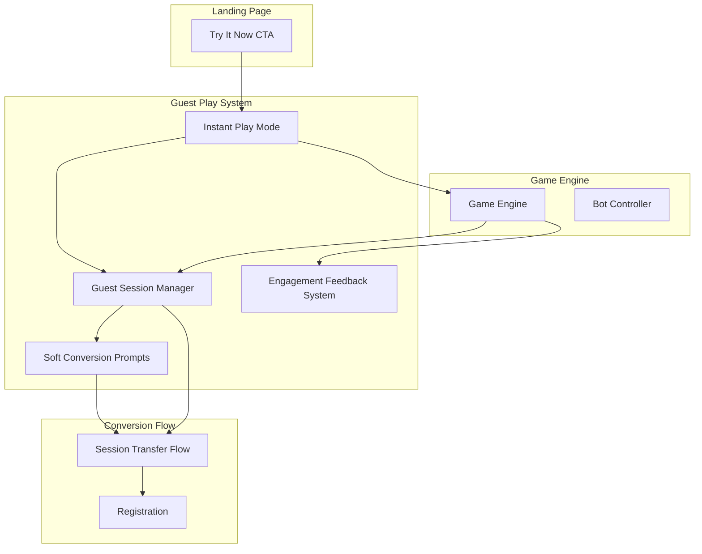

# Design Document: Guest Experience Enhancement

## Overview

This design transforms the guest play experience from a passive demo viewer to an engaging, conversion-optimized gameplay funnel. The core philosophy is "instant gratification with progressive investment" - get users playing immediately, make them feel successful, show them what they're building toward, and make signup feel like unlocking rather than gatekeeping.

The system introduces:
1. **Instant Play Mode** - Zero-friction game start from landing page CTA
2. **Guest Session Manager** - Tracks progress, stats, and milestones during anonymous play
3. **Engagement Feedback System** - Enhanced visual/audio rewards for guest players
4. **Soft Conversion Prompts** - Non-intrusive signup nudges at strategic moments
5. **Session Transfer Flow** - Seamless progress migration when guests create accounts

## Architecture



## Components and Interfaces

### 1. InstantPlayManager

Handles zero-friction game initialization from landing page.

```typescript
interface InstantPlayConfig {
  defaultCategory: string        // 'general' - broad appeal
  defaultMap: MapConfig          // NEXUS_ARENA - most polished
  tutorialEnabled: boolean       // true for first-time guests
  preloadAssets: boolean         // true - start loading on hover
}

interface InstantPlayManager {
  // Initialize instant play mode
  initialize(config?: Partial<InstantPlayConfig>): Promise<void>
  
  // Start game immediately with defaults
  startInstantGame(): Promise<void>
  
  // Check if assets are preloaded
  isReady(): boolean
  
  // Get initialization time for metrics
  getLoadTimeMs(): number
}
```

### 2. GuestSessionManager

Tracks all guest progress in localStorage with session-based persistence.

```typescript
interface GuestSessionStats {
  sessionId: string
  startedAt: number
  matchesPlayed: number
  matchesWon: number
  totalKills: number
  totalDeaths: number
  questionsAnswered: number
  questionsCorrect: number
  previewXpEarned: number
  milestonesAchieved: string[]
  categoriesPlayed: string[]
}

interface GuestMilestone {
  id: string
  name: string
  description: string
  condition: (stats: GuestSessionStats) => boolean
  xpBonus: number
}

interface GuestSessionManager {
  // Get or create current session
  getSession(): GuestSessionStats
  
  // Update stats after match
  recordMatchResult(result: MatchResult): void
  
  // Check for new milestones
  checkMilestones(): GuestMilestone[]
  
  // Calculate preview XP for display
  calculatePreviewXp(matchResult: MatchResult): number
  
  // Get session data for transfer
  getTransferData(): SessionTransferData
  
  // Clear session (after transfer or explicit reset)
  clearSession(): void
}
```

### 3. EngagementFeedbackSystem

Enhanced visual and audio feedback for guest players.

```typescript
interface FeedbackConfig {
  correctAnswerParticles: boolean
  killConfirmationEffect: boolean
  streakAnnouncements: boolean
  previewXpPopups: boolean
}

interface EngagementFeedbackSystem {
  // Trigger correct answer celebration
  onCorrectAnswer(timeMs: number, streak: number): void
  
  // Trigger kill confirmation
  onKillConfirmed(killStreak: number): void
  
  // Show XP preview popup
  showXpPreview(amount: number, reason: string): void
  
  // Show milestone achievement
  showMilestoneUnlocked(milestone: GuestMilestone): void
  
  // Show match completion summary
  showMatchSummary(result: MatchResult, previewXp: number): void
}
```

### 4. SoftConversionPrompts

Strategic, non-intrusive signup prompts.

```typescript
interface ConversionPromptConfig {
  firstMatchPrompt: boolean      // After first match
  thirdMatchStatsPrompt: boolean // After third match
  fifthMatchBreakPrompt: boolean // After fifth match
  guestModeIndicator: boolean    // During gameplay
}

interface ConversionPrompt {
  id: string
  type: 'feature-preview' | 'stats-save' | 'break-suggestion' | 'progress-warning'
  title: string
  message: string
  features?: string[]
  ctaText: string
  dismissable: boolean
}

interface SoftConversionPrompts {
  // Check if prompt should show
  shouldShowPrompt(stats: GuestSessionStats): ConversionPrompt | null
  
  // Record prompt interaction
  recordPromptInteraction(promptId: string, action: 'shown' | 'clicked' | 'dismissed'): void
  
  // Get guest mode indicator config
  getGuestIndicatorConfig(): GuestIndicatorConfig
}
```

### 5. SessionTransferFlow

Handles progress migration during signup.

```typescript
interface SessionTransferData {
  previewXp: number
  matchesPlayed: number
  matchesWon: number
  milestonesAchieved: string[]
  estimatedRewards: {
    coins: number
    xp: number
    unlockedItems: string[]
  }
}

interface SessionTransferFlow {
  // Check if transfer is available
  hasTransferableSession(): boolean
  
  // Get transfer preview
  getTransferPreview(): SessionTransferData
  
  // Execute transfer after account creation
  executeTransfer(userId: string, token: string): Promise<TransferResult>
  
  // Show transfer confirmation
  showTransferConfirmation(result: TransferResult): void
}
```

### 6. BotPersonalitySystem

Makes bot opponents feel more human-like.

```typescript
interface BotPersonality {
  name: string
  avatar: string
  difficulty: 'easy' | 'medium' | 'hard'
  behaviorBias: 'aggressive' | 'defensive' | 'balanced'
  quizSpeed: 'fast' | 'medium' | 'slow'
  tauntFrequency: number
}

const BOT_NAME_POOL = [
  'QuizMaster_99', 'TriviaKing', 'BrainiacBot', 'FactFinder',
  'KnowledgeNinja', 'QuestionQueen', 'SmartShooter', 'WisdomWarrior',
  'MindMaster', 'ThinkTank', 'BrainStorm', 'QuizWhiz'
]

interface BotPersonalitySystem {
  // Generate random bot personality
  generatePersonality(): BotPersonality
  
  // Get behavior modifiers for personality
  getBehaviorModifiers(personality: BotPersonality): BotBehaviorConfig
}
```

## Data Models

### GuestSession (localStorage)

```typescript
interface GuestSessionData {
  version: 1
  sessionId: string
  createdAt: number
  lastPlayedAt: number
  stats: GuestSessionStats
  promptsShown: string[]
  promptsDismissed: string[]
}
```

### MatchResult

```typescript
interface MatchResult {
  won: boolean
  playerScore: number
  botScore: number
  kills: number
  deaths: number
  questionsAnswered: number
  questionsCorrect: number
  matchDurationMs: number
  category: string
}
```

### TransferResult

```typescript
interface TransferResult {
  success: boolean
  xpCredited: number
  coinsCredited: number
  achievementsUnlocked: string[]
  welcomeMessage: string
}
```

## Correctness Properties

*A property is a characteristic or behavior that should hold true across all valid executions of a system-essentially, a formal statement about what the system should do. Properties serve as the bridge between human-readable specifications and machine-verifiable correctness guarantees.*

### Property 1: Game initialization timing bound
*For any* instant play initialization, the time from trigger to playable state SHALL be less than 3000ms when assets are preloaded.
**Validates: Requirements 1.1**

### Property 2: Tutorial auto-dismiss timing
*For any* tutorial overlay display, if not manually dismissed, the overlay SHALL automatically dismiss after exactly 5000ms (±100ms tolerance).
**Validates: Requirements 1.4**

### Property 3: Preview XP calculation consistency
*For any* match result, the calculated preview XP SHALL be identical whether displayed as in-game preview or in session transfer summary.
**Validates: Requirements 2.3, 8.2**

### Property 4: Session stats accumulation correctness
*For any* sequence of match results, the accumulated session statistics SHALL equal the sum of individual match statistics for wins, kills, deaths, questions answered, and questions correct.
**Validates: Requirements 4.1**

### Property 5: Milestone detection determinism
*For any* guest session state, the set of achieved milestones SHALL be deterministic based solely on the session statistics.
**Validates: Requirements 4.2**

### Property 6: Play again initialization timing
*For any* "Play Again" action, the time from click to new match start SHALL be less than 2000ms.
**Validates: Requirements 5.2**

### Property 7: Category suggestion probability
*For any* "Play Again" prompt after 3+ matches in the same category, there SHALL be a non-zero probability (≥20%) of suggesting a different category.
**Validates: Requirements 5.3**

### Property 8: Mobile touch target compliance
*For any* interactive element displayed on a mobile device, the touch target dimensions SHALL be at least 44x44 CSS pixels.
**Validates: Requirements 6.1, 6.3**

### Property 9: Bot name uniqueness per session
*For any* guest session, consecutive bot opponents SHALL have different names (no immediate repeats).
**Validates: Requirements 7.2**

### Property 10: Bot behavior variation
*For any* bot opponent over a 30-second window, the bot SHALL exhibit at least 2 different behavior patterns (patrol, chase, strafe, evade).
**Validates: Requirements 7.3**

## Error Handling

### Asset Loading Failures
- If preload fails, fall back to on-demand loading with loading indicator
- If critical assets fail, show error with retry option
- Track load failures for monitoring

### Session Storage Failures
- If localStorage is unavailable, use in-memory session (warn user progress won't persist)
- If session data is corrupted, reset to fresh session
- Validate session data on load

### Network Failures
- Questions API failure: Use cached fallback questions for instant play
- Transfer API failure: Queue transfer for retry, show pending status
- Track failures for monitoring

### Bot Behavior Edge Cases
- If bot gets stuck, reset to patrol behavior after 3 seconds
- If bot health desync, reconcile with authoritative state
- Log anomalies for debugging

## Testing Strategy

### Unit Testing
- Test XP calculation formulas with specific inputs
- Test milestone condition functions
- Test session stats accumulation
- Test bot name generation uniqueness

### Property-Based Testing

We will use **fast-check** for property-based testing in TypeScript.

Each property test should run a minimum of 100 iterations.

Property tests will be tagged with format: `**Feature: guest-experience-enhancement, Property {number}: {property_text}**`

Key properties to test:
1. Timing bounds (initialization, auto-dismiss, play again)
2. Calculation consistency (XP preview vs transfer)
3. Stats accumulation (sum of parts equals whole)
4. Milestone determinism (same input → same output)
5. Touch target sizing (all mobile elements ≥ 44px)
6. Bot name uniqueness (no consecutive repeats)
7. Bot behavior variation (multiple patterns per window)

### Integration Testing
- Full flow from CTA click to game start
- Session persistence across page reloads
- Transfer flow from guest to authenticated
- Mobile device detection and UI adaptation
