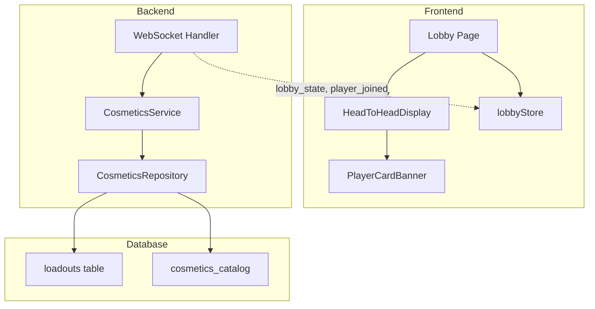

# Design Document: Lobby Playercard Redesign

## Overview

This design adds a fighting-game style head-to-head playercard display to the Lobby page. The feature is purely additive and preserves all existing lobby functionality. Players will see their equipped playercard cosmetic displayed prominently, with a VS indicator between them and their opponent.

The implementation follows the existing pattern used for player skins in the game_start event, extending the Player type with optional playercard data that flows through WebSocket events.

## Architecture



## Components and Interfaces

### Frontend Components

#### PlayerCardBanner Component
A reusable component that displays a playercard with the player's name.

```typescript
interface PlayerCardBannerProps {
  playercard: Cosmetic | null;  // The equipped playercard cosmetic
  playerName: string;           // Player's display name
  isCurrentUser?: boolean;      // Highlight if current user
  size?: 'small' | 'medium' | 'large';  // Size variant
  showStatus?: {
    isHost?: boolean;
    isReady?: boolean;
  };
}
```

#### HeadToHeadDisplay Component
Container component that arranges two PlayerCardBanner components in a VS layout.

```typescript
interface HeadToHeadDisplayProps {
  currentPlayer: PlayerWithCard | null;
  opponent: PlayerWithCard | null;
  isWaitingForOpponent: boolean;
}
```

### Extended Types

#### Player Type Extension (Frontend)
```typescript
// Extends existing Player type - all existing fields preserved
interface PlayerWithCard extends Player {
  playercard?: Cosmetic | null;  // Optional equipped playercard
}
```

#### Loadout Schema Extension (Backend)
```python
class Loadout(BaseSchema):
    # ... existing fields preserved ...
    playercard_equipped: Optional[Cosmetic] = Field(None, description="Equipped playercard")
```

### Backend Changes

#### CosmeticsService Extension
Add `playercard_equipped` to the SLOT_MAP and loadout fetching:

```python
SLOT_MAP = {
    # ... existing slots ...
    CosmeticType.PLAYERCARD: "playercard_equipped",
}
```

#### WebSocket Event Extension
Extend `lobby_state` and `player_joined` events to include playercard data:

```python
async def _get_player_playercards(self, player_ids: list[str]) -> Dict[str, Optional[Dict]]:
    """Fetch equipped playercards for all players."""
    # Similar pattern to _get_player_skins
```

## Data Models

### Database Schema Extension

The `loadouts` table needs a new column:

```sql
ALTER TABLE loadouts 
ADD COLUMN playercard_equipped UUID REFERENCES cosmetics_catalog(id);
```

### WebSocket Payload Extension

The Player object in WebSocket events will include:

```json
{
  "id": "uuid",
  "display_name": "PlayerName",
  "is_host": true,
  "is_ready": false,
  "playercard": {
    "id": "uuid",
    "name": "Frostborne Valkyrie Card",
    "type": "playercard",
    "rarity": "rare",
    "image_url": "https://..."
  }
}
```

## Correctness Properties

*A property is a characteristic or behavior that should hold true across all valid executions of a system-essentially, a formal statement about what the system should do. Properties serve as the bridge between human-readable specifications and machine-verifiable correctness guarantees.*

### Property 1: PlayerCardBanner renders playercard image and name
*For any* valid playercard cosmetic and player name, the PlayerCardBanner component SHALL render both the playercard's image_url and the player's display name in the output.
**Validates: Requirements 1.1, 1.3, 4.2**

### Property 2: PlayerCardBanner fallback to placeholder
*For any* null or undefined playercard input, the PlayerCardBanner component SHALL render a default placeholder design without errors.
**Validates: Requirements 1.2, 4.3**

### Property 3: Current user positioned on left
*For any* lobby with a current user and players array, the HeadToHeadDisplay SHALL position the current user's card on the left side regardless of their position in the players array.
**Validates: Requirements 2.3**

### Property 4: Size variants produce different dimensions
*For any* size prop value ('small', 'medium', 'large'), the PlayerCardBanner SHALL render with distinct dimensions corresponding to that size.
**Validates: Requirements 4.4**

### Property 5: Extended Player type preserves existing fields
*For any* PlayerWithCard object, all existing Player fields (id, display_name, is_host, is_ready) SHALL be present and unchanged, with playercard as an optional additional field.
**Validates: Requirements 5.1, 5.3**

### Property 6: Loadout playercard round-trip
*For any* user who equips a playercard cosmetic, fetching their loadout SHALL return the same playercard cosmetic data that was equipped.
**Validates: Requirements 5.4**

## Error Handling

| Error Scenario | Handling Strategy |
|----------------|-------------------|
| Playercard image fails to load | Show placeholder with player name |
| WebSocket playercard data missing | Render default placeholder, don't block lobby |
| Invalid playercard cosmetic type | Ignore and show placeholder |
| Loadout fetch fails | Continue with null playercard, log error |

All error handling is graceful degradation - the lobby remains fully functional even if playercard display fails.

## Testing Strategy

### Property-Based Testing
- Use `fast-check` for frontend property tests
- Use `hypothesis` for backend property tests
- Minimum 100 iterations per property test

### Unit Tests
- PlayerCardBanner component rendering
- HeadToHeadDisplay layout logic
- Loadout schema validation

### Integration Tests
- WebSocket event flow with playercard data
- Equip/unequip playercard flow
- Lobby state updates with playercard changes

### Test Annotations
All property-based tests will be annotated with:
```typescript
// **Feature: lobby-playercard-redesign, Property {N}: {property_text}**
// **Validates: Requirements X.Y**
```
