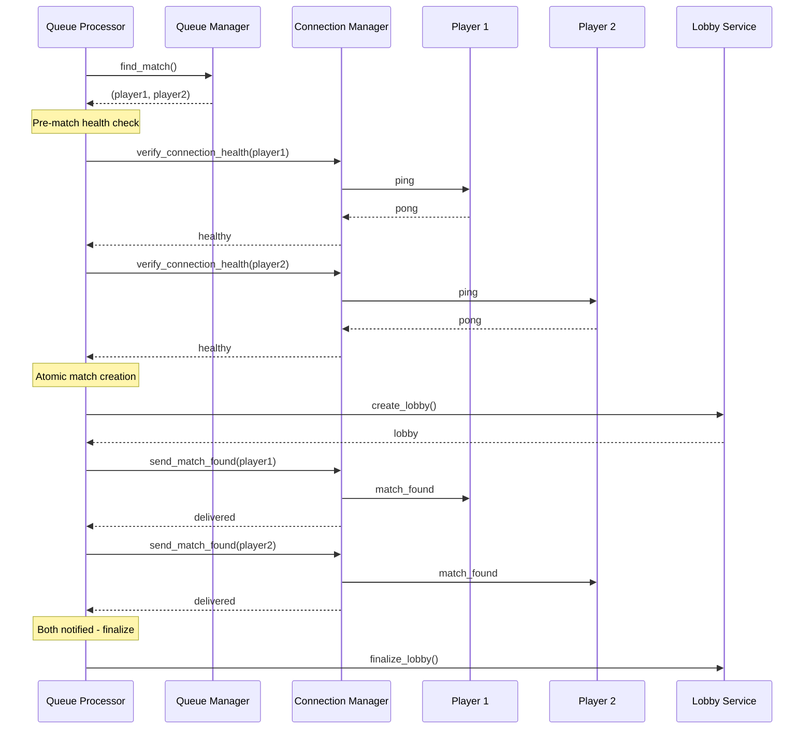
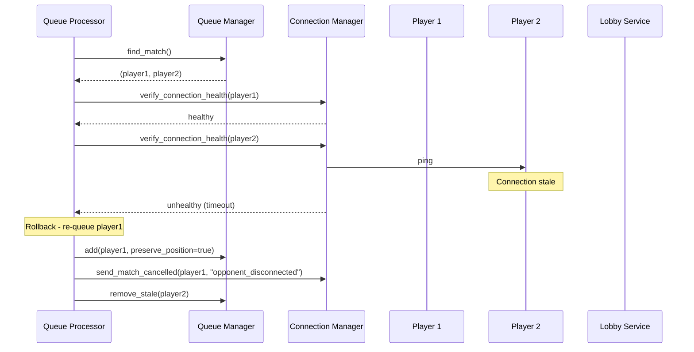

# Design Document: Matchmaking Hardening

## Overview

This design hardens the matchmaking system to enterprise standards by implementing connection health verification, atomic match creation with rollback, stale connection detection, and client-side resilience. The core principle is that a match should never be created unless both players can be successfully notified.

The implementation adds three key mechanisms:
1. **Pre-match health check**: Ping-pong verification before creating any match
2. **Atomic match creation**: Two-phase commit pattern - notify both players, then finalize
3. **Continuous health monitoring**: Server-side heartbeat to detect stale connections proactively

## Architecture



### Failure Scenario - Rollback



## Components and Interfaces

### 1. ConnectionHealthChecker (New)

```python
class ConnectionHealthChecker:
    """Verifies WebSocket connections are responsive."""
    
    PING_TIMEOUT = 2.0  # seconds
    
    async def verify_health(self, user_id: str) -> HealthCheckResult:
        """
        Verify a user's connection is healthy via ping-pong.
        
        Returns:
            HealthCheckResult with status and latency
        """
        pass
    
    async def verify_multiple(self, user_ids: List[str]) -> Dict[str, HealthCheckResult]:
        """
        Verify multiple connections in parallel.
        """
        pass
```

### 2. AtomicMatchCreator (New)

```python
class AtomicMatchCreator:
    """Creates matches with two-phase commit semantics."""
    
    async def create_match(
        self,
        player1: MatchTicket,
        player2: MatchTicket,
    ) -> MatchResult:
        """
        Create a match atomically.
        
        Phase 1: Create lobby, send notifications
        Phase 2: Confirm both received, finalize
        
        On failure: Rollback lobby, re-queue healthy player
        """
        pass
```

### 3. HeartbeatMonitor (New)

```python
class HeartbeatMonitor:
    """Monitors queue player connections via periodic heartbeats."""
    
    HEARTBEAT_INTERVAL = 15.0  # seconds
    MAX_MISSED_HEARTBEATS = 2
    
    async def start(self) -> None:
        """Start heartbeat monitoring for all queued players."""
        pass
    
    async def stop(self) -> None:
        """Stop heartbeat monitoring."""
        pass
    
    def record_pong(self, user_id: str) -> None:
        """Record a pong response from a user."""
        pass
    
    def get_stale_players(self) -> List[str]:
        """Get list of players who missed heartbeats."""
        pass
```

### 4. Enhanced QueueManager

```python
class QueueManager:
    # Existing methods...
    
    async def add_with_position(
        self,
        ticket: MatchTicket,
        position: int,
    ) -> bool:
        """
        Add a ticket at a specific position (for rollback).
        """
        pass
    
    async def remove_stale(self, player_id: str) -> Optional[MatchTicket]:
        """
        Remove a player marked as stale.
        """
        pass
```

### 5. Enhanced ConnectionManager

```python
class ConnectionManager:
    # Existing methods...
    
    async def ping_user(self, user_id: str, timeout: float = 2.0) -> bool:
        """
        Send ping and wait for pong with timeout.
        
        Returns:
            True if pong received within timeout
        """
        pass
    
    def get_connection_state(self, user_id: str) -> ConnectionState:
        """
        Get detailed connection state for logging.
        """
        pass
```

## Data Models

### HealthCheckResult

```python
@dataclass
class HealthCheckResult:
    """Result of a connection health check."""
    user_id: str
    healthy: bool
    latency_ms: Optional[float] = None
    failure_reason: Optional[str] = None  # "not_connected", "ping_timeout", "send_failed"
    checked_at: datetime = field(default_factory=datetime.utcnow)
```

### MatchResult

```python
@dataclass
class MatchResult:
    """Result of atomic match creation."""
    success: bool
    lobby_code: Optional[str] = None
    player1_notified: bool = False
    player2_notified: bool = False
    failure_reason: Optional[str] = None
    rollback_performed: bool = False
    requeued_player_id: Optional[str] = None
```

### ConnectionState

```python
@dataclass
class ConnectionState:
    """Detailed connection state for logging."""
    user_id: str
    connected: bool
    lobby_code: Optional[str] = None
    connected_at: Optional[datetime] = None
    last_message_at: Optional[datetime] = None
    missed_heartbeats: int = 0
```

### HeartbeatStatus

```python
@dataclass
class HeartbeatStatus:
    """Tracks heartbeat state for a queued player."""
    user_id: str
    last_ping_sent: Optional[datetime] = None
    last_pong_received: Optional[datetime] = None
    missed_count: int = 0
    is_stale: bool = False
```


## Correctness Properties

*A property is a characteristic or behavior that should hold true across all valid executions of a system-essentially, a formal statement about what the system should do. Properties serve as the bridge between human-readable specifications and machine-verifiable correctness guarantees.*

### Property 1: Pre-match connection verification

*For any* two players matched by the queue manager, both players must have verified healthy connections before any lobby is created.

**Validates: Requirements 1.1**

### Property 2: Disconnected player skip and re-queue

*For any* match attempt where one player's connection is unhealthy, the healthy player must be re-queued and the unhealthy player must be removed from the queue.

**Validates: Requirements 1.2, 1.4**

### Property 3: Health check timeout enforcement

*For any* connection health check, if no pong response is received within 2 seconds, the check must return unhealthy.

**Validates: Requirements 1.3**

### Property 4: Atomic match rollback with position preservation

*For any* match creation where notification fails for one player, the successfully-notified player must be re-queued at their original position and the lobby must be cancelled.

**Validates: Requirements 2.2, 2.4**

### Property 5: Stale detection after missed heartbeats

*For any* queued player who misses 2 consecutive heartbeat pings, that player must be marked as stale and removed from the queue.

**Validates: Requirements 3.2, 3.3**

### Property 6: Match cancelled notification content

*For any* player re-queued due to opponent connection failure, they must receive a match_cancelled event with reason "opponent_disconnected".

**Validates: Requirements 6.1**

### Property 7: Rollback notification timing

*For any* match rollback, the affected player must be notified within 1 second of the rollback decision.

**Validates: Requirements 6.3**

### Property 8: Client reconnection with exponential backoff

*For any* unexpected WebSocket closure on the client, the client must attempt reconnection up to 3 times with exponential backoff delays.

**Validates: Requirements 4.1**

### Property 9: Client heartbeat timeout detection

*For any* client that receives no heartbeat response for 30 seconds, the client must trigger reconnection.

**Validates: Requirements 4.4**

## Error Handling

### Connection Health Check Failures

| Failure Type | Action | Notification |
|-------------|--------|--------------|
| Not connected | Remove from queue | queue_cancelled (connection_lost) |
| Ping timeout | Remove from queue | queue_cancelled (connection_timeout) |
| Send failed | Remove from queue | queue_cancelled (connection_error) |

### Match Creation Failures

| Failure Point | Rollback Action | Notification |
|--------------|-----------------|--------------|
| Player 1 health check fails | Re-queue Player 2 | match_cancelled (opponent_disconnected) |
| Player 2 health check fails | Re-queue Player 1 | match_cancelled (opponent_disconnected) |
| Lobby creation fails | Re-queue both | match_cancelled (server_error) |
| Player 1 notification fails | Cancel lobby, re-queue Player 2 | match_cancelled (opponent_disconnected) |
| Player 2 notification fails | Cancel lobby, re-queue Player 1 | match_cancelled (opponent_disconnected) |

### Heartbeat Failures

| Condition | Action | Logging |
|-----------|--------|---------|
| 1 missed heartbeat | Increment counter | Debug log |
| 2 missed heartbeats | Mark stale, remove from queue | Warning log with player ID, queue time |
| Pong received after miss | Reset counter | Debug log |

## Testing Strategy

### Property-Based Testing

The implementation will use **Hypothesis** (Python) for backend property-based tests and **fast-check** (TypeScript) for frontend property-based tests.

Each property-based test will:
- Run a minimum of 100 iterations
- Be tagged with the correctness property it validates
- Use the format: `**Feature: matchmaking-hardening, Property {number}: {property_text}**`

### Test Categories

#### Backend Property Tests (Hypothesis)

1. **Connection Health Verification** (Property 1, 2, 3)
   - Generate random queue states with mixed connection health
   - Verify matches only occur between healthy connections
   - Verify unhealthy players are removed and healthy ones re-queued

2. **Atomic Match Rollback** (Property 4)
   - Generate match scenarios with notification failures
   - Verify position preservation on re-queue
   - Verify lobby cancellation on failure

3. **Stale Detection** (Property 5)
   - Generate heartbeat response patterns
   - Verify stale marking after 2 missed heartbeats
   - Verify queue removal on stale detection

4. **Notification Content and Timing** (Property 6, 7)
   - Generate rollback scenarios
   - Verify correct event types and reasons
   - Verify timing constraints

#### Frontend Property Tests (fast-check)

1. **Reconnection Logic** (Property 8)
   - Generate connection failure sequences
   - Verify retry count and backoff timing

2. **Heartbeat Timeout** (Property 9)
   - Generate heartbeat response delays
   - Verify timeout detection at 30 seconds

### Unit Tests

- Health checker ping-pong mechanics
- Heartbeat monitor interval timing
- Queue position calculation for re-queue
- Event serialization for match_cancelled

### Integration Tests

- End-to-end match creation with simulated connection failures
- Reconnection flow with state resync
- Logging output verification
