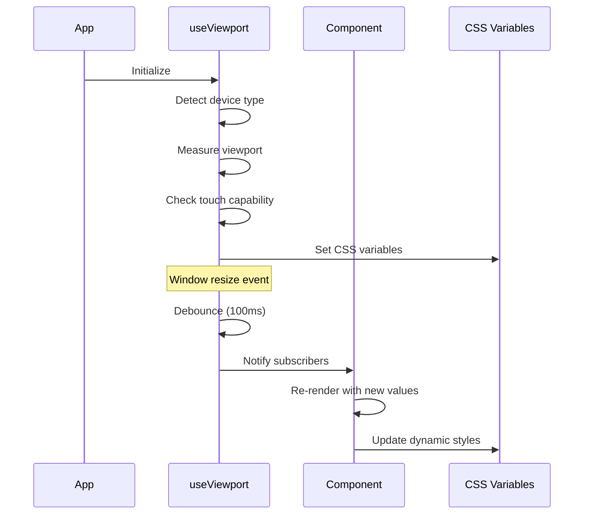

# Design Document: Mobile Optimization

## Overview

This design implements enterprise-grade mobile optimization across the entire 1v1bro platform. The approach is mobile-first with progressive enhancement, ensuring the base experience works perfectly on 320px screens while scaling elegantly to 4K displays.

The implementation follows a layered architecture:
1. **Foundation Layer**: Responsive hooks, utilities, CSS variables, and breakpoint system
2. **Component Layer**: Touch-optimized base components (Button, Input, Modal, Card)
3. **Layout Layer**: Adaptive layouts for dashboard, navigation, and page structures
4. **Feature Layer**: Mobile-specific implementations for game arena, shop, battlepass, etc.

## Architecture

```mermaid
graph TB
    subgraph "Foundation Layer"
        VH[useViewport Hook]
        TH[useTouch Hook]
        BK[Breakpoint Constants]
        CV[CSS Variables]
        SA[Safe Area Utils]
    end
    
    subgraph "Component Layer"
        BTN[Button]
        INP[Input]
        MOD[Modal]
        CRD[Card]
        NAV[Navigation]
    end
    
    subgraph "Layout Layer"
        DL[DashboardLayout]
        GL[GameLayout]
        PL[PageLayout]
        ML[ModalLayout]
    end
    
    subgraph "Feature Layer"
        GA[GameArena]
        MC[MobileControls]
        SP[ShopPage]
        BP[BattlePass]
        PR[Profile]
    end
    
    VH --> BTN
    VH --> INP
    VH --> MOD
    TH --> MC
    BK --> DL
    BK --> GL
    CV --> BTN
    CV --> INP
    SA --> GL
    SA --> MC
    
    BTN --> GA
    MOD --> SP
    NAV --> DL
    CRD --> BP
</mermaid>
```

### Responsive Flow



## Components and Interfaces

### 1. useViewport Hook (Foundation)

**Location:** `frontend/src/hooks/useViewport.ts`

```typescript
interface ViewportState {
  width: number
  height: number
  deviceType: 'mobile' | 'tablet' | 'desktop' | 'wide'
  orientation: 'portrait' | 'landscape'
  isTouch: boolean
  isMobile: boolean
  isTablet: boolean
  isDesktop: boolean
  safeAreaInsets: {
    top: number
    right: number
    bottom: number
    left: number
  }
}

function useViewport(): ViewportState
```

**Key Design Decisions:**
- Debounce resize events at 100ms to prevent excessive re-renders
- Use `matchMedia` for breakpoint detection (more performant than width checks)
- Cache touch detection result (doesn't change during session)
- Provide boolean helpers (`isMobile`, `isTablet`) for common checks

### 2. useTouch Hook (Foundation)

**Location:** `frontend/src/hooks/useTouch.ts`

```typescript
interface TouchState {
  isTouch: boolean
  hasFinePointer: boolean
  hasCoarsePointer: boolean
  prefersReducedMotion: boolean
}

interface TouchHandlers {
  onTouchStart: (e: TouchEvent) => void
  onTouchMove: (e: TouchEvent) => void
  onTouchEnd: (e: TouchEvent) => void
}

function useTouch(): TouchState
function useTouchGesture(options: GestureOptions): TouchHandlers
```

### 3. Breakpoint Constants (Foundation)

**Location:** `frontend/src/utils/breakpoints.ts`

```typescript
export const BREAKPOINTS = {
  mobile: 640,    // < 640px
  tablet: 1024,   // 640-1024px
  desktop: 1440,  // 1024-1440px
  wide: 1920,     // > 1440px
} as const

export const TOUCH_TARGET = {
  min: 44,        // Apple HIG minimum
  recommended: 48, // Material Design recommended
  comfortable: 56, // Comfortable for all users
} as const

export const SPACING = {
  touchGap: 8,    // Minimum gap between touch targets
  safeArea: 16,   // Additional safe area padding
} as const
```

### 4. CSS Variables System (Foundation)

**Location:** `frontend/src/styles/responsive.css`

```css
:root {
  /* Base spacing that scales with device */
  --spacing-base: 16px;
  --spacing-xs: calc(var(--spacing-base) * 0.25);
  --spacing-sm: calc(var(--spacing-base) * 0.5);
  --spacing-md: var(--spacing-base);
  --spacing-lg: calc(var(--spacing-base) * 1.5);
  --spacing-xl: calc(var(--spacing-base) * 2);
  
  /* Touch target sizing */
  --touch-target-min: 44px;
  --touch-target-recommended: 48px;
  
  /* Typography scale */
  --font-scale: 1;
  --font-size-xs: calc(12px * var(--font-scale));
  --font-size-sm: calc(14px * var(--font-scale));
  --font-size-base: calc(16px * var(--font-scale));
  --font-size-lg: calc(18px * var(--font-scale));
  --font-size-xl: calc(20px * var(--font-scale));
  --font-size-2xl: calc(24px * var(--font-scale));
  --font-size-3xl: calc(30px * var(--font-scale));
  
  /* Safe area fallbacks */
  --safe-area-top: env(safe-area-inset-top, 0px);
  --safe-area-right: env(safe-area-inset-right, 0px);
  --safe-area-bottom: env(safe-area-inset-bottom, 0px);
  --safe-area-left: env(safe-area-inset-left, 0px);
}

/* Mobile adjustments */
@media (max-width: 640px) {
  :root {
    --spacing-base: 12px;
    --font-scale: 0.95;
  }
}

/* Tablet adjustments */
@media (min-width: 641px) and (max-width: 1024px) {
  :root {
    --spacing-base: 14px;
    --font-scale: 0.975;
  }
}
```

### 5. ResponsiveButton Component

**Location:** `frontend/src/components/ui/Button.tsx` (enhanced)

```typescript
interface ButtonProps {
  size?: 'sm' | 'md' | 'lg'
  variant?: 'primary' | 'secondary' | 'ghost'
  fullWidth?: boolean
  touchOptimized?: boolean // Forces 44px+ touch target
  children: React.ReactNode
}

// Touch target enforcement
const getTouchTargetStyles = (size: string, isTouch: boolean) => {
  if (!isTouch) return {}
  
  const minHeight = TOUCH_TARGET.min
  return {
    minHeight: `${minHeight}px`,
    minWidth: `${minHeight}px`,
    padding: size === 'sm' ? '12px 16px' : undefined,
  }
}
```

### 6. ResponsiveModal Component

**Location:** `frontend/src/components/ui/Modal.tsx` (enhanced)

```typescript
interface ModalProps {
  isOpen: boolean
  onClose: () => void
  title?: string
  size?: 'sm' | 'md' | 'lg' | 'full'
  mobileFullScreen?: boolean // Default true on mobile
  children: React.ReactNode
}

// Mobile-specific behavior
const getMobileStyles = (isMobile: boolean, mobileFullScreen: boolean) => {
  if (!isMobile || !mobileFullScreen) return {}
  
  return {
    width: '100%',
    maxWidth: '100%',
    height: 'auto',
    maxHeight: '90vh',
    margin: 0,
    borderRadius: '16px 16px 0 0',
    paddingBottom: 'calc(16px + var(--safe-area-bottom))',
  }
}
```

### 7. MobileControls Enhancement

**Location:** `frontend/src/components/game/MobileControls.tsx` (enhanced)

```typescript
interface MobileControlsProps {
  onMove: (velocity: Vector2) => void
  onFire: () => void
  onFireDirection?: (direction: Vector2) => void
  enabled?: boolean
  layout?: 'default' | 'compact' | 'custom'
}

// Safe area aware positioning
const getControlPositions = (safeAreaInsets: SafeAreaInsets) => ({
  joystick: {
    left: `max(15px, calc(15px + ${safeAreaInsets.left}px))`,
    bottom: `max(60px, calc(20px + ${safeAreaInsets.bottom}px + 40px))`,
  },
  fireButton: {
    right: `max(15px, calc(15px + ${safeAreaInsets.right}px))`,
    bottom: `max(60px, calc(20px + ${safeAreaInsets.bottom}px + 40px))`,
  },
})
```

### 8. AdaptiveDashboardLayout

**Location:** `frontend/src/components/dashboard/DashboardLayout.tsx` (enhanced)

```typescript
interface DashboardLayoutProps {
  children: ReactNode
  activeNav?: NavItem
  mobileNavType?: 'hamburger' | 'bottom' | 'auto'
}

// Layout adaptation based on device
const getLayoutMode = (deviceType: DeviceType, mobileNavType: string) => {
  if (deviceType === 'desktop' || deviceType === 'wide') {
    return 'sidebar'
  }
  if (mobileNavType === 'auto') {
    return deviceType === 'tablet' ? 'hamburger' : 'bottom'
  }
  return mobileNavType
}
```

### 9. GameArenaLayout

**Location:** `frontend/src/components/game/GameArenaLayout.tsx` (new)

```typescript
interface GameArenaLayoutProps {
  children: ReactNode
  showControls?: boolean
  showHUD?: boolean
}

// Landscape enforcement and safe area handling
const GameArenaLayout = ({ children, showControls, showHUD }: GameArenaLayoutProps) => {
  const { orientation, isMobile, safeAreaInsets } = useViewport()
  
  if (isMobile && orientation === 'portrait') {
    return <RotateDevicePrompt />
  }
  
  return (
    <div style={{
      paddingLeft: safeAreaInsets.left,
      paddingRight: safeAreaInsets.right,
    }}>
      {children}
      {showControls && isMobile && <MobileControls />}
      {showHUD && <GameHUD position={isMobile ? 'mobile' : 'desktop'} />}
    </div>
  )
}
```

## Data Models

### ViewportState

```typescript
interface ViewportState {
  width: number
  height: number
  deviceType: 'mobile' | 'tablet' | 'desktop' | 'wide'
  orientation: 'portrait' | 'landscape'
  isTouch: boolean
  isMobile: boolean
  isTablet: boolean
  isDesktop: boolean
  safeAreaInsets: SafeAreaInsets
}
```

### SafeAreaInsets

```typescript
interface SafeAreaInsets {
  top: number
  right: number
  bottom: number
  left: number
}
```

### ResponsiveConfig

```typescript
interface ResponsiveConfig {
  breakpoints: {
    mobile: number
    tablet: number
    desktop: number
    wide: number
  }
  touchTarget: {
    min: number
    recommended: number
  }
  spacing: {
    base: number
    touchGap: number
  }
}
```

## Correctness Properties

*A property is a characteristic or behavior that should hold true across all valid executions of a system-essentially, a formal statement about what the system should do. Properties serve as the bridge between human-readable specifications and machine-verifiable correctness guarantees.*

### Property 1: Viewport hook returns complete state

*For any* viewport configuration (width, height, touch capability), the useViewport hook SHALL return a complete ViewportState object with all required fields (deviceType, orientation, isTouch, isMobile, isTablet, isDesktop, safeAreaInsets).

**Validates: Requirements 1.1**

### Property 2: Touch target minimum size enforcement

*For any* interactive element (button, link, input) rendered on a touch device, the computed touch target area SHALL be at least 44×44 pixels, either through direct sizing or invisible padding extension.

**Validates: Requirements 2.1, 2.3, 2.5**

### Property 3: Safe area inset application

*For any* fixed-position element (header, footer, modal, mobile controls), the element SHALL include appropriate safe area inset padding to prevent content from being obscured by device notches or home indicators.

**Validates: Requirements 3.1, 3.2, 3.3, 3.4, 3.5**

### Property 4: Typography minimum size on mobile

*For any* text element rendered on mobile devices, body text SHALL have a minimum computed font size of 16px to ensure readability and prevent iOS auto-zoom on input focus.

**Validates: Requirements 4.2**

### Property 5: Fluid typography scaling

*For any* heading element, the computed font size SHALL fall within the defined minimum (mobile) and maximum (desktop) bounds, scaling smoothly between breakpoints using clamp().

**Validates: Requirements 4.1**

### Property 6: Game canvas aspect ratio preservation

*For any* viewport size, the game canvas SHALL scale to fit while maintaining its aspect ratio, never stretching or distorting the game view.

**Validates: Requirements 5.2**

### Property 7: Mobile control positioning

*For any* mobile device in landscape orientation, the joystick control SHALL be positioned in the bottom-left quadrant and the fire button SHALL be positioned in the bottom-right quadrant, both with touch targets of at least 44px and positioned above the safe area bottom inset.

**Validates: Requirements 5.3, 5.5**

### Property 8: Dashboard layout adaptation

*For any* viewport width below the tablet breakpoint (640px), the dashboard sidebar SHALL be hidden and replaced with either a hamburger menu or bottom navigation, with all navigation items having minimum 48px touch targets.

**Validates: Requirements 6.1, 6.3**

### Property 9: Modal mobile sizing

*For any* modal rendered on mobile devices, the modal SHALL be full-width with a maximum height of 90vh, scrollable content area, and action buttons that are full-width and stacked vertically.

**Validates: Requirements 8.1, 8.3**

### Property 10: Animation GPU acceleration

*For any* animation running on mobile devices, the animation SHALL use only GPU-accelerated CSS properties (transform, opacity) to ensure smooth 30fps+ performance.

**Validates: Requirements 9.2**

### Property 11: Image responsive srcset

*For any* image element, the element SHALL include srcset attribute with appropriate sizes for different device pixel ratios (1x, 2x, 3x) to optimize bandwidth on mobile networks.

**Validates: Requirements 9.3**

### Property 12: Resize event debouncing

*For any* sequence of rapid viewport resize events, the useViewport hook SHALL debounce updates and notify subscribers no more frequently than once per 100ms.

**Validates: Requirements 1.2**

## Error Handling

### Viewport Detection Failures

| Failure Type | Fallback Behavior | Logging |
|-------------|-------------------|---------|
| matchMedia unavailable | Use window.innerWidth comparison | Warning log |
| Safe area env() unsupported | Use 0px fallback values | Debug log |
| Touch detection fails | Default to non-touch | Warning log |
| Orientation API unavailable | Calculate from width/height | Debug log |

### Component Rendering Failures

| Failure Type | Fallback Behavior | User Impact |
|-------------|-------------------|-------------|
| CSS variable undefined | Use hardcoded fallback | None (graceful) |
| Breakpoint mismatch | Default to mobile-first | Slightly larger touch targets |
| Safe area calculation error | Add extra padding | Content slightly inset |

### Performance Degradation

| Condition | Action | Threshold |
|-----------|--------|-----------|
| Frame rate drops below 30fps | Reduce animation complexity | 3 consecutive low frames |
| Resize events exceed 10/sec | Increase debounce to 200ms | Automatic |
| Memory pressure detected | Disable non-essential animations | Browser signal |

## Testing Strategy

### Property-Based Testing

The implementation will use **fast-check** (TypeScript) for frontend property-based tests.

Each property-based test will:
- Run a minimum of 100 iterations
- Be tagged with the correctness property it validates
- Use the format: `**Feature: mobile-optimization, Property {number}: {property_text}**`

### Test Categories

#### Viewport Hook Tests (Properties 1, 12)

```typescript
// Generate random viewport dimensions and verify hook output
fc.assert(
  fc.property(
    fc.integer({ min: 320, max: 3840 }),
    fc.integer({ min: 480, max: 2160 }),
    fc.boolean(),
    (width, height, isTouch) => {
      const state = simulateViewport(width, height, isTouch)
      // Verify all required fields present
      // Verify deviceType matches breakpoint rules
      // Verify orientation matches width/height ratio
    }
  )
)
```

#### Touch Target Tests (Property 2)

```typescript
// Generate random button configurations and verify touch targets
fc.assert(
  fc.property(
    fc.constantFrom('sm', 'md', 'lg'),
    fc.boolean(),
    (size, isTouch) => {
      const { minWidth, minHeight } = computeTouchTarget(size, isTouch)
      if (isTouch) {
        expect(minWidth).toBeGreaterThanOrEqual(44)
        expect(minHeight).toBeGreaterThanOrEqual(44)
      }
    }
  )
)
```

#### Safe Area Tests (Property 3)

```typescript
// Generate random safe area insets and verify application
fc.assert(
  fc.property(
    fc.record({
      top: fc.integer({ min: 0, max: 50 }),
      right: fc.integer({ min: 0, max: 50 }),
      bottom: fc.integer({ min: 0, max: 50 }),
      left: fc.integer({ min: 0, max: 50 }),
    }),
    (insets) => {
      const styles = computeFixedElementStyles(insets)
      expect(styles.paddingTop).toContain(insets.top)
      expect(styles.paddingBottom).toContain(insets.bottom)
    }
  )
)
```

#### Typography Tests (Properties 4, 5)

```typescript
// Generate random viewport widths and verify font sizes
fc.assert(
  fc.property(
    fc.integer({ min: 320, max: 1920 }),
    (width) => {
      const fontSize = computeFluidFontSize('heading', width)
      expect(fontSize).toBeGreaterThanOrEqual(MIN_HEADING_SIZE)
      expect(fontSize).toBeLessThanOrEqual(MAX_HEADING_SIZE)
    }
  )
)
```

### Unit Tests

- Breakpoint constant values match specification
- CSS variable generation for different device types
- Touch target calculation with various sizes
- Safe area inset parsing and application
- Debounce timing accuracy

### Integration Tests

- Full page render at mobile breakpoint
- Modal open/close on mobile with safe areas
- Game arena landscape enforcement
- Dashboard navigation mode switching
- Orientation change handling

### Visual Regression Tests

- Screenshot comparison at key breakpoints (320px, 640px, 1024px, 1440px)
- Safe area simulation with different device frames
- Touch target highlight overlay verification

