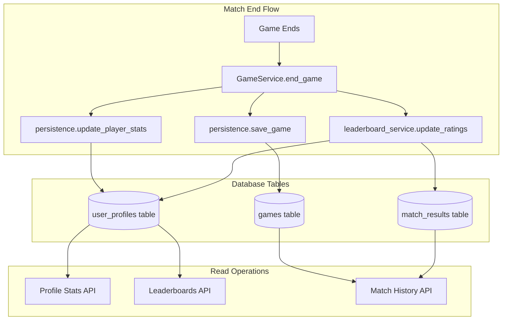

# Design Document: Player Stats Source of Truth

## Overview

This document establishes the definitive data architecture for player statistics in 1v1Bro. The architecture ensures all stats displayed across the application (profile, leaderboards, match history, recap) come from a single, consistent source.

## Architecture

### Data Flow Diagram



### Source of Truth: `user_profiles` Table

The `user_profiles` table is the **single source of truth** for all aggregated player statistics:

| Column | Description |
|--------|-------------|
| `games_played` | Total matches played |
| `games_won` | Total matches won |
| `total_score` | Cumulative score across all matches |
| `total_kills` | Total kills across all matches |
| `total_deaths` | Total deaths across all matches |
| `shots_fired` | Total shots fired |
| `shots_hit` | Total shots that hit |
| `total_questions_answered` | Total trivia questions answered |
| `total_correct_answers` | Total correct answers |
| `total_answer_time_ms` | Cumulative answer time |
| `fastest_answer_ms` | Personal best answer time |
| `current_win_streak` | Current consecutive wins |
| `best_win_streak` | Best ever win streak |
| `current_elo` | Current ELO rating |
| `peak_elo` | Highest ELO ever achieved |
| `current_tier` | Current rank tier (Bronze-Grandmaster) |

### Supporting Tables

#### `games` Table
- Stores individual match records
- Contains full game data (questions, answers, combat stats per match)
- Used for match history display
- **NOT** the source of truth for aggregated stats

#### `match_results` Table
- Stores ELO change history
- Contains pre/post ELO for both players
- Used for ELO audit trail and match history ELO display
- **NOT** the source of truth for current ELO

## Components and Interfaces

### Write Path (Match End)

```
GameService.end_game()
├── persistence.save_game()           → games table
├── persistence.update_player_stats() → user_profiles (via StatsRepository)
└── leaderboard_service.update_ratings()
    ├── user_profiles (ELO update via UnifiedStatsRepository)
    └── match_results (audit record via MatchResultsRepository)
```

### Read Path (Stats Display)

| Feature | API Endpoint | Data Source |
|---------|--------------|-------------|
| Profile Stats | `/api/v1/stats/me` | user_profiles |
| ELO Leaderboard | `/api/v1/leaderboards/elo/global` | user_profiles |
| Category Leaderboards | `/api/v1/leaderboards/{category}` | user_profiles |
| Match History | `/api/v1/games/history` | games + match_results |
| User ELO Rank | `/api/v1/leaderboards/elo/me` | user_profiles |

## Data Models

### StatsRepository (Write)
- Updates `user_profiles` via `increment_player_stats` stored procedure
- Atomic updates for all stat fields
- Used by `GamePersistenceService`

### UnifiedStatsRepository (Read/Write)
- Reads from `user_profiles` for leaderboard queries
- Updates ELO in `user_profiles`
- Used by `LeaderboardService`

### MatchResultsRepository (Write)
- Creates records in `match_results` for ELO audit trail
- Used by `LeaderboardService.update_ratings()`

## Correctness Properties

*A property is a characteristic or behavior that should hold true across all valid executions of a system-essentially, a formal statement about what the system should do. Properties serve as the bridge between human-readable specifications and machine-verifiable correctness guarantees.*

### Property 1: Stats Consistency After Match
*For any* completed match, the user_profiles.games_played for both players SHALL increase by exactly 1
**Validates: Requirements 2.1, 6.1**

### Property 2: Win Count Consistency
*For any* completed match with a winner, the winner's user_profiles.games_won SHALL increase by exactly 1
**Validates: Requirements 2.1, 6.2**

### Property 3: ELO Update Consistency
*For any* completed match, both players' current_elo in user_profiles SHALL be updated, and a corresponding record SHALL exist in match_results
**Validates: Requirements 2.2, 2.3**

### Property 4: Leaderboard Data Source
*For any* leaderboard query, the games_played count SHALL equal the value from user_profiles.games_played
**Validates: Requirements 4.3**

## Error Handling

The match end flow is designed to be resilient:

1. **Game save failure**: Critical - will throw error
2. **Stats update failure**: Logged, does not fail game end
3. **ELO update failure**: Logged, does not fail game end
4. **Match results record failure**: Logged, does not fail game end

This ensures players always see their game complete, even if some background updates fail.

## Testing Strategy

### Unit Tests
- Test StatsRepository.increment_stats updates correct fields
- Test LeaderboardService.update_ratings calculates ELO correctly
- Test LeaderboardService reads from user_profiles

### Property-Based Tests
- Property 1: After N games, games_played = N
- Property 2: After N wins, games_won = N
- Property 3: ELO changes are symmetric (winner gains ≈ loser loses)

### Integration Tests
- Full match end flow updates all tables correctly
- Leaderboard displays match user_profiles data
