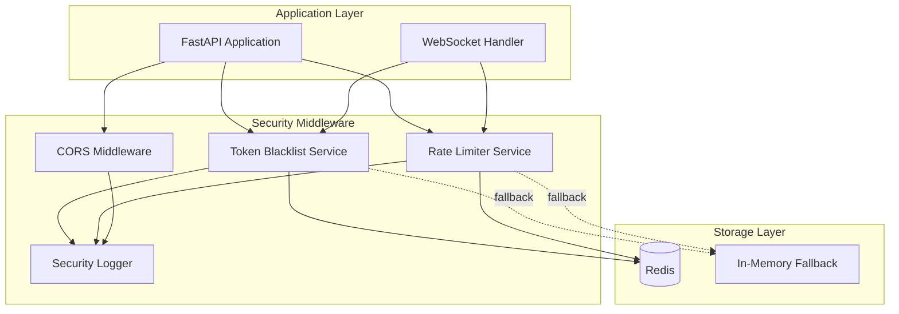

# Security Hardening Design Document

## Overview

This design document outlines the technical approach for hardening the 1v1bro platform's security infrastructure by migrating in-memory security mechanisms to Redis-backed persistent storage. The implementation enables horizontal scaling, ensures security state survives server restarts, and provides configurable security policies.

## Architecture



## Components and Interfaces

### 1. Redis Token Blacklist Service

**Location:** `backend/app/security/token_blacklist.py`

```python
class RedisTokenBlacklist:
    """Redis-backed token blacklist with fail-closed behavior."""
    
    async def add(self, token: str, ttl_seconds: int) -> bool:
        """Add token hash to blacklist with TTL."""
        
    async def is_blacklisted(self, token: str) -> bool:
        """Check if token is blacklisted. Fails closed on Redis error."""
        
    async def remove(self, token: str) -> bool:
        """Remove token from blacklist (for testing)."""
```

**Key Design Decisions:**
- Store SHA-256 hash of token, not raw token (security)
- TTL matches token expiration (automatic cleanup)
- Fail closed: if Redis unavailable, reject token
- Key format: `blacklist:{token_hash}`

### 2. Redis Rate Limiter Service

**Location:** `backend/app/security/rate_limiter.py`

```python
class RedisRateLimiter:
    """Redis-backed distributed rate limiter using sliding window."""
    
    async def is_allowed(self, key: str, limit: int, window_seconds: int) -> tuple[bool, dict]:
        """Check if request is allowed. Returns (allowed, headers)."""
        
    async def get_remaining(self, key: str, limit: int, window_seconds: int) -> int:
        """Get remaining requests in current window."""
```

**Key Design Decisions:**
- Use Redis sorted sets for sliding window algorithm
- Atomic operations via Lua scripts for consistency
- Graceful degradation to in-memory on Redis failure
- Key format: `ratelimit:{key}:{window}`

### 3. CORS Configuration Service

**Location:** `backend/app/core/cors.py`

```python
def get_cors_origins() -> list[str]:
    """Get CORS origins from environment with secure defaults."""
    
def validate_origin(origin: str, allowed: list[str]) -> bool:
    """Validate if origin is in allowed list."""
```

**Key Design Decisions:**
- Parse `CORS_ORIGINS` as comma-separated list
- Secure defaults based on environment (production vs dev)
- No wildcard support in production

### 4. Security Logger

**Location:** `backend/app/security/security_logger.py`

```python
class SecurityLogger:
    """Structured security event logging."""
    
    def log_blacklist_event(self, user_id: str, reason: str) -> None:
        """Log token blacklist event."""
        
    def log_rate_limit_event(self, client_id: str, endpoint: str, limit: str) -> None:
        """Log rate limit exceeded event."""
        
    def log_cors_rejection(self, origin: str, resource: str) -> None:
        """Log CORS rejection event."""
        
    def log_degraded_mode(self, service: str, reason: str) -> None:
        """Log degraded mode activation."""
```

## Data Models

### Redis Key Schemas

```
# Token Blacklist
blacklist:{sha256_hash}  ->  "1"  (with TTL)

# Rate Limiting (Sorted Set)
ratelimit:{client_id}:{endpoint_category}  ->  ZSET(timestamp, request_id)
```

### Configuration Schema

```python
# Environment Variables
CORS_ORIGINS: str  # Comma-separated list: "https://1v1bro.online,https://www.1v1bro.online"
REDIS_URL: str     # Already exists in config
```

### Security Event Log Schema

```json
{
  "timestamp": "2024-12-09T19:30:00Z",
  "event_type": "token_blacklisted|rate_limit_exceeded|cors_rejected|degraded_mode",
  "service": "token_blacklist|rate_limiter|cors",
  "details": {
    "user_id": "uuid",
    "client_id": "ip:xxx.xxx.xxx.xxx",
    "endpoint": "/api/v1/...",
    "origin": "https://...",
    "reason": "..."
  }
}
```

## Correctness Properties

*A property is a characteristic or behavior that should hold true across all valid executions of a system-essentially, a formal statement about what the system should do. Properties serve as the bridge between human-readable specifications and machine-verifiable correctness guarantees.*

### Property 1: Token Blacklist Round Trip

*For any* valid JWT token, adding it to the blacklist and then checking if it's blacklisted SHALL return `True`.

**Validates: Requirements 1.1, 1.2**

### Property 2: Blacklist Distributed Consistency

*For any* token blacklisted by one service instance, all other service instances querying the same Redis SHALL see the token as blacklisted.

**Validates: Requirements 1.4**

### Property 3: Rate Limit Enforcement

*For any* client making N requests where N > limit within the window, the (N+1)th request SHALL be rejected with HTTP 429 and valid Retry-After header.

**Validates: Requirements 2.1, 2.2**

### Property 4: Rate Limit Distributed Consistency

*For any* client making requests across multiple server instances, the total count across all instances SHALL equal the sum of individual requests, enforcing a single shared limit.

**Validates: Requirements 2.3**

### Property 5: Rate Limit Window Reset

*For any* rate-limited client, after the window expires, the client SHALL be allowed to make requests again up to the limit.

**Validates: Requirements 2.5**

### Property 6: CORS Origin Acceptance

*For any* origin in the CORS_ORIGINS list, preflight requests from that origin SHALL be accepted.

**Validates: Requirements 3.1, 3.2**

### Property 7: CORS Origin Rejection

*For any* origin NOT in the CORS_ORIGINS list, preflight requests from that origin SHALL be rejected.

**Validates: Requirements 3.4**

### Property 8: Security Log Completeness

*For any* security event (blacklist, rate limit, CORS rejection), the log entry SHALL contain all required fields (timestamp, event_type, and event-specific details).

**Validates: Requirements 4.1, 4.2, 4.4**

## Error Handling

### Redis Unavailability

| Service | Behavior | Rationale |
|---------|----------|-----------|
| Token Blacklist | Fail closed (reject token) | Security-critical: better to force re-auth than allow potentially revoked token |
| Rate Limiter | Fall back to in-memory | Availability-critical: better to allow some requests than block all |

### Error Logging

All Redis connection failures trigger:
1. Structured log with `degraded_mode` event type
2. Metric increment for monitoring alerts
3. Automatic retry with exponential backoff

## Testing Strategy

### Property-Based Testing

**Framework:** Hypothesis (Python)

Property-based tests will verify:
- Token blacklist round-trip consistency
- Rate limiter counting accuracy across many request patterns
- CORS origin matching for various origin formats
- Log format completeness for all event types

Each property test will run minimum 100 iterations with diverse inputs.

### Unit Testing

Unit tests will cover:
- Redis key generation and parsing
- TTL calculation from token expiration
- CORS origin parsing from environment variable
- Log message formatting

### Integration Testing

Integration tests will verify:
- Actual Redis operations (requires Redis test instance)
- Middleware integration with FastAPI
- End-to-end request flow with security checks

### Test Annotations

All property-based tests MUST include:
```python
# **Feature: security-hardening, Property {N}: {property_text}**
# **Validates: Requirements X.Y**
```
