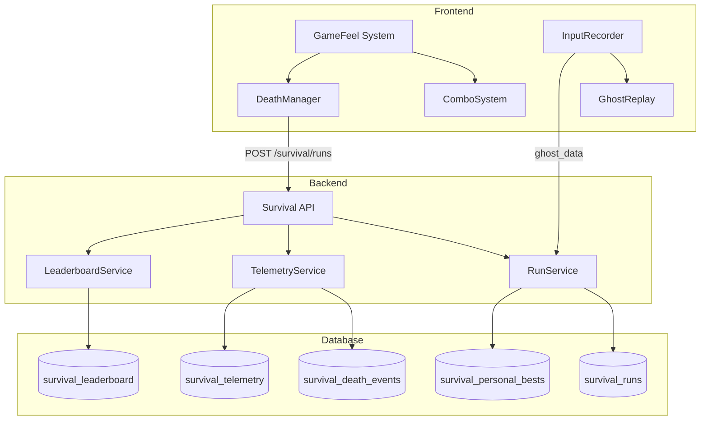

# Design Document: Survival Game Feel & Telemetry

## Overview

This design specifies the implementation of AAA-quality game feel enhancements and a full-stack telemetry system for Survival Mode. The system is divided into two main areas:

1. **Client-Side Game Feel**: Slow-mo death, combo system, perfect timing feedback, and input recording
2. **Full-Stack Telemetry**: Ghost replays, death analytics, leaderboards, and deterministic replay

The architecture leverages the existing survival mode engine, extending it with new systems while maintaining the fixed-timestep game loop and clean separation of concerns.

## Architecture



## Components and Interfaces

### 1. ComboSystem (Frontend)

Tracks near-misses and perfect dodges to build combo multipliers.

```typescript
interface ComboState {
  combo: number
  multiplier: number
  lastEventTime: number
  decayTimer: number
}

interface ComboEvent {
  type: 'near_miss' | 'perfect_dodge' | 'collision' | 'decay' | 'milestone'
  combo: number
  multiplier: number
  position?: { x: number, z: number }
}

class ComboSystem {
  // Constants
  static NEAR_MISS_THRESHOLD = 0.5  // units
  static PERFECT_DODGE_THRESHOLD = 0.2  // units
  static DECAY_START_TIME = 3.0  // seconds
  static DECAY_RATE = 1  // combo per second
  
  // Methods
  checkProximity(playerPos: Vector3, obstaclePos: Vector3, obstacleSize: Vector3): ComboEvent | null
  onCollision(): void
  update(deltaTime: number): void
  getMultiplier(): number  // Returns 1 + combo * 0.1
  reset(): void
  
  // Events
  onComboChange: (event: ComboEvent) => void
}
```

### 2. DeathManager (Frontend)

Handles death sequence including slow-mo, camera effects, and telemetry capture.

```typescript
interface DeathContext {
  position: { x: number, z: number }
  obstacleType: string
  speed: number
  distance: number
  wasJumping: boolean
  wasSliding: boolean
  currentLane: number
  comboAtDeath: number
}

interface SlowMoConfig {
  timeScale: number  // 0.2
  duration: number   // 1.5 seconds
  cameraZoomFactor: number  // 1.5
}

class DeathManager {
  triggerDeath(context: DeathContext): void
  update(deltaTime: number): void
  isInSlowMo(): boolean
  getTimeScale(): number
  getDeathContext(): DeathContext | null
}
```

### 3. InputRecorder (Frontend)

Records timestamped inputs for ghost replay and bug reports.

```typescript
interface InputEvent {
  t: number      // timestamp (game time in ms, compressed)
  i: number      // input type enum (0=left, 1=right, 2=jump, 3=slide)
  p?: number     // position z (optional, for validation)
}

interface InputRecording {
  version: number
  seed: number
  startTime: number
  duration: number
  events: InputEvent[]
}

class InputRecorder {
  start(seed: number): void
  recordInput(type: InputAction, gameTime: number, position: number): void
  stop(): InputRecording
  serialize(): string  // Compressed JSON
  static deserialize(data: string): InputRecording
  static estimateSize(events: InputEvent[]): number
}
```

### 4. GhostReplay (Frontend)

Plays back recorded inputs as a ghost character.

```typescript
interface GhostState {
  active: boolean
  currentEventIndex: number
  position: { x: number, z: number }
  opacity: number
  tint: number  // Color hex
}

class GhostReplay {
  static GHOST_OPACITY = 0.5
  static GHOST_TINT = 0x00ffff  // Cyan
  
  load(recording: InputRecording): void
  start(): void
  update(gameTime: number): GhostState
  getNextInput(gameTime: number): InputEvent | null
  isComplete(): boolean
  despawn(): void
}
```

### 5. SurvivalRunService (Backend)

Handles run persistence and personal best management.

```python
class SurvivalRunCreate(BaseModel):
    distance: int
    score: int
    duration_seconds: int
    max_speed: float
    max_combo: int
    total_near_misses: int
    perfect_dodges: int
    obstacles_cleared: int
    death_obstacle_type: Optional[str]
    death_position_x: Optional[float]
    death_position_z: Optional[float]
    seed: Optional[int]
    ghost_data: Optional[str]  # Compressed JSON

class SurvivalRunService:
    async def create_run(user_id: UUID, run: SurvivalRunCreate) -> SurvivalRun
    async def get_personal_best(user_id: UUID) -> Optional[SurvivalPersonalBest]
    async def get_ghost_data(user_id: UUID) -> Optional[str]
```

### 6. SurvivalTelemetryService (Backend)

Handles death event storage and aggregation.

```python
class DeathEventCreate(BaseModel):
    obstacle_type: str
    position_x: float
    position_z: float
    distance: int
    speed: float
    was_jumping: bool
    was_sliding: bool
    current_lane: int
    combo_at_death: int
    pattern_id: Optional[str]

class SurvivalTelemetryService:
    async def record_death(user_id: UUID, run_id: UUID, event: DeathEventCreate) -> None
    async def get_aggregated_telemetry(start: datetime, end: datetime) -> TelemetryAggregate
    async def get_death_heatmap(start: datetime, end: datetime) -> List[DeathPosition]
```

### 7. SurvivalLeaderboardService (Backend)

Handles leaderboard queries with player rank inclusion.

```python
class LeaderboardEntry(BaseModel):
    rank: int
    user_id: UUID
    display_name: str
    avatar_url: Optional[str]
    best_distance: int
    best_score: int
    best_combo: int

class SurvivalLeaderboardService:
    async def get_leaderboard(limit: int = 100) -> List[LeaderboardEntry]
    async def get_player_rank(user_id: UUID) -> Optional[int]
    async def refresh_leaderboard() -> None
```

## Data Models

### Frontend State

```typescript
interface SurvivalRunData {
  // Core metrics
  distance: number
  score: number
  durationSeconds: number
  maxSpeed: number
  
  // Combo stats
  maxCombo: number
  totalNearMisses: number
  perfectDodges: number
  obstaclesCleared: number
  
  // Death info
  deathObstacleType?: string
  deathPosition?: { x: number, z: number }
  
  // Replay data
  seed: number
  ghostData?: string
}
```

### Backend Tables

Already defined in migration `034_survival_mode.sql`:
- `survival_runs` - Individual run records
- `survival_personal_bests` - Best run per user with ghost data
- `survival_death_events` - Individual death events
- `survival_telemetry` - Aggregated analytics
- `survival_leaderboard` - Materialized view for rankings

## Correctness Properties

*A property is a characteristic or behavior that should hold true across all valid executions of a system-essentially, a formal statement about what the system should do. Properties serve as the bridge between human-readable specifications and machine-verifiable correctness guarantees.*

### Property 1: Slow-mo time scale on death
*For any* collision event, the game time scale SHALL be set to 0.2 immediately after collision detection.
**Validates: Requirements 1.1**

### Property 2: Slow-mo restoration
*For any* slow-mo death sequence, after 1.5 seconds of game time, the time scale SHALL return to 1.0 and game phase SHALL transition to 'gameover'.
**Validates: Requirements 1.3**

### Property 3: Near-miss combo increment
*For any* player position within 0.5 units but greater than 0.2 units of an obstacle, the combo counter SHALL increase by exactly 1.
**Validates: Requirements 2.1**

### Property 4: Perfect dodge combo increment
*For any* player position within 0.2 units of an obstacle (without collision), the combo counter SHALL increase by exactly 3.
**Validates: Requirements 2.2**

### Property 5: Collision resets combo
*For any* collision event, regardless of current combo value, the combo counter SHALL be reset to 0.
**Validates: Requirements 2.3**

### Property 6: Combo decay timing
*For any* combo state where 3+ seconds have passed since the last near-miss or perfect dodge, the combo SHALL decay by 1 per second.
**Validates: Requirements 2.4**

### Property 7: Score multiplier calculation
*For any* combo value C and base points P, the calculated score SHALL equal P * (1 + C * 0.1).
**Validates: Requirements 2.6**

### Property 8: Hitstop on perfect dodge
*For any* perfect dodge event, a hitstop of exactly 3 frames (50ms at 60fps) SHALL be triggered.
**Validates: Requirements 3.3**

### Property 9: Combo milestone events
*For any* combo value that is a multiple of 5 (5, 10, 15...), a milestone event SHALL be emitted.
**Validates: Requirements 3.4**

### Property 10: Input recording contains required fields
*For any* recorded input event, the stored data SHALL contain input type, timestamp, and player position.
**Validates: Requirements 4.2**

### Property 11: Input recording round-trip
*For any* valid InputRecording, serializing then deserializing SHALL produce an equivalent recording with identical events and timing.
**Validates: Requirements 4.3, 4.5**

### Property 12: Recording size constraint
*For any* 5-minute run (assuming max 10 inputs/second = 3000 events), the serialized recording SHALL be smaller than 50KB.
**Validates: Requirements 4.4**

### Property 13: Ghost input timing accuracy
*For any* ghost replay, inputs SHALL be applied within 1 frame (16.67ms) of their recorded timestamp.
**Validates: Requirements 5.2**

### Property 14: Personal best update condition
*For any* run where distance exceeds the current personal best, the personal best record SHALL be updated with the new run's data.
**Validates: Requirements 5.4, 6.3**

### Property 15: Run data completeness
*For any* saved run, the backend record SHALL contain distance, score, duration, max_combo, and death information.
**Validates: Requirements 6.2**

### Property 16: Leaderboard ordering
*For any* leaderboard query, results SHALL be ordered by distance descending and limited to 100 entries.
**Validates: Requirements 6.4**

### Property 17: Player rank inclusion
*For any* leaderboard query where the requesting player is outside top 100, the response SHALL include their rank.
**Validates: Requirements 6.5**

### Property 18: Death telemetry completeness
*For any* death event, the recorded data SHALL contain position, obstacle_type, speed, and player state (jumping/sliding/lane/combo).
**Validates: Requirements 7.1**

### Property 19: Telemetry aggregation accuracy
*For any* set of death events, the aggregated counts by obstacle type SHALL equal the sum of individual events.
**Validates: Requirements 7.3**

### Property 20: Seed determinism for obstacles
*For any* random seed, generating obstacles with that seed SHALL produce identical obstacle sequences on every execution.
**Validates: Requirements 8.2**

### Property 21: Replay position determinism
*For any* input recording played back with the same seed, the ghost position at any timestamp SHALL match the original within 0.01 units.
**Validates: Requirements 8.4**

## Error Handling

### Frontend Errors

| Error | Handling |
|-------|----------|
| Ghost data corrupted | Log error, disable ghost for this run |
| Input recording overflow | Stop recording, mark as incomplete |
| API call failure | Queue for retry, continue gameplay |
| Slow-mo interrupted | Force transition to game over |

### Backend Errors

| Error | Handling |
|-------|----------|
| Run save failure | Return error, client retries |
| Ghost data too large | Truncate to last 50KB, log warning |
| Leaderboard refresh failure | Serve stale data, retry in background |
| Telemetry batch failure | Queue for retry, don't block run save |

## Testing Strategy

### Property-Based Testing

The system will use **Hypothesis** (Python) for backend property tests and **fast-check** (TypeScript) for frontend property tests.

Each property-based test MUST:
- Run a minimum of 100 iterations
- Be tagged with the format: `**Feature: survival-game-feel-telemetry, Property {number}: {property_text}**`
- Reference the specific correctness property from this design document

### Unit Tests

Unit tests will cover:
- ComboSystem threshold calculations
- DeathManager state transitions
- InputRecorder serialization edge cases
- API endpoint validation
- Database trigger behavior

### Integration Tests

- End-to-end run submission flow
- Ghost replay accuracy verification
- Leaderboard refresh and ranking
- Telemetry aggregation pipeline
