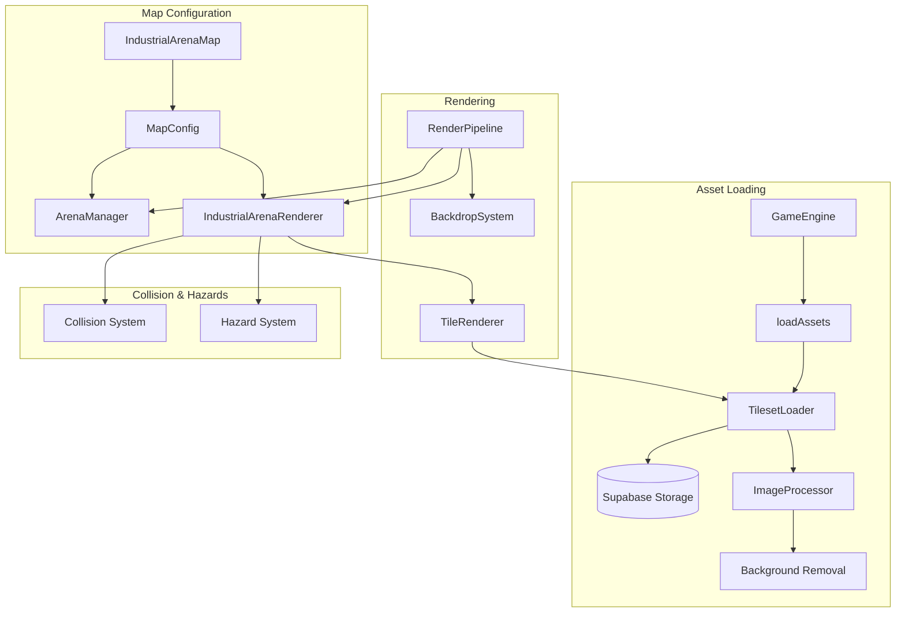

# Design Document: Tileset Integration

## Overview

This design document describes the integration of external tileset assets into the game engine's rendering pipeline. The system enables rendering maps using sprite sheet tilesets stored in Supabase Storage, providing a more polished visual experience compared to procedural graphics.

The integration bridges the existing `TilesetLoader`, `TileRenderer`, and `IndustrialArenaRenderer` classes with the `GameEngine` and `RenderPipeline`, enabling seamless tileset-based map rendering.

## Architecture



## Components and Interfaces

### 1. TilesetLoader (Existing - No Changes)

The singleton `TilesetLoader` handles loading tileset images from Supabase Storage:

```typescript
interface TilesetConfig {
  id: string
  url: string
  columns: number
  rows: number
  tileWidth: number  // 0 = auto-detect
  tileHeight: number // 0 = auto-detect
  removeBackground?: boolean
}

interface LoadedTileset {
  config: TilesetConfig
  tiles: Tile[]
  tileCount: number
  loaded: boolean
}
```

### 2. GameEngine Integration (Modified)

Add tileset loading to the asset pipeline:

```typescript
// In GameEngine.loadAssets()
private async loadAssets(): Promise<void> {
  const theme = this.currentMapConfig?.metadata?.theme ?? 'space'
  
  const coreLoads = [
    loadGameAssets(),
    arenaAssets.load(),
    this.visualCoordinator.initialize(),
  ]
  
  // Load industrial tilesets if theme requires them
  if (theme === 'industrial') {
    coreLoads.push(this.loadIndustrialTilesets())
  }
  
  await Promise.all(coreLoads)
}

private async loadIndustrialTilesets(): Promise<void> {
  const requiredTilesets = [
    'floor-tiles', 'wall-tiles', 'cover-tiles', 
    'hazard-tiles', 'prop-tiles', 'arena-border'
  ]
  
  try {
    await tilesetLoader.preloadAll(requiredTilesets)
    await this.renderPipeline.initializeIndustrialRenderer(this.ctx)
    this.industrialTilesetsReady = true
  } catch (err) {
    console.error('[GameEngine] Industrial tileset loading failed:', err)
    this.industrialTilesetsReady = false
    // Fall back to procedural rendering
  }
}
```

### 3. RenderPipeline Integration (Modified)

The `RenderPipeline` already has `initializeIndustrialRenderer()` - ensure it's called:

```typescript
// In RenderPipeline.render()
render(...): void {
  // Layer 1: Industrial tileset floor/obstacles (if industrial theme)
  if (this.isIndustrialTheme() && this.industrialRendererReady && this.industrialRenderer) {
    this.industrialRenderer.render()
    this.industrialRenderer.renderBorder()
  } else {
    // Standard ArenaManager rendering
    this.arenaManager.render(this.ctx)
  }
}
```

### 4. Collision Integration (New)

Bridge the `IndustrialArenaRenderer` collision methods with `ArenaManager`:

```typescript
// New: TileCollisionAdapter
class TileCollisionAdapter {
  private renderer: IndustrialArenaRenderer
  private tileSize: number
  
  checkCollision(position: Vector2, radius: number): boolean {
    // Convert world position to tile coordinates
    const tileX = Math.floor(position.x / this.tileSize)
    const tileY = Math.floor(position.y / this.tileSize)
    
    // Check surrounding tiles for collision
    for (let dy = -1; dy <= 1; dy++) {
      for (let dx = -1; dx <= 1; dx++) {
        if (!this.renderer.isWalkable(
          (tileX + dx) * this.tileSize + this.tileSize / 2,
          (tileY + dy) * this.tileSize + this.tileSize / 2
        )) {
          // Check actual collision with tile bounds
          if (this.circleRectCollision(position, radius, tileX + dx, tileY + dy)) {
            return true
          }
        }
      }
    }
    return false
  }
}
```

### 5. Hazard Integration (New)

Bridge tile-based hazards with the existing hazard system:

```typescript
// New: TileHazardAdapter
class TileHazardAdapter {
  private renderer: IndustrialArenaRenderer
  private tileSize: number
  
  getDamageAtPosition(position: Vector2): number {
    return this.renderer.getDamageAt(position.x, position.y)
  }
  
  getHazardZones(): HazardConfig[] {
    return this.renderer.getHazardTiles().map(tile => ({
      id: `tile-hazard-${tile.x}-${tile.y}`,
      type: 'damage' as const,
      bounds: {
        x: tile.x,
        y: tile.y,
        width: tile.width,
        height: tile.height,
      },
      intensity: tile.damage,
    }))
  }
}
```

## Data Models

### ArenaMap (Existing)

```typescript
interface MapTile {
  floor: number      // Floor tile index
  obstacle?: number  // Obstacle tile index (blocks movement)
  hazard?: number    // Hazard tile index (deals damage)
  prop?: number      // Prop tile index (decorative)
  solid: boolean     // Blocks movement
  damaging: boolean  // Deals damage
  damage?: number    // Damage per second
}

interface ArenaMap {
  name: string
  width: number      // In tiles
  height: number     // In tiles
  tiles: MapTile[][] // [y][x]
  spawn1: { x: number; y: number }
  spawn2: { x: number; y: number }
  tilesets: string[] // Required tileset IDs
}
```

### Extended MapConfig

```typescript
interface MapConfig {
  metadata: MapMetadata
  tiles: TileDefinition[][]
  barriers: BarrierConfig[]
  hazards: HazardConfig[]
  traps: TrapConfig[]
  teleporters: TeleporterConfig[]
  jumpPads: JumpPadConfig[]
  spawnPoints: SpawnPointConfig[]
  powerUpSpawns: Vector2[]
  
  // New: Tileset support
  tilesetMap?: ArenaMap  // Optional tile-based map data
  requiredTilesets?: string[]  // Tileset IDs to preload
}
```

## Correctness Properties

*A property is a characteristic or behavior that should hold true across all valid executions of a system-essentially, a formal statement about what the system should do. Properties serve as the bridge between human-readable specifications and machine-verifiable correctness guarantees.*

### Property 1: Tileset Loading Completeness
*For any* industrial theme map initialization, when the assets loaded callback fires, all required tilesets (floor-tiles, wall-tiles, cover-tiles, hazard-tiles, prop-tiles, arena-border) SHALL be present in the TilesetLoader cache.
**Validates: Requirements 1.1, 1.4**

### Property 2: Tile Index Correctness
*For any* tile type and position in an ArenaMap, the TileRenderer SHALL use the tile index that matches the corresponding constant in the tileset index definitions (FLOOR_TILES, COVER_TILES, HAZARD_TILES, PROP_TILES, BORDER_TILES).
**Validates: Requirements 2.3**

### Property 3: ArenaMap to MapConfig Round-Trip
*For any* valid ArenaMap, converting to MapConfig and back SHALL preserve all tile layer information (floor, obstacle, hazard, prop indices) and metadata (solid, damaging, damage values).
**Validates: Requirements 3.2**

### Property 4: Solid Tile Collision
*For any* tile marked as solid in an ArenaMap, the collision system SHALL return true for collision checks when a player's bounding circle overlaps that tile's bounds.
**Validates: Requirements 4.1**

### Property 5: World to Grid Coordinate Conversion
*For any* world position (x, y) and tile size, the grid coordinates SHALL be calculated as (floor(x / tileSize), floor(y / tileSize)).
**Validates: Requirements 4.2**

### Property 6: Out of Bounds Non-Walkable
*For any* position where gridX < 0 OR gridX >= mapWidth OR gridY < 0 OR gridY >= mapHeight, the collision system SHALL return non-walkable (collision = true).
**Validates: Requirements 4.4**

### Property 7: Hazard Damage Application
*For any* tile marked as damaging with a damage value D, when a player stands on that tile for T seconds, the total damage applied SHALL be D * T (within floating point tolerance).
**Validates: Requirements 5.1**

### Property 8: Maximum Hazard Damage
*For any* set of overlapping hazard tiles with damage values [D1, D2, ..., Dn], the damage applied per second SHALL equal max(D1, D2, ..., Dn).
**Validates: Requirements 5.4**

### Property 9: Tile Dimension Auto-Detection
*For any* tileset config with tileWidth=0 and tileHeight=0, and an image of dimensions (imgWidth, imgHeight) with grid (columns, rows), the extracted tile dimensions SHALL be (imgWidth/columns, imgHeight/rows).
**Validates: Requirements 6.3, 7.2**

### Property 10: Industrial Theme Renderer Selection
*For any* MapConfig with metadata.theme === 'industrial' and successful tileset loading, the RenderPipeline SHALL use IndustrialArenaRenderer instead of ArenaManager for rendering.
**Validates: Requirements 3.1**

## Error Handling

### Tileset Loading Failures

1. **Network Error**: Log error, set `industrialTilesetsReady = false`, fall back to procedural rendering
2. **Invalid URL**: Throw descriptive error including the attempted URL
3. **Image Processing Error**: Use original image without background removal, log warning
4. **Missing Tileset Config**: Throw error with unknown tileset ID

### Collision Edge Cases

1. **Player at tile boundary**: Check all adjacent tiles
2. **Player moving fast**: Use swept collision or multiple samples
3. **Destroyed obstacles**: Update collision map immediately

### Hazard Edge Cases

1. **Undefined damage value**: Default to 10 DPS
2. **Player on tile edge**: Use center-point check for simplicity
3. **Rapid tile transitions**: Apply damage based on time spent, not entry count

## Testing Strategy

### Unit Tests

- TilesetLoader: Test loading, caching, tile extraction
- Coordinate conversion: Test world-to-grid and grid-to-world
- Collision adapter: Test solid tile detection
- Hazard adapter: Test damage calculation

### Property-Based Tests

Using `fast-check` for property-based testing:

1. **Tileset Loading**: Generate random tileset configs, verify all tiles extracted
2. **Coordinate Conversion**: Generate random positions, verify round-trip consistency
3. **Collision Detection**: Generate random solid tile patterns, verify all solid tiles block movement
4. **Hazard Damage**: Generate random hazard configurations, verify damage calculations

### Integration Tests

- Full map load with industrial theme
- Gameplay on industrial map (movement, combat, hazards)
- Fallback behavior when tilesets fail to load

### Test Configuration

```typescript
// Property test configuration
const PBT_CONFIG = {
  numRuns: 100,  // Minimum 100 iterations per property
  seed: undefined,  // Random seed for reproducibility
}
```
