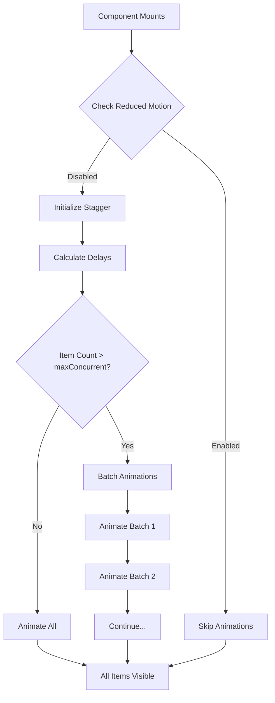
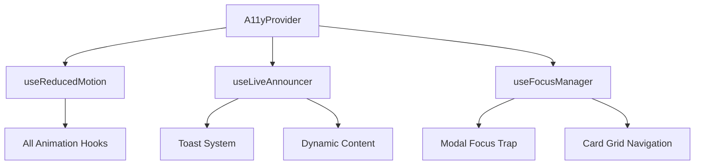

# Design Document: UI Polish 8/10

## Overview

This design document outlines the technical approach to elevate the Shop, Inventory, and Battle Pass UI components to 8/10 quality across micro-interactions, responsive design, and accessibility. The implementation focuses on creating reusable utilities and hooks that can be applied consistently across all enterprise components.

## Architecture

The enhancement follows a layered approach:

```
┌─────────────────────────────────────────────────────────────┐
│                    Page Components                          │
│         (Shop, Inventory, BattlePass)                       │
├─────────────────────────────────────────────────────────────┤
│                 Enterprise Components                        │
│    (ItemDisplayBox, InventoryItemBox, RewardDisplayBox)     │
├─────────────────────────────────────────────────────────────┤
│                   Shared Utilities                          │
│  ┌──────────┐ ┌──────────┐ ┌──────────┐ ┌──────────────┐   │
│  │ useFocus │ │useStagger│ │useMotion │ │BottomSheet  │   │
│  │  Ring    │ │Animation │ │Preference│ │  Modal      │   │
│  └──────────┘ └──────────┘ └──────────┘ └──────────────┘   │
├─────────────────────────────────────────────────────────────┤
│                   CSS Utilities                             │
│    focus-ring, press-feedback, safe-area, touch-target     │
└─────────────────────────────────────────────────────────────┘
```

## Components and Interfaces

### 1. useReducedMotion Hook

```typescript
interface UseReducedMotionReturn {
  prefersReducedMotion: boolean
}

function useReducedMotion(): UseReducedMotionReturn
```

Detects user's motion preference via `prefers-reduced-motion` media query and provides a reactive boolean for conditional animation rendering.

### 2. useStaggerAnimation Hook

```typescript
interface StaggerConfig {
  itemCount: number
  baseDelay?: number      // default: 50ms
  maxConcurrent?: number  // default: 8
  enabled?: boolean       // respects reduced motion
}

interface UseStaggerReturn {
  getDelay: (index: number) => number
  isVisible: (index: number) => boolean
  triggerStagger: () => void
}

function useStaggerAnimation(config: StaggerConfig): UseStaggerReturn
```

Manages staggered entry animations with configurable delays and concurrent animation limits.

### 3. useAnimatedValue Hook

```typescript
interface AnimatedValueConfig {
  from: number
  to: number
  duration?: number  // default: 600ms
  easing?: string    // default: 'ease-out'
}

interface UseAnimatedValueReturn {
  value: number
  isAnimating: boolean
  animate: (newValue: number) => void
}

function useAnimatedValue(config: AnimatedValueConfig): UseAnimatedValueReturn
```

Provides smooth number interpolation for XP bars and progress indicators.

### 4. BottomSheetModal Component

```typescript
interface BottomSheetModalProps {
  isOpen: boolean
  onClose: () => void
  children: React.ReactNode
  title?: string
  snapPoints?: number[]  // default: [0.5, 0.9]
}

function BottomSheetModal(props: BottomSheetModalProps): JSX.Element
```

Mobile-optimized modal that slides up from bottom with drag-to-dismiss and snap points.

### 5. SwipeCarousel Component

```typescript
interface SwipeCarouselProps<T> {
  items: T[]
  renderItem: (item: T, index: number) => React.ReactNode
  snapToItem?: boolean
  showIndicators?: boolean
  itemWidth?: number | 'auto'
}

function SwipeCarousel<T>(props: SwipeCarouselProps<T>): JSX.Element
```

Touch-friendly horizontal carousel with snap scrolling and visual indicators.

### 6. FocusRing Utility Classes

```css
.focus-ring {
  @apply focus-visible:outline-none focus-visible:ring-2 focus-visible:ring-[#6366f1] focus-visible:ring-offset-2 focus-visible:ring-offset-[var(--color-bg-base)];
}

.press-feedback {
  @apply active:scale-[0.97] transition-transform duration-100;
}

.touch-target {
  @apply min-h-[44px] min-w-[44px];
}

.safe-area-bottom {
  padding-bottom: env(safe-area-inset-bottom, 0px);
}
```

### 7. AccessibleCard Component Wrapper

```typescript
interface AccessibleCardProps {
  children: React.ReactNode
  onClick?: () => void
  ariaLabel: string
  className?: string
}

function AccessibleCard(props: AccessibleCardProps): JSX.Element
```

Wraps item cards with proper role, tabindex, and keyboard event handlers.

## Data Models

### Animation State

```typescript
interface AnimationState {
  isStaggering: boolean
  visibleItems: Set<number>
  reducedMotion: boolean
}
```

### Accessibility Context

```typescript
interface A11yContextValue {
  prefersReducedMotion: boolean
  announceMessage: (message: string) => void
  focusedElement: string | null
}
```


## Correctness Properties

*A property is a characteristic or behavior that should hold true across all valid executions of a system-essentially, a formal statement about what the system should do. Properties serve as the bridge between human-readable specifications and machine-verifiable correctness guarantees.*

### Property 1: Press feedback applies correct transform

*For any* CTA button element with the press-feedback class, the active state transform should scale to exactly 0.97 with transition duration of 100ms or less.
**Validates: Requirements 1.1**

### Property 2: Stagger delay calculation is linear

*For any* array of N items and a base delay D, the delay for item at index i should equal i * D milliseconds.
**Validates: Requirements 1.2**

### Property 3: Animated value stays within bounds

*For any* animation from value A to value B, all intermediate values returned by useAnimatedValue should be between min(A,B) and max(A,B) inclusive.
**Validates: Requirements 1.4**

### Property 4: Touch targets meet minimum size

*For any* interactive element with the touch-target class, the computed min-height and min-width should be greater than or equal to 44 pixels.
**Validates: Requirements 2.2**

### Property 5: Carousel enables on threshold

*For any* item array where length > 4 and viewport is mobile (< 640px), the SwipeCarousel component should render with scrolling enabled.
**Validates: Requirements 2.5**

### Property 6: Focus ring applies on focus-visible

*For any* element with the focus-ring class, when focused via keyboard (focus-visible), the element should have a visible ring with width >= 2px and brand color.
**Validates: Requirements 3.1**

### Property 7: Interactive elements are keyboard accessible

*For any* interactive element (buttons, clickable cards), the element should either be a naturally focusable element (button, a, input) or have tabindex >= 0.
**Validates: Requirements 3.2**

### Property 8: Rarity badges have descriptive aria-labels

*For any* rarity value in ['common', 'uncommon', 'rare', 'epic', 'legendary'], the Badge component should render with an aria-label containing that rarity name.
**Validates: Requirements 3.3**

### Property 9: Reduced motion disables animations

*For any* component using animations, when prefersReducedMotion is true, animation durations should be 0ms or animations should be conditionally skipped.
**Validates: Requirements 3.4, 5.4**

### Property 10: Clickable cards have correct ARIA attributes

*For any* AccessibleCard component with an onClick handler, the rendered element should have role="button" and tabindex="0".
**Validates: Requirements 3.6**

### Property 11: Animations use GPU-accelerated properties only

*For any* animation class in the system, the animated properties should be limited to transform and opacity (no width, height, top, left, margin, padding).
**Validates: Requirements 4.1**

### Property 12: Stagger limits concurrent animations

*For any* stagger animation with N items and maxConcurrent M, at most M items should have isVisible=true simultaneously during the stagger sequence.
**Validates: Requirements 4.3**

## Error Handling

### Animation Failures
- If requestAnimationFrame is unavailable, fall back to setTimeout
- If CSS transitions fail, ensure final state is applied immediately
- If reduced motion detection fails, default to animations enabled (fail open for UX)

### Accessibility Fallbacks
- If aria-live announcements fail, ensure visual feedback is still present
- If focus management fails, allow native browser focus behavior
- If touch detection fails, enable both touch and mouse interactions

### Responsive Breakpoint Edge Cases
- Handle orientation changes gracefully with debounced resize handlers
- Support both CSS-based and JS-based breakpoint detection for consistency
- Ensure safe-area-inset fallback to 0px on non-notched devices

## Testing Strategy

### Property-Based Testing Library
**fast-check** will be used for property-based testing in TypeScript/React.

### Unit Tests
- Test each hook in isolation (useReducedMotion, useStaggerAnimation, useAnimatedValue)
- Test utility class generation functions
- Test component prop validation

### Property-Based Tests
Each correctness property will be implemented as a fast-check property test:

1. **Stagger delay tests**: Generate random item counts (1-100) and base delays (10-200ms), verify linear calculation
2. **Animated value bounds tests**: Generate random from/to pairs, verify all intermediate values stay in bounds
3. **Touch target tests**: Generate random button configurations, verify minimum dimensions
4. **ARIA attribute tests**: Generate all rarity values, verify aria-label presence
5. **Keyboard accessibility tests**: Generate random interactive element configurations, verify tabindex

### Integration Tests
- Test full page renders with accessibility audit (axe-core)
- Test animation sequences with reduced motion enabled/disabled
- Test responsive layouts at key breakpoints (320px, 640px, 768px, 1024px, 1280px)

### Test Configuration
- Property tests: minimum 100 iterations per property
- Each property test tagged with: `**Feature: ui-polish-8-of-10, Property {number}: {property_text}**`

## Mermaid Diagram: Animation Flow



## Mermaid Diagram: Accessibility Context


